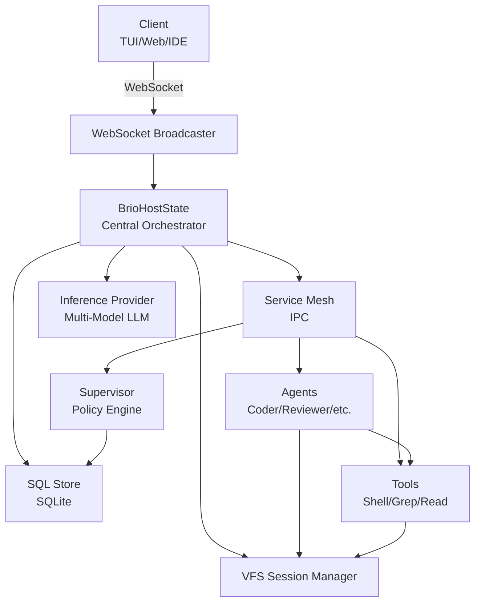

# Brio-Kernel Documentation

Welcome to the Brio-Kernel documentation! Brio is a strictly headless micro-kernel designed to orchestrate AI agents using the WebAssembly Component Model (WASI Preview 2).

## What is Brio?

Brio synthesizes the safety of a database kernel with the speed of a service mesh. It provides:

- **Security-First Design**: All components run in sandboxed WebAssembly with capability-based access control
- **Zero-Copy Performance**: Internal IPC uses direct memory channels, not HTTP/serialization
- **Atomic Operations**: File changes are isolated in temp directories and atomically committed
- **Multi-Agent Orchestration**: Built-in support for specialized agents (coder, reviewer, planner, and more)
- **Branching Workflows**: Parallel execution with sophisticated merge strategies

## Quick Links

- **[Getting Started](getting-started/quickstart.md)** - Install and run Brio in 5 minutes
- **[Architecture](concepts/architecture.md)** - Understand how Brio works
- **[Agents](concepts/agents.md)** - Learn about the different agent types
- **[API Reference](api-reference/agent-sdk.md)** - Build your own agents and tools

## Architecture Overview

## Use Cases

- **AI-Powered Development**: Code writing, review, and refactoring
- **Task Automation**: Automated workflows with specialized agents
- **Code Analysis**: Static analysis, security scanning, documentation generation
- **Multi-Agent Systems**: Complex tasks requiring coordination between multiple AI agents

## Features

### Current Features

✅ **WebAssembly Components** - WASI Preview 2 native components  
✅ **Service Mesh IPC** - Zero-copy inter-component communication  
✅ **VFS Session Isolation** - Atomic file operations with rollback  
✅ **Multi-Agent Support** - 5 specialized agent types  
✅ **Branching & Merging** - Parallel task execution with conflict resolution  
✅ **SQL State Management** - Policy-enforced database access  
✅ **WebSocket Real-Time Updates** - Live state synchronization  
✅ **Multi-Model LLM Support** - OpenAI, Anthropic, extensible  
✅ **Distributed Mesh** - Multi-node deployment support  

### Coming Soon

🚧 Component Hot-Reload - Update agents without restart  
🚧 Persistent Sessions - Resume across restarts  
🚧 Plugin System - Third-party tool installation  

## Getting Help

- 📖 [Full Documentation](SUMMARY.md)
- 🐛 [Report Issues](https://github.com/Brio-Kernel/brio-kernel/issues)
- 💬 [Discussions](https://github.com/Brio-Kernel/brio-kernel/discussions)
- 🤝 [Contributing](../CONTRIBUTING.md)

## License

Brio-Kernel is licensed under the Mozilla Public License 2.0 (MPL-2.0).

---

**Ready to dive in?** Start with the [Getting Started Guide](getting-started/quickstart.md).
