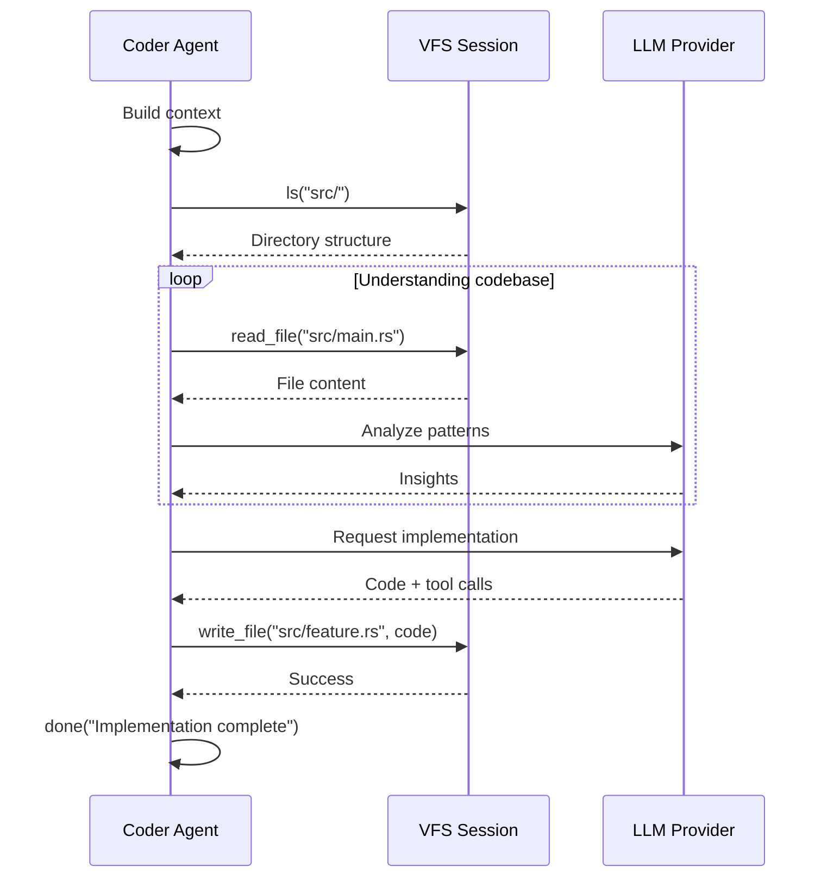

# Coder Agent

The Coder Agent is specialized for code writing and modification tasks. It has full read/write capabilities and is optimized for implementing features and fixing bugs.

## Overview

The Coder Agent combines the power of LLMs with file system tools to write, modify, and refactor code autonomously.


## Capabilities

### File Operations

The Coder Agent can:

| Tool | Purpose | Security |
|------|---------|----------|
| `read_file` | Read source files | Size limited (1MB default) |
| `write_file` | Write/modify files | Path validation |
| `ls` | Explore directories | Depth limited (10 levels) |
| `done` | Mark completion | Includes summary |

### Code Writing Process



## Configuration

### Default Settings

```toml
[agents.coder]
model = "gpt-4-turbo"
max_iterations = 30
max_file_size = 1048576  # 1MB
max_depth = 10
enable_write = true
```

### Tool Registry

```rust
impl StandardAgent for CoderAgent {
    fn create_tool_registry(&self, config: &AgentConfig) -> ToolRegistry {
        ToolRegistryBuilder::new()
            .with_done_tool()
            .with_read_tool(config.max_file_size)
            .with_list_tool(config.max_depth)
            .with_write_tool()
            .build()
    }
}
```

## Use Cases

### 1. Implementing Features

```json
{
  "agent": "coder",
  "content": "Implement a user authentication system with JWT tokens",
  "input_files": ["src/models.rs", "src/routes.rs"]
}
```

### 2. Bug Fixes

```json
{
  "agent": "coder",
  "content": "Fix the null pointer exception in the user service",
  "input_files": ["src/services/user.rs"]
}
```

### 3. Code Refactoring

```json
{
  "agent": "coder",
  "content": "Refactor the database layer to use async/await",
  "input_files": ["src/db/"]
}
```

### 4. Adding Tests

```json
{
  "agent": "coder",
  "content": "Add unit tests for the calculation module",
  "input_files": ["src/calc.rs"]
}
```

## Best Practices

### Task Design

1. **Be Specific** - Clear requirements lead to better results
2. **Provide Context** - Include relevant files
3. **Set Boundaries** - Define scope clearly
4. **Include Examples** - Show expected patterns

### Example Task

```json
{
  "agent": "coder",
  "content": "Create a Rust function that validates email addresses. Requirements:\n- Use regex for validation\n- Return Result<bool, ValidationError>\n- Include unit tests\n- Follow existing code style in src/utils.rs",
  "input_files": ["src/utils.rs", "Cargo.toml"]
}
```

### Safety Guidelines

1. **Review Generated Code** - Always review before committing
2. **Test Changes** - Run tests after agent completes
3. **Use VFS Sessions** - All changes go to temp directory first
4. **Limit File Access** - Only provide necessary files
5. **Set Iteration Limits** - Prevent infinite loops

## Tool Invocation Examples

### Reading Files

```xml
I'll start by examining the existing code structure.

<read_file path="src/main.rs" />
```

### Writing Code

```xml
Now I'll create the authentication module:

<write_file path="src/auth.rs">
pub struct Authenticator;

impl Authenticator {
    pub fn new() -> Self {
        Self
    }
    
    pub fn validate_token(&self, token: &str) -> bool {
        // Implementation
        token.len() > 10
    }
}

#[cfg(test)]
mod tests {
    use super::*;
    
    #[test]
    fn test_validate_token() {
        let auth = Authenticator::new();
        assert!(auth.validate_token("valid_token_here"));
    }
}
</write_file>
```

### Marking Completion

```xml
The authentication module has been created with:
- Token validation logic
- Unit tests
- Documentation

<done>
Successfully implemented authentication module in src/auth.rs.
The module provides token validation with unit tests.
</done>
```

## Prompt Engineering

The Coder Agent uses a specialized prompt that emphasizes:

1. **Reading before writing** - Always understand existing code
2. **Following conventions** - Match existing style
3. **Complete solutions** - Fully working code
4. **Error handling** - Proper error handling
5. **Testing** - Include tests when appropriate

## Limitations

- **Context Window** - Limited by LLM context size
- **File Size** - Large files may be truncated
- **Complexity** - Very complex tasks may need decomposition
- **Dependencies** - May not understand all external dependencies

## Comparison with Other Agents

| Feature | Coder | Reviewer | Smart Agent |
|---------|-------|----------|-------------|
| **Write Files** | ✅ | ❌ | ✅ |
| **Read Files** | ✅ | ✅ | ✅ |
| **Shell Commands** | ❌ | ❌ | ✅ |
| **Best For** | Writing code | Reviewing code | Complex tasks |

## Troubleshooting

### Agent Writes Incorrect Code

1. **Provide more context** - Include relevant files
2. **Be more specific** - Add detailed requirements
3. **Show examples** - Include sample code
4. **Check file size** - Ensure files aren't truncated

### Agent Gets Stuck

1. **Check max_iterations** - Increase if needed
2. **Simplify task** - Break into smaller tasks
3. **Review logs** - Check for errors
4. **Verify VFS** - Ensure session is working

## Additional Resources

- **[Agents Overview](../concepts/agents.md)** - All agent types
- **[Smart Agent](./smart-agent.md)** - More powerful alternative
- **[Reviewer Agent](./reviewer.md)** - Code review agent
- **[Creating Agents](../guides/creating-agents.md)** - Build custom agents
