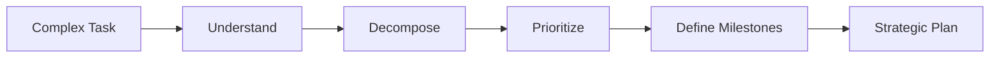
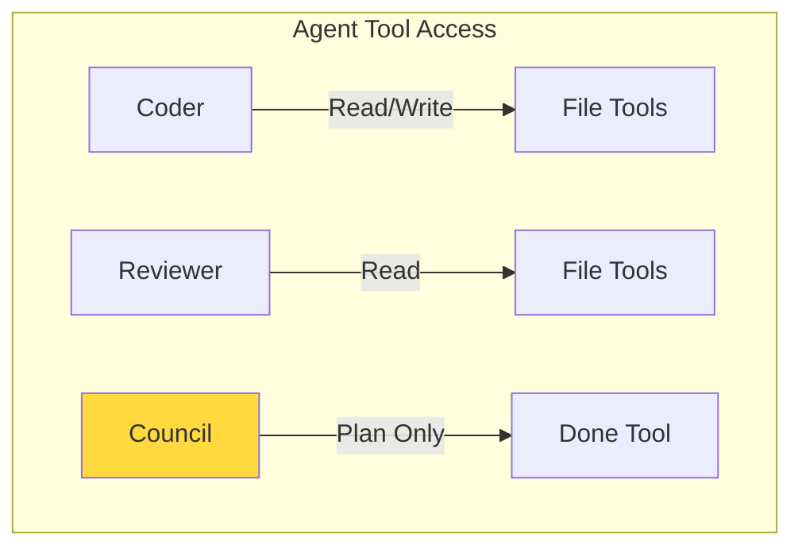
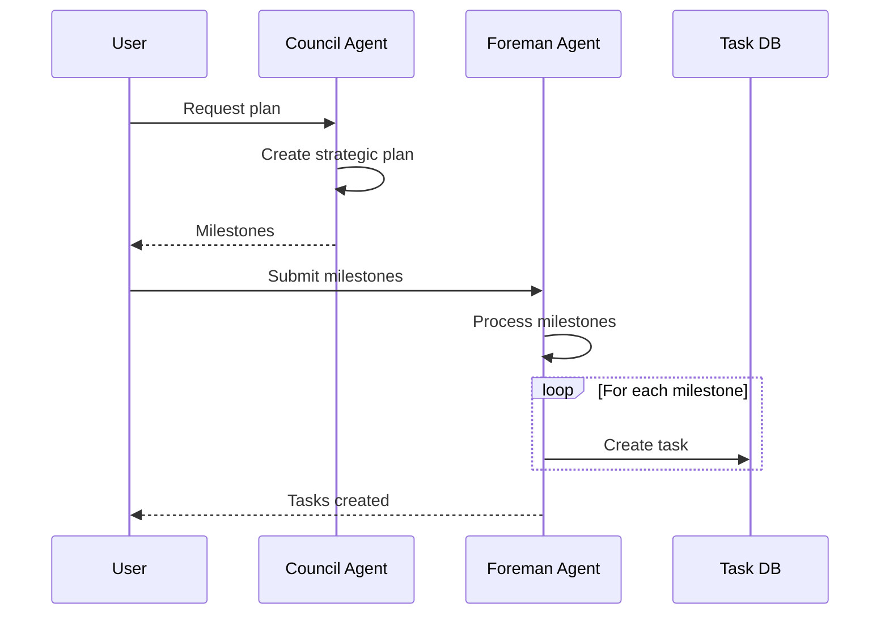

# Council Agent

The Council Agent is a strategic planning and oversight expert. Unlike other agents, it focuses on planning rather than execution, with minimal tool access.

## Overview

The Council Agent specializes in:
- **Strategic Planning** - Analyzing requirements and breaking down complex tasks
- **Milestone Definition** - Creating actionable milestones with success criteria
- **Dependency Analysis** - Identifying dependencies between tasks
- **Risk Assessment** - Highlighting risks and mitigation strategies



## Capabilities

### Minimal Tool Set

The Council Agent has the most restricted tool set by design:

| Tool | Purpose |
|------|---------|
| `done` | Mark planning as complete with strategic summary |

**Why only `done`?** The Council Agent is designed for **planning, not execution**. It provides strategic guidance without performing file operations.



## 4-Step Planning Process

### 1. Understand

Analyze the task requirements:
- What is the goal?
- What are the constraints?
- What resources are available?

### 2. Decompose

Break down into smaller tasks:
- Identify components
- Define subtasks
- Estimate complexity

### 3. Prioritize

Order tasks by importance:
- Dependencies first
- High-impact items
- Risk mitigation

### 4. Define Milestones

Create actionable milestones:
- Clear success criteria
- Deliverables
- Timeline estimates

## Configuration

### Default Settings

```toml
[agents.council]
model = "gpt-4"
max_iterations = 5  # Fewer iterations needed for planning
enable_write = false  # No file access
```

### Tool Registry

```rust
impl StandardAgent for CouncilAgent {
    fn create_tool_registry(&self, _config: &AgentConfig) -> ToolRegistry {
        // Council agent only needs the done tool
        ToolRegistryBuilder::new()
            .with_done_tool()
            .build()
    }
}
```

## Use Cases

### 1. Project Architecture Planning

```json
{
  "agent": "council",
  "content": "Plan the architecture for a real-time chat application with WebSockets, Redis, and PostgreSQL",
  "input_files": []
}
```

### 2. Sprint Planning

```json
{
  "agent": "council",
  "content": "Break down the user authentication feature into sprint tasks with dependencies and estimates",
  "input_files": ["requirements/auth.md"]
}
```

### 3. Migration Planning

```json
{
  "agent": "council",
  "content": "Create a migration plan from REST to GraphQL including risks and rollback strategy",
  "input_files": ["api/current-rest-api.yaml"]
}
```

### 4. Technical Debt Assessment

```json
{
  "agent": "council",
  "content": "Analyze this codebase and create a plan to address technical debt",
  "input_files": ["src/"]
}
```

## Example Output

### Strategic Plan Example

```xml
<done>
## Strategic Plan: Real-time Chat Application

### Executive Summary
Build a scalable real-time chat application using WebSockets for real-time communication,
Redis for pub/sub and session management, and PostgreSQL for persistent storage.

### Milestones

#### Phase 1: Foundation (Week 1-2)
**Milestone**: Basic WebSocket Server
- Set up Axum with WebSocket support
- Implement connection management
- Basic message broadcasting
**Success Criteria**: Can connect 100 concurrent clients

#### Phase 2: Persistence (Week 3-4)
**Milestone**: Message Storage
- PostgreSQL schema design
- Message persistence layer
- Message history API
**Success Criteria**: Messages persist across restarts

#### Phase 3: Scalability (Week 5-6)
**Milestone**: Redis Integration
- Redis pub/sub for multi-server support
- Session management
- Rate limiting
**Success Criteria**: Horizontal scaling works

### Dependencies
1. WebSocket server → Message storage
2. Auth system → All features
3. Redis → Scalability features

### Risk Assessment

**High Risk**: WebSocket connection stability
- **Mitigation**: Implement reconnection logic and heartbeats

**Medium Risk**: Database performance
- **Mitigation**: Implement connection pooling and query optimization

**Low Risk**: Redis cluster setup
- **Mitigation**: Use managed Redis service

### Resource Requirements
- 1 Backend Developer (full-time)
- 1 DevOps Engineer (part-time, Phase 3)
- Redis cluster (managed service)
- PostgreSQL instance

### Success Metrics
- 10,000 concurrent connections
- <100ms message latency
- 99.9% uptime

### Next Steps
1. Start Phase 1 with the Coder Agent
2. Set up infrastructure with DevOps
3. Begin authentication implementation
</done>
```

## Integration with Foreman

The Council Agent works well with the Foreman Agent:



1. **Council** creates strategic plan with milestones
2. **Foreman** converts milestones into actionable tasks
3. **Other Agents** execute the tasks

## Best Practices

### Effective Planning

1. **Clear Scope** - Define what is in/out of scope
2. **Realistic Timelines** - Consider team capacity
3. **Identify Dependencies** - Critical path analysis
4. **Risk Management** - Plan for contingencies
5. **Measurable Outcomes** - Define success criteria

### Task Preparation

1. **Provide Context** - Share requirements and constraints
2. **Set Constraints** - Budget, timeline, technology
3. **Define Success** - What does "done" look like?
4. **Share Vision** - Ultimate goal and purpose

## Limitations

- **No Execution** - Cannot implement the plan
- **No File Access** - Cannot examine code in detail
- **Estimates** - Time estimates are approximate
- **Static Analysis** - Cannot test assumptions

## When to Use Council

### ✅ Use Council For:

- Breaking down complex projects
- Strategic planning
- Architecture decisions
- Risk assessment
- Sprint planning
- Migration planning

### ❌ Don't Use Council For:

- Writing code
- Debugging
- Code review
- Quick fixes
- Operational tasks

## Comparison with Other Agents

| Feature | Council | Coder | Reviewer |
|---------|---------|-------|----------|
| **Read Files** | ❌ | ✅ | ✅ |
| **Write Files** | ❌ | ✅ | ❌ |
| **Shell Commands** | ❌ | ❌ | ❌ |
| **Best For** | Planning | Coding | Reviewing |
| **Output** | Strategic plan | Code | Review report |

## Prompt Engineering

The Council Agent prompt emphasizes:

1. **Big-Picture Thinking** - Focus on strategy
2. **Structured Output** - Clear milestones
3. **Actionable Items** - Specific next steps
4. **Risk Awareness** - Identify and mitigate risks
5. **Dependency Mapping** - Show relationships

## Advanced Usage

### Multi-Agent Workflow

```json
// Step 1: Council creates plan
{
  "agent": "council",
  "content": "Plan implementation of feature X"
}

// Step 2: Coder implements first milestone
{
  "agent": "coder",
  "content": "Implement milestone 1 from the plan"
}

// Step 3: Reviewer checks implementation
{
  "agent": "reviewer",
  "content": "Review the implementation"
}

// Step 4: Council reassesses
{
  "agent": "council",
  "content": "Update plan based on progress"
}
```

## Additional Resources

- **[Agents Overview](../concepts/agents.md)** - All agent types
- **[Foreman Agent](./foreman.md)** - Task distribution
- **[Supervisor](../concepts/supervisor.md)** - Orchestration
- **[Creating Agents](../guides/creating-agents.md)** - Build custom agents
