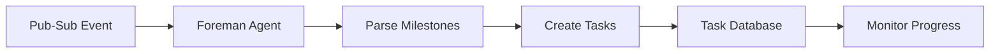
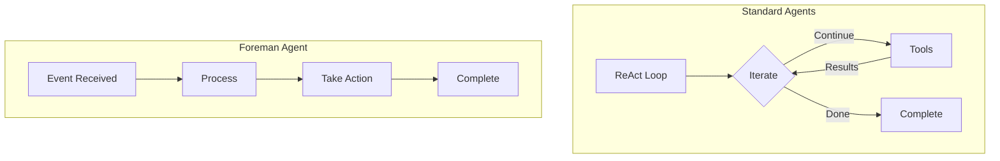
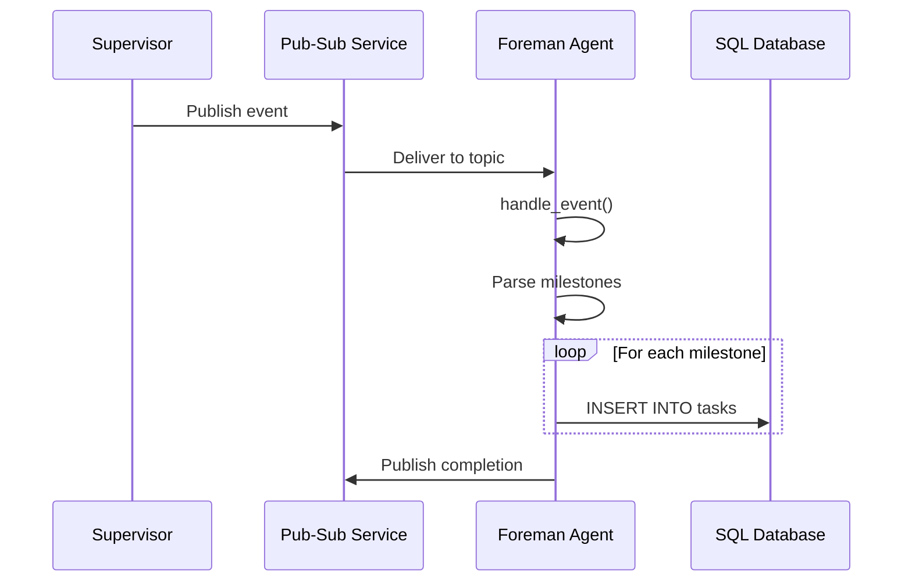
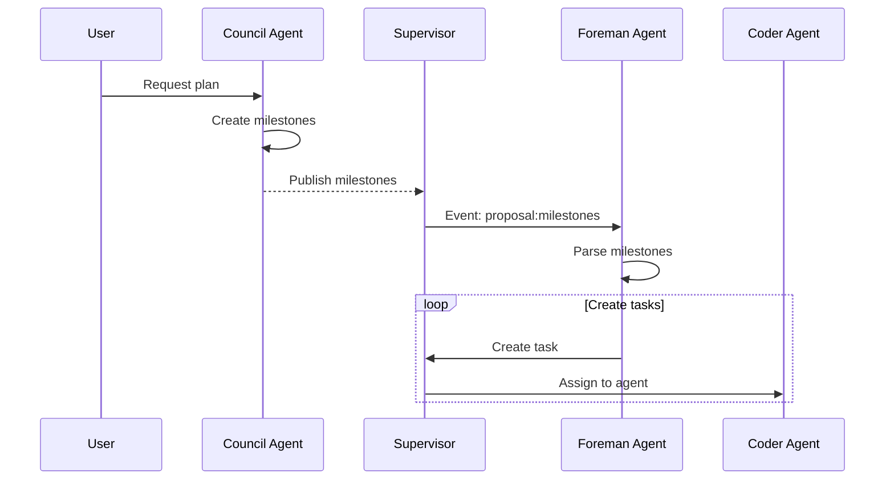

# Foreman Agent

The Foreman Agent is a task orchestration and milestone tracking agent. Unlike other agents, it uses an event-driven architecture and focuses on distributing work to other agents.

## Overview

The Foreman Agent specializes in:
- **Event-Driven Processing** - Reacts to pub-sub events
- **Task Distribution** - Converts milestones into tasks
- **Progress Tracking** - Monitors task completion
- **Workflow Automation** - Automates multi-agent workflows



## Architecture

### Event-Driven Design

Unlike other agents that use the ReAct loop, Foreman is **event-driven**:



### Pub-Sub Integration

The Foreman subscribes to specific topics:



## Capabilities

### Event Handling

| Event Type | Action |
|------------|--------|
| `proposal:milestones` | Parse and create tasks |
| `task:completed` | Update tracking |
| `task:failed` | Log and alert |

### Tool Set

The Foreman has a unique tool set focused on task management:

| Tool | Purpose |
|------|---------|
| `create_task` | Create task from milestone |

### WIT Interfaces

The Foreman implements both agent interfaces:

```wit
world foreman {
  // Standard agent interface
  export agent-runner;
  
  // Event handler interface
  export event-handler;
  
  import sql-state;
  import service-mesh;
  import logging;
}
```

## Configuration

### Default Settings

```toml
[agents.foreman]
# Foreman doesn't use LLM inference
# No max_iterations needed
# Event-driven, not ReAct loop
```

### Event Subscription

```rust
pub struct ForemanAgent;

impl exports::brio::core::event_handler::Guest for ForemanAgent {
    fn handle_event(topic: String, data: Payload) {
        match topic.as_str() {
            "proposal:milestones" => {
                Self::process_milestones(data);
            }
            _ => {
                log::warn!("Unknown event: {}", topic);
            }
        }
    }
}
```

## Use Cases

### 1. Milestone Processing

```json
{
  "event": "proposal:milestones",
  "payload": {
    "task_id": "feature-auth",
    "milestones": [
      "Set up authentication middleware",
      "Implement JWT token validation",
      "Create login/logout endpoints",
      "Add password reset flow"
    ]
  }
}
```

Foreman converts each milestone into a task:

```sql
INSERT INTO tasks (content, priority, status) 
VALUES ('Set up authentication middleware', 10, 'pending');
```

### 2. Workflow Automation



### 3. Progress Monitoring

```json
{
  "event": "task:completed",
  "payload": {
    "task_id": "auth-001",
    "milestone_id": "feature-auth"
  }
}
```

Foreman updates progress tracking and may trigger next steps.

## Internal Engine

### ForemanEngine

```rust
pub struct ForemanEngine {
    create_task_tool: Box<dyn Tool>,
}

impl ForemanEngine {
    pub fn new() -> Self {
        Self {
            create_task_tool: Box::new(CreateTaskTool),
        }
    }
    
    pub fn process_milestones(
        &self, 
        payload_json: &str
    ) -> Result<(), ToolError> {
        let event: MilestonesEvent = 
            serde_json::from_str(payload_json)?;
        
        for milestone in event.milestones {
            let args = hashmap! {
                "content".to_string() => milestone,
                "priority".to_string() => "10".to_string(),
            };
            
            self.create_task_tool.execute(&args)?;
        }
        
        Ok(())
    }
}
```

### CreateTaskTool

```rust
pub struct CreateTaskTool;

impl Tool for CreateTaskTool {
    fn name(&self) -> Cow<'static, str> {
        "create_task".into()
    }
    
    fn description(&self) -> Cow<'static, str> {
        "Creates a task in the task database".into()
    }
    
    fn execute(
        &self,
        args: &HashMap<String, String>,
    ) -> Result<String, ToolError> {
        let content = args.get("content")
            .ok_or(ToolError::MissingArg("content"))?;
        
        // Execute SQL via WIT interface
        let sql = "INSERT INTO tasks (content, priority, status) 
                   VALUES (?, 10, 'pending')";
        
        brio::core::sql_state::execute(sql, &[content])
            .map_err(|e| ToolError::Database(e))?;
        
        Ok("Task created".to_string())
    }
}
```

## Database Integration

### Task Schema

```sql
CREATE TABLE tasks (
    id INTEGER PRIMARY KEY AUTOINCREMENT,
    content TEXT NOT NULL,
    priority INTEGER DEFAULT 10,
    status TEXT DEFAULT 'pending',
    created_at TIMESTAMP DEFAULT CURRENT_TIMESTAMP,
    assigned_agent TEXT,
    parent_id INTEGER,
    FOREIGN KEY (parent_id) REFERENCES tasks(id)
);
```

### Queries

The Foreman uses these SQL operations:

```rust
// Create task
INSERT INTO tasks (content, priority, status) 
VALUES (?, 10, 'pending');

// Update status
UPDATE tasks SET status = 'completed' 
WHERE id = ?;

// Get pending tasks
SELECT * FROM tasks 
WHERE status = 'pending' 
ORDER BY priority DESC;
```

## Best Practices

### Event Design

1. **Clear Payloads** - Well-structured event data
2. **Idempotent** - Handle duplicate events gracefully
3. **Error Handling** - Log and continue on errors
4. **Ordering** - Consider event sequence

### Task Creation

1. **Appropriate Granularity** - Not too big, not too small
2. **Clear Descriptions** - Actionable task content
3. **Priority Levels** - Set appropriate priorities
4. **Dependencies** - Link related tasks

### Monitoring

1. **Log Everything** - Track all actions
2. **Metrics** - Task creation rates
3. **Alerting** - Failed event processing
4. **Health Checks** - Agent availability

## Limitations

- **No LLM** - Doesn't use AI for reasoning
- **Event Only** - Only responds to events
- **Limited Tools** - Only task creation
- **No File Access** - Cannot examine code

## When to Use Foreman

### ✅ Use Foreman For:

- Automating task creation
- Processing milestone proposals
- Workflow orchestration
- Progress tracking
- Multi-agent coordination

### ❌ Don't Use Foreman For:

- Direct task execution
- Code writing
- Decision making
- Complex reasoning

## Comparison with Other Agents

| Feature | Foreman | Coder | Council |
|---------|---------|-------|---------|
| **Architecture** | Event-driven | ReAct Loop | ReAct Loop |
| **LLM Usage** | ❌ | ✅ | ✅ |
| **File Access** | ❌ | ✅ | ❌ |
| **Task Execution** | ❌ | ✅ | ❌ |
| **Best For** | Orchestration | Coding | Planning |
| **Triggers** | Events | Direct | Direct |

## Integration Examples

### Council + Foreman Workflow

```rust
// Council creates milestones
let council_task = Task {
    agent: "council",
    content: "Plan the new feature",
};

// Foreman processes them
// Automatically converts milestones to tasks

// Coder executes tasks
for task in foreman.created_tasks {
    assign_to_agent("coder", task);
}
```

### Custom Events

```rust
// Define custom event
pub struct CustomEvent {
    pub event_type: String,
    pub data: serde_json::Value,
}

// Handle in Foreman
impl ForemanAgent {
    fn handle_custom(&self, 
        event: CustomEvent
    ) {
        match event.event_type.as_str() {
            "deploy:trigger" => {
                self.create_deployment_tasks(event.data);
            }
            "test:failed" => {
                self.create_debug_tasks(event.data);
            }
            _ => {}
        }
    }
}
```

## Troubleshooting

### Events Not Processed

1. **Check subscription** - Verify topic subscription
2. **Check permissions** - Ensure access to pub-sub
3. **Check logs** - Look for error messages
4. **Check format** - Validate event payload

### Tasks Not Created

1. **Check SQL permissions** - Can insert into tasks table?
2. **Check payload** - Valid milestone format?
3. **Check database** - Table exists?
4. **Check constraints** - Not violating constraints?

## Additional Resources

- **[Agents Overview](../concepts/agents.md)** - All agent types
- **[Council Agent](./council.md)** - Strategic planning
- **[Supervisor](../concepts/supervisor.md)** - Orchestration
- **[Event Handling](../guides/event-handling.md)** - Event system
- **[Creating Agents](../guides/creating-agents.md)** - Build custom agents
