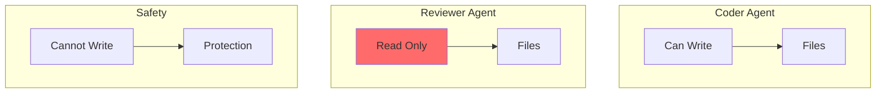
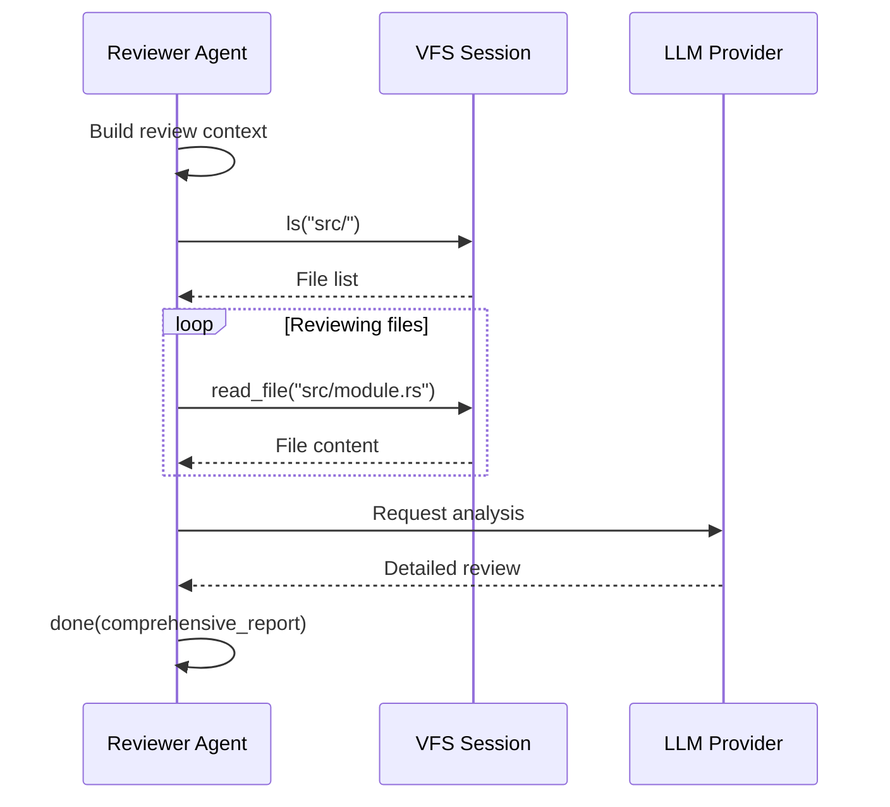
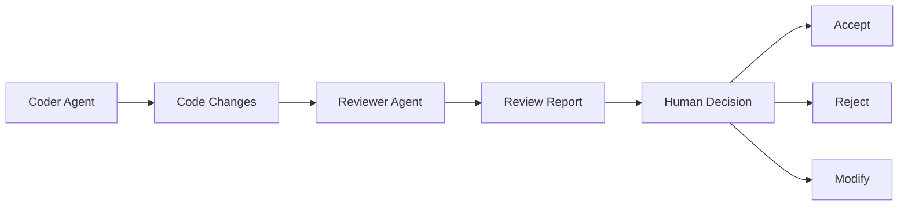

# Reviewer Agent

The Reviewer Agent is a specialized code review agent with **read-only access** for safety. It analyzes code for correctness, security, performance, and maintainability.

## Overview

The Reviewer Agent demonstrates Brio's **security-first design**. It can analyze code but cannot modify it, preventing accidental or malicious changes during review.


## Safety Feature: Read-Only Operation



This is **intentional and by design**. The Reviewer Agent:
- ✅ Can read any file
- ✅ Can analyze code thoroughly
- ✅ Can provide detailed feedback
- ❌ **Cannot write or modify files**
- ❌ **Cannot execute shell commands**

## Capabilities

### Read Operations

| Tool | Purpose | Limitations |
|------|---------|-------------|
| `read_file` | Read source files | Size limited |
| `ls` | List directories | Depth limited |
| `done` | Report findings | Includes full review |

### Review Criteria

The Reviewer Agent analyzes code across 6 dimensions:

1. **Correctness** - Logic errors, bugs, edge cases
2. **Security** - Vulnerabilities, unsafe patterns
3. **Performance** - Inefficient algorithms, resource leaks
4. **Maintainability** - Code organization, readability
5. **Testing** - Test coverage, test quality
6. **Documentation** - Comments, documentation completeness

## Configuration

### Default Settings

```toml
[agents.reviewer]
model = "gpt-4"
max_iterations = 10
max_file_size = 1048576
max_depth = 10
enable_write = false  # Safety: read-only
```

### Tool Registry

```rust
impl StandardAgent for ReviewerAgent {
    fn create_tool_registry(&self, config: &AgentConfig) -> ToolRegistry {
        ToolRegistryBuilder::new()
            .with_done_tool()
            .with_read_tool(config.max_file_size)
            .with_list_tool(config.max_depth)
            // Note: NO write_tool!
            .build()
    }
}
```

### Verification

The agent includes a test to ensure write access is not available:

```rust
#[test]
fn test_tool_registry_excludes_write_tool() {
    let agent = ReviewerAgent;
    let registry = agent.create_tool_registry(&config);
    
    // SAFETY: Verify write tool is NOT present (read-only agent)
    assert!(!registry.available_tools().contains(&"write_file"));
}
```

## Use Cases

### 1. Security Audits

```json
{
  "agent": "reviewer",
  "content": "Review the authentication module for security vulnerabilities",
  "input_files": ["src/auth.rs", "src/middleware/auth.rs"]
}
```

### 2. Code Quality Review

```json
{
  "agent": "reviewer",
  "content": "Review the database layer for code quality and best practices",
  "input_files": ["src/db/"]
}
```

### 3. Performance Analysis

```json
{
  "agent": "reviewer",
  "content": "Analyze the sorting algorithm for performance issues",
  "input_files": ["src/algorithms/sort.rs"]
}
```

### 4. Bug Detection

```json
{
  "agent": "reviewer",
  "content": "Find potential bugs in the error handling code",
  "input_files": ["src/error.rs"]
}
```

## Review Process



## Example Output

### Sample Review Report

```xml
<done>
## Code Review Report

### Files Reviewed
- src/auth.rs
- src/middleware/auth.rs

### 1. Correctness ✅
The authentication logic is sound. Token validation correctly checks expiration.

### 2. Security ⚠️
**Issue Found**: Passwords are logged in plaintext at line 45:
```rust
log::info!("User login: {}", password);  // SECURITY RISK
```
**Recommendation**: Remove password from logs, use user_id only.

### 3. Performance ✅
No performance issues detected. Token cache is properly implemented.

### 4. Maintainability ✅
Good code organization. Consider extracting validation logic to separate function.

### 5. Testing ⚠️
**Issue**: Missing test for token expiration edge case.
**Recommendation**: Add test case for expired tokens.

### 6. Documentation ✅
Good inline comments. Consider adding module-level documentation.

### Summary
- **Critical Issues**: 1 (password logging)
- **Warnings**: 1 (missing test)
- **Suggestions**: 2

Overall good implementation with one critical security issue to fix.
</done>
```

## Best Practices

### Review Workflow

1. **Coder writes → Reviewer reviews → Human decides**



2. **Provide Context** - Include all relevant files
3. **Be Specific** - Ask for specific types of review
4. **Review the Review** - Always verify agent findings

### Example Workflow

```bash
# 1. Coder implements feature
curl -X POST /api/tasks -d '{
  "agent": "coder",
  "content": "Implement user registration"
}'

# 2. Reviewer checks the code
curl -X POST /api/tasks -d '{
  "agent": "reviewer",
  "content": "Review the user registration implementation for security",
  "input_files": ["src/auth.rs", "src/models/user.rs"]
}'

# 3. Human reviews both and decides
# 4. If approved, commit from VFS session
```

## Prompt Engineering

The Reviewer Agent prompt emphasizes:

1. **Thoroughness** - Review all aspects of the code
2. **Constructiveness** - Provide actionable feedback
3. **Prioritization** - Identify critical issues first
4. **6 Criteria** - Check all review dimensions
5. **Examples** - Show specific code examples

## Limitations

- **No Context on Intent** - Doesn't know original requirements
- **Limited to Code** - Can't review design decisions
- **Static Analysis** - Can't test runtime behavior
- **Context Window** - Large codebases may exceed limits

## Comparison with Other Agents

| Feature | Reviewer | Coder | Smart Agent |
|---------|----------|-------|-------------|
| **Read Files** | ✅ | ✅ | ✅ |
| **Write Files** | ❌ (safety) | ✅ | ✅ |
| **Shell Commands** | ❌ | ❌ | ✅ |
| **Best For** | Code review | Writing code | Complex tasks |
| **Safety Level** | Maximum | Standard | Configurable |

## Security Considerations

### Why Read-Only?

1. **Prevents Accidental Changes** - Agent can't modify code during review
2. **Audit Trail** - Clear separation of read/write operations
3. **Compliance** - Meets strict review requirements
4. **Trust** - Users can safely run reviews

### Comparison with Human Review

| Aspect | Human | Reviewer Agent |
|--------|-------|----------------|
| **Speed** | Hours | Minutes |
| **Consistency** | Varies | Consistent |
| **Knowledge** | Domain expertise | General patterns |
| **Creativity** | High | Low |
| **Context** | Full understanding | Code-only |
| **Cost** | Time | Compute |

## Troubleshooting

### Review Misses Issues

1. **Provide more context** - Include related files
2. **Be specific** - Ask about specific concerns
3. **Check file size** - Ensure complete files are read
4. **Split large reviews** - Break into smaller chunks

### Review Too Vague

1. **Specify focus** - Ask for specific review type
2. **Set criteria** - Request specific checks
3. **Show examples** - Provide expected format

## Integration with CI/CD

```yaml
# GitHub Actions example
name: AI Code Review

on: [pull_request]

jobs:
  review:
    runs-on: ubuntu-latest
    steps:
      - uses: actions/checkout@v4
      
      - name: Start Brio Kernel
        run: cargo run --bin brio-kernel &
      
      - name: Request Review
        run: |
          curl -X POST http://localhost:8080/api/tasks \
            -H "Content-Type: application/json" \
            -d '{
              "agent": "reviewer",
              "content": "Review this PR for security and quality",
              "input_files": ["${{ github.event.pull_request.changed_files }}"]
            }'
      
      - name: Check Results
        run: |
          # Parse review results
          # Fail if critical issues found
```

## Additional Resources

- **[Agents Overview](../concepts/agents.md)** - All agent types
- **[Coder Agent](./coder.md)** - Code writing agent
- **[Smart Agent](./smart-agent.md)** - General-purpose agent
- **[Security Model](../concepts/security-model.md)** - Security documentation
