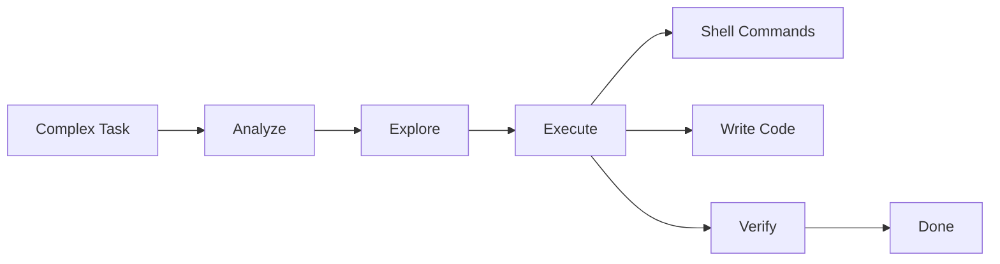
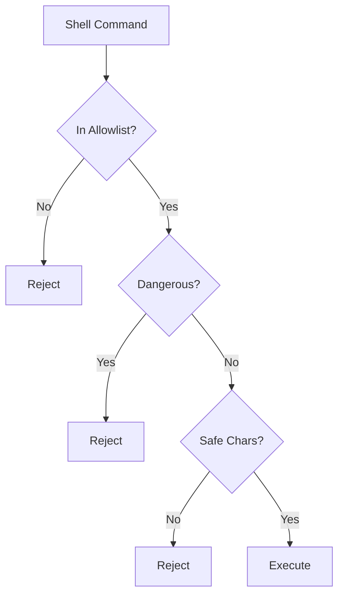

# Smart Agent

The Smart Agent is a general-purpose agent with comprehensive capabilities including file operations and shell command execution. It's the most powerful agent for complex development tasks.

## Overview

The Smart Agent combines all available tools to handle complex tasks autonomously. It can read, write, explore, and execute commands to accomplish development workflows.



## Capabilities

### Complete Tool Set

| Tool | Purpose | Configurable |
|------|---------|--------------|
| `read_file` | Read source files | Always enabled |
| `write_file` | Write/modify files | `enable_write` |
| `ls` | Explore directories | Always enabled |
| `shell` | Execute commands | `enable_shell` + allowlist |
| `done` | Mark completion | Always enabled |

### Shell Execution

**Only the Smart Agent can execute shell commands**, with these safeguards:

1. **Explicit Enablement** - Must set `enable_shell: true`
2. **Allowlist Validation** - Only approved commands
3. **Dangerous Command Blocking** - `rm`, `mkfs`, etc. blocked
4. **Character Filtering** - Metacharacters blocked



## Configuration

### Default Settings

```toml
[agents.smart]
model = "gpt-4"
max_iterations = 25
max_file_size = 1048576
max_depth = 10
enable_write = true
enable_shell = false  # Must explicitly enable
shell_allowlist = []
```

### Enabling Shell Access

```toml
[agents.smart]
enable_shell = true
shell_allowlist = [
    "cargo",
    "rustc",
    "python",
    "npm",
    "node",
    "ls",
    "cat",
    "grep",
    "find"
]
```

### Tool Registry

```rust
impl StandardAgent for SmartAgent {
    fn create_tool_registry(&self, config: &AgentConfig) -> ToolRegistry {
        let mut builder = ToolRegistryBuilder::new()
            .with_done_tool()
            .with_read_tool(config.max_file_size)
            .with_list_tool(config.max_depth);
        
        if config.tool_config.enable_write {
            builder = builder.with_write_tool();
        }
        
        if config.tool_config.enable_shell {
            builder = builder.with_shell_tool(
                config.shell_allowlist.clone()
            );
        }
        
        builder.build()
    }
}
```

## Use Cases

### 1. Full Project Setup

```json
{
  "agent": "smart-agent",
  "content": "Create a new Rust project with cargo, add tokio and serde dependencies, and create a basic HTTP server structure",
  "config": {
    "enable_shell": true,
    "shell_allowlist": ["cargo", "rustc"]
  }
}
```

### 2. Complex Refactoring

```json
{
  "agent": "smart-agent",
  "content": "Migrate the project from sync to async, update all database calls to use async/await",
  "input_files": ["src/"],
  "config": {
    "enable_shell": true,
    "shell_allowlist": ["cargo"]
  }
}
```

### 3. Build and Test

```json
{
  "agent": "smart-agent",
  "content": "Fix the compilation errors, run tests, and verify everything passes",
  "config": {
    "enable_shell": true,
    "shell_allowlist": ["cargo"]
  }
}
```

### 4. Research and Documentation

```json
{
  "agent": "smart-agent",
  "content": "Explore this codebase and generate documentation for the public API",
  "input_files": ["src/"],
  "config": {
    "enable_write": true,
    "enable_shell": false
  }
}
```

## Shell Security

### Blocked Characters

The following characters are blocked in shell commands:
- `|` (pipe)
- `;` (command separator)
- `&` (background)
- `$` (variable expansion)
- `` ` `` (command substitution)
- `>` and `<` (redirection)
- `(` and `)` (subshell)
- `{` and `}` (brace expansion)

### Blocked Commands

These commands are always blocked:
- `rm`, `rmdir`, `del`
- `mkfs`, `format`, `fdisk`
- `dd`
- `sudo`, `su`
- `chmod`, `chown`

### Safe Shell Usage

```xml
<!-- ✅ Safe: Simple command -->
<shell>cargo build</shell>

<!-- ✅ Safe: With arguments -->
<shell>python script.py --verbose</shell>

<!-- ❌ Blocked: Pipe -->
<shell>cat file | grep pattern</shell>

<!-- ❌ Blocked: Variable -->
<shell>echo $HOME</shell>

<!-- ❌ Blocked: Dangerous command -->
<shell>rm -rf /</shell>
```

## Working Process

The Smart Agent follows a 5-step process:

### 1. Analyze

Understand the task requirements:
```xml
I'll analyze the requirements for this task. Let me start by examining the project structure.
```

### 2. Explore

Explore the codebase to understand context:
```xml
<ls path="src/" />
<read_file path="src/main.rs" />
```

### 3. Execute

Perform the work using appropriate tools:
```xml
<write_file path="src/feature.rs">// Implementation</write_file>
<shell>cargo check</shell>
```

### 4. Verify

Verify the work is correct:
```xml
<shell>cargo test</shell>
<read_file path="test_output.log" />
```

### 5. Complete

Mark task as complete with summary:
```xml
<done>
Successfully implemented the feature with tests passing.
</done>
```

## Example Session

```xml
# Agent starts working
I'll help you set up a new Rust project. Let me start by exploring the current directory and then creating the project.

<ls path="." />

# Agent sees workspace is empty
The workspace is empty. I'll create a new Rust project with cargo.

<shell>cargo new my-project</shell>

# Project created
Great! Project created. Now let me add the dependencies.

<read_file path="my-project/Cargo.toml" />

# Agent modifies Cargo.toml
<write_file path="my-project/Cargo.toml">
[package]
name = "my-project"
version = "0.1.0"
edition = "2021"

[dependencies]
tokio = { version = "1", features = ["full"] }
serde = { version = "1.0", features = ["derive"] }
serde_json = "1.0"
</write_file>

# Agent creates main.rs
<write_file path="my-project/src/main.rs">
use tokio;

#[tokio::main]
async fn main() {
    println!("Hello, async world!");
}
</write_file>

# Verify it compiles
<shell>cd my-project && cargo build</shell>

# Success!
<done>
Successfully created a new Rust project with:
- Tokio for async runtime
- Serde for serialization
- Basic async main function

The project builds successfully!
</done>
```

## Best Practices

### Security

1. **Minimize Shell Access** - Only enable when needed
2. **Strict Allowlist** - Only necessary commands
3. **Review Commands** - Check what agent executes
4. **Monitor Output** - Watch for suspicious activity
5. **Disable When Done** - Turn off shell after use

### Task Design

1. **Clear Scope** - Define boundaries clearly
2. **Iterative Approach** - Break large tasks into steps
3. **Provide Examples** - Show expected output
4. **Set Limits** - Use iteration and timeout limits
5. **Review Results** - Always verify agent work

### Configuration Examples

**Safe Development:**
```toml
[agents.smart]
enable_write = true
enable_shell = false  # Only file operations
```

**Build Tasks:**
```toml
[agents.smart]
enable_write = true
enable_shell = true
shell_allowlist = ["cargo", "rustc", "make"]
```

**Exploration Only:**
```toml
[agents.smart]
enable_write = false  # Read-only
enable_shell = false
```

## Comparison with Other Agents

| Feature | Smart | Coder | Reviewer |
|---------|-------|-------|----------|
| **Read Files** | ✅ | ✅ | ✅ |
| **Write Files** | ✅ | ✅ | ❌ |
| **Shell Commands** | ✅ (configurable) | ❌ | ❌ |
| **Best For** | Complex tasks | Code writing | Code review |
| **Security** | Configurable | Standard | Maximum |
| **Power Level** | High | Medium | Low (by design) |

## Troubleshooting

### Shell Command Rejected

```
Error: Command not in allowlist
```

**Solution:** Add command to `shell_allowlist` in configuration.

### Command Has Unsafe Characters

```
Error: Command contains blocked characters
```

**Solution:** Simplify command or split into multiple commands.

### Build Fails

```
error: could not compile
```

**Solution:** Check that shell commands are properly configured and dependencies are correct.

## Limitations

- **No Pipes** - Cannot chain commands with pipes
- **No Variables** - Cannot use shell variables
- **No Redirections** - Cannot redirect output to files
- **Context Window** - Large projects may exceed limits
- **Iteration Limit** - Complex tasks may hit max_iterations

## Advanced Configuration

### Dynamic Allowlist

```rust
// Programmatically set allowlist based on task
let config = AgentConfig {
    tool_config: ToolConfig {
        enable_shell: true,
    },
    shell_allowlist: vec![
        "cargo".to_string(),
        "npm".to_string(),
        // Add task-specific commands
    ],
    ..Default::default()
};
```

### Task-Specific Shell Access

```json
{
  "agent": "smart-agent",
  "content": "Build the project",
  "config": {
    "enable_shell": true,
    "shell_allowlist": ["cargo"],
    "max_iterations": 5  // Short timeout for builds
  }
}
```

## Additional Resources

- **[Agents Overview](../concepts/agents.md)** - All agent types
- **[Coder Agent](./coder.md)** - Writing code
- **[Reviewer Agent](./reviewer.md)** - Code review
- **[Creating Agents](../guides/creating-agents.md)** - Build custom agents
- **[Shell Tool](../api-reference/tools/shell-tool.md)** - Shell tool details
