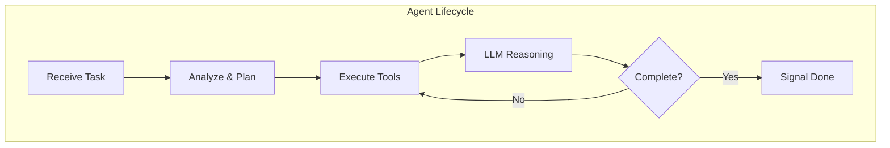
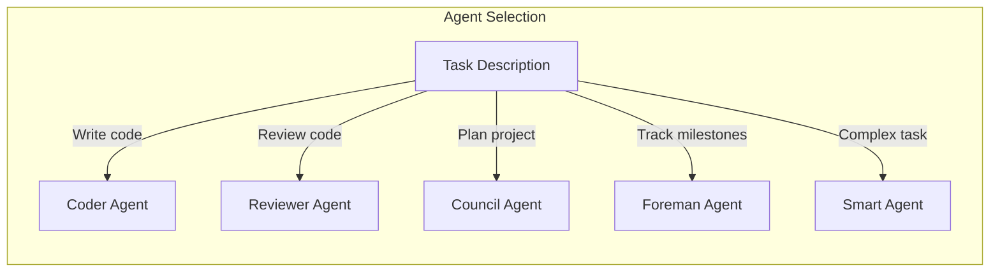
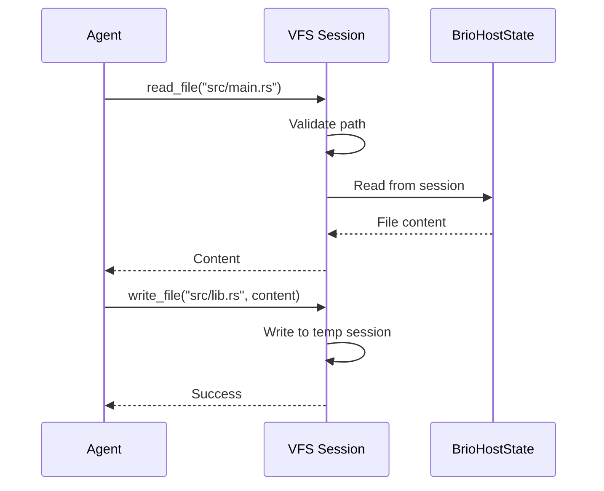
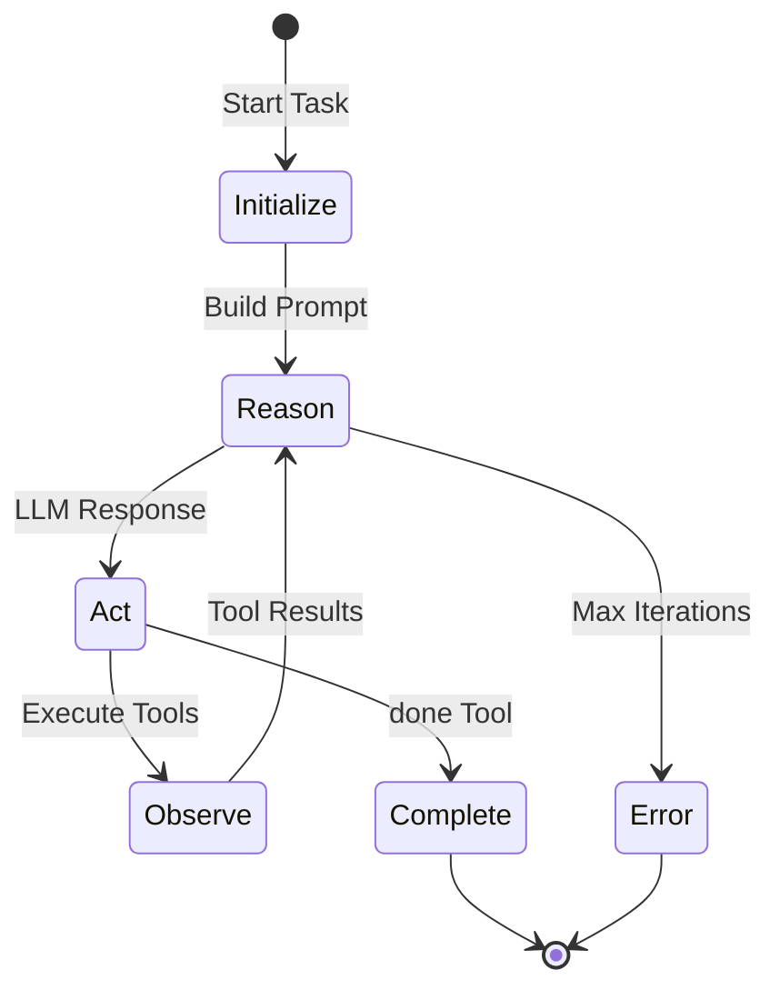
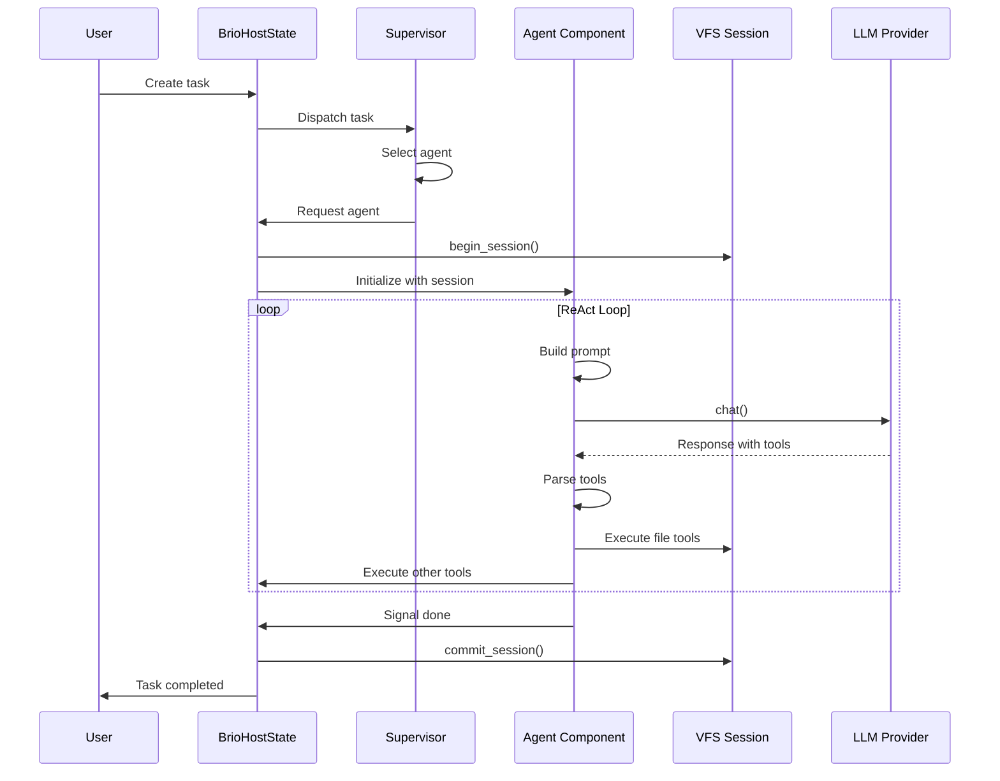

# Agents

Agents are the worker components in Brio-Kernel. They are WebAssembly components that perform AI-powered tasks such as code writing, review, planning, and more.

## What is an Agent?

An agent in Brio is a **stateful, autonomous WebAssembly component** that:

- Receives tasks via the service mesh
- Uses AI models (GPT-4, Claude, etc.) for reasoning
- Executes tools to interact with the filesystem and environment
- Follows a ReAct (Reasoning + Acting) loop pattern
- Reports completion via the `done` tool



## Agent Types

Brio includes 5 built-in agents, each optimized for specific tasks:

### Comparison Matrix

| Agent | Primary Role | Read | Write | Shell | Architecture | Use Case |
|-------|--------------|------|-------|-------|--------------|----------|
| **Coder** | Code writing | ✅ | ✅ | ❌ | StandardAgent | Writing new code, modifications |
| **Reviewer** | Code review | ✅ | ❌ | ❌ | StandardAgent | Safety-first code analysis |
| **Council** | Strategic planning | ❌ | ❌ | ❌ | StandardAgent | Task decomposition, planning |
| **Foreman** | Task orchestration | ❌ | ❌ | ❌ | Event-driven | Milestone tracking, task distribution |
| **Smart Agent** | General-purpose | ✅ | ✅ | ✅ | StandardAgent | Complex development tasks |



## Agent Capabilities

### File Operations

Agents can interact with the filesystem through the VFS session manager:



**Available Tools:**
- `read_file` - Read file contents
- `write_file` - Write content to file (Coder/Smart only)
- `ls` - List directory contents
- `shell` - Execute shell commands (Smart only, with allowlist)
- `done` - Mark task as complete

### AI Model Integration

All agents (except Foreman) use LLMs for reasoning:

```mermaid
graph LR
    Agent[Agent] -->|build_prompt| Prompt[Prompt Builder]
    Prompt -->|format| Formatted[Formatted Prompt]
    Formatted -->|chat()| LLM[LLM Provider]
    LLM -->|Response| Agent
    Agent -->|parse| Tools[Tool Parser]
    Tools -->|execute| Tool[Tool Execution]
```

**Supported Models:**
- OpenAI GPT-4, GPT-4 Turbo, GPT-3.5
- Anthropic Claude 3 (Opus, Sonnet, Haiku)
- Local models via Ollama (optional)

## Agent Architecture

### StandardAgent Pattern

Most agents implement the `StandardAgent` trait:

```rust
pub trait StandardAgent: Clone + Send + Sync {
    const NAME: &'static str;
    
    /// Build the prompt for the agent
    fn build_prompt(
        &self, 
        context: &TaskContext, 
        tools: &ToolRegistry,
        config: &StandardAgentConfig
    ) -> String;
    
    /// Create tool registry for this agent
    fn create_tool_registry(&self, 
        config: &AgentConfig
    ) -> ToolRegistry;
    
    /// Perform LLM inference
    fn perform_inference(
        &self, 
        model: &str, 
        history: &[Message]
    ) -> Result<InferenceResponse, AgentError>;
}
```

### ReAct Loop

The ReAct (Reasoning + Acting) loop is the core execution pattern:



**Workflow:**
1. **Initialize** - Set up context and tool registry
2. **Reason** - LLM analyzes situation and decides actions
3. **Act** - Execute tools (read, write, shell, etc.)
4. **Observe** - Collect tool results
5. **Complete** - Signal completion via `done` tool

## Agent Configuration

### Default Configuration

```toml
[agents]
max_iterations = 20
max_file_size = 1048576      # 1MB
max_depth = 10
timeout = 300
model = "gpt-4"

[agents.tools]
enable_write = true
enable_shell = false
```

### Per-Agent Configuration

```toml
# Coder Agent - Optimized for code writing
[agents.coder]
model = "gpt-4-turbo"
max_iterations = 30
enable_write = true

# Reviewer Agent - Read-only for safety
[agents.reviewer]
model = "gpt-4"
max_iterations = 10
enable_write = false  # Safety feature

# Council Agent - No file access needed
[agents.council]
model = "gpt-4"
max_iterations = 5

# Smart Agent - Full capabilities
[agents.smart]
model = "gpt-4"
max_iterations = 25
enable_write = true
enable_shell = true
shell_allowlist = ["cargo", "rustc", "python", "npm"]
```

## When to Use Each Agent

### Coder Agent

**Best for:**
- Writing new code from scratch
- Implementing features
- Refactoring existing code
- Fixing bugs

**Example Tasks:**
```json
{
  "agent": "coder",
  "content": "Implement a REST API endpoint for user authentication",
  "input_files": ["src/routes.rs"]
}
```

### Reviewer Agent

**Best for:**
- Code review and analysis
- Security audits
- Performance analysis
- Best practices validation

**Safety Feature:** The Reviewer Agent is intentionally **read-only** - it cannot modify code.

**Example Tasks:**
```json
{
  "agent": "reviewer",
  "content": "Review this authentication code for security vulnerabilities",
  "input_files": ["src/auth.rs"]
}
```

### Council Agent

**Best for:**
- Strategic planning
- Architecture decisions
- Task decomposition
- Milestone definition

**Note:** Council Agent has minimal tool access (only `done`) as it's designed for planning, not execution.

**Example Tasks:**
```json
{
  "agent": "council",
  "content": "Plan the architecture for a real-time chat application",
  "input_files": []
}
```

### Foreman Agent

**Best for:**
- Task distribution
- Milestone tracking
- Progress monitoring
- Event-driven workflows

**Architecture:** Event-driven (not StandardAgent), subscribes to pub-sub topics.

**Example Tasks:**
- Automatically creates tasks from milestone proposals
- Monitors task completion
- Distributes work to other agents

### Smart Agent

**Best for:**
- Complex development tasks
- Tasks requiring shell commands
- Full-stack development
- Research and exploration

**Features:**
- Full file read/write access
- Shell command execution (with allowlist)
- Most comprehensive tool set

**Example Tasks:**
```json
{
  "agent": "smart-agent",
  "content": "Set up a new Rust project with cargo, add dependencies, and create the main structure",
  "config": {
    "enable_shell": true,
    "shell_allowlist": ["cargo", "rustc"]
  }
}
```

## Agent Lifecycle



## Building Custom Agents

To create your own agent:

1. **Create a new WASM component** using the agent-sdk
2. **Implement the StandardAgent trait** (or custom logic for event-driven)
3. **Define your tool set** - which tools the agent can use
4. **Write prompts** - guide the LLM behavior
5. **Register with the supervisor** - so it can be dispatched

See [Creating Agents](../guides/creating-agents.md) for a complete tutorial.

## Security Considerations

### Read-Only Agents

The **Reviewer Agent** demonstrates an important security pattern: read-only operation. This prevents accidental or malicious code modification during analysis.

### Shell Access

Only the **Smart Agent** can execute shell commands, and only:
- When explicitly enabled (`enable_shell: true`)
- Commands are validated against an allowlist
- Dangerous commands are blocked

### File Size Limits

All agents respect file size limits to prevent:
- Excessive memory usage
- Accidental deletion of large files
- Denial of service

### Path Validation

All file paths are validated to prevent:
- Path traversal attacks (`../`)
- Access outside the VFS session
- Symlink attacks

## Monitoring and Debugging

### Agent Logs

Enable debug logging to see agent behavior:

```bash
RUST_LOG=debug cargo run --bin brio-kernel
```

### WebSocket Events

Monitor agent activity in real-time:

```json
{
  "type": "agent_event",
  "agent_id": "coder",
  "task_id": "task-001",
  "event": "tool_executed",
  "tool": "read_file",
  "path": "src/main.rs"
}
```

### Metrics

Track agent performance:

- Task completion rate
- Average execution time
- Tool usage statistics
- Error rates

## Best Practices

1. **Choose the Right Agent**: Use specialized agents for their intended purpose
2. **Set Appropriate Limits**: Configure max_iterations and timeouts
3. **Validate Output**: Always review agent-generated code
4. **Use Reviewer**: Have the Reviewer Agent check Coder Agent output
5. **Start Small**: Test agents on small tasks before complex ones
6. **Monitor Resources**: Watch file sizes and iteration counts

## Additional Resources

- **[Coder Agent](../api-reference/agents/coder.md)** - Detailed Coder Agent documentation
- **[Reviewer Agent](../api-reference/agents/reviewer.md)** - Detailed Reviewer Agent documentation
- **[Council Agent](../api-reference/agents/council.md)** - Detailed Council Agent documentation
- **[Foreman Agent](../api-reference/agents/foreman.md)** - Detailed Foreman Agent documentation
- **[Smart Agent](../api-reference/agents/smart-agent.md)** - Detailed Smart Agent documentation
- **[Creating Agents](../guides/creating-agents.md)** - Build your own agents
- **[Agent SDK](../api-reference/agent-sdk.md)** - SDK reference

---

Agents are the core workers in Brio-Kernel. Understanding their capabilities and choosing the right agent for each task is key to effective use of the system.
