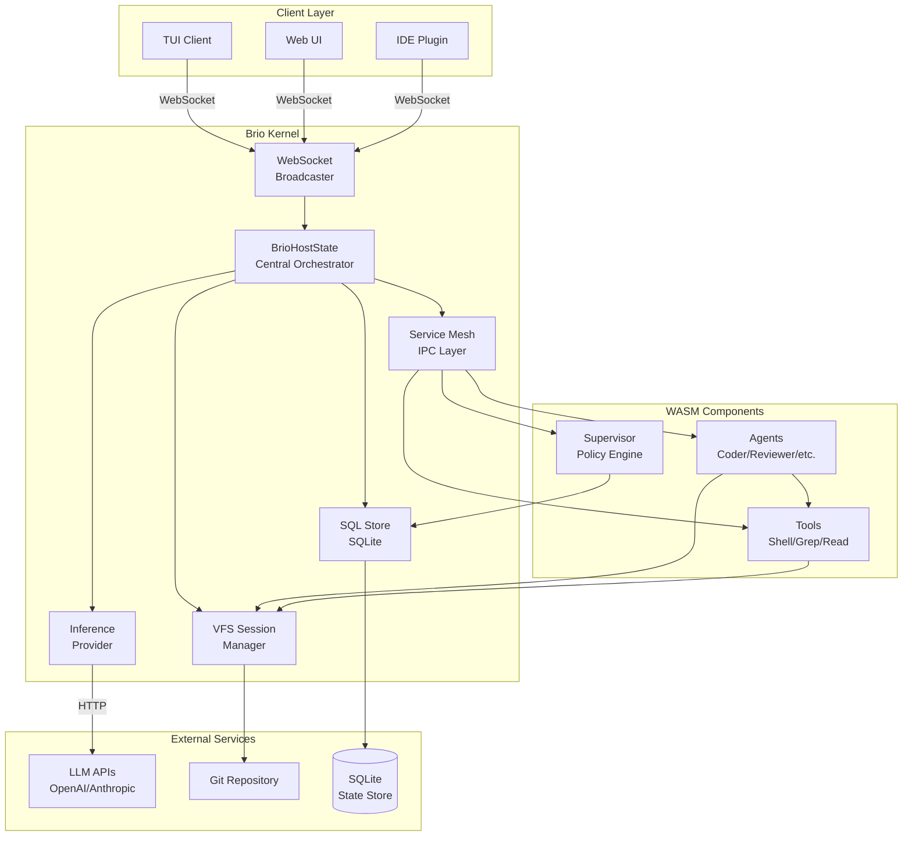
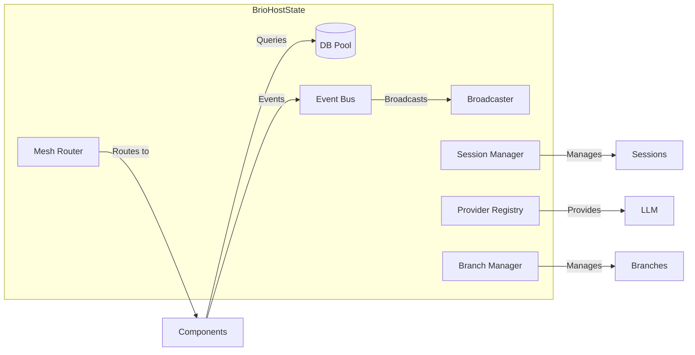
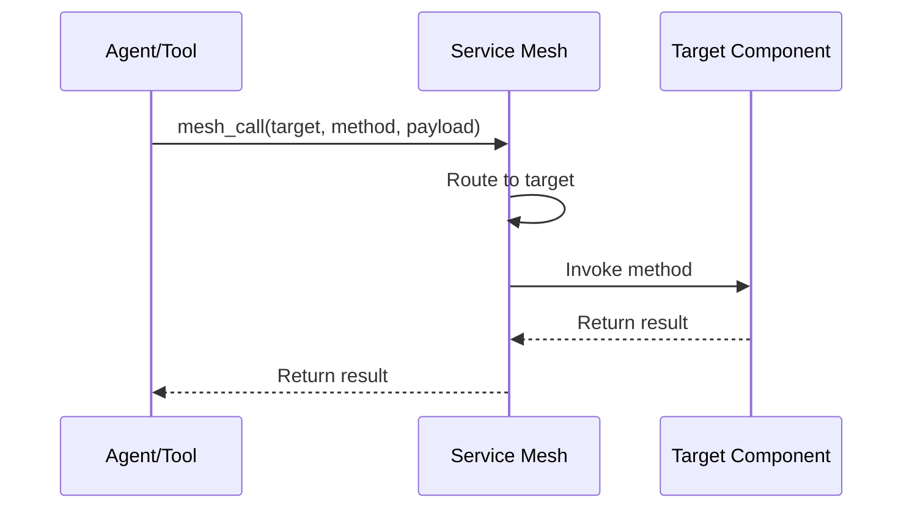
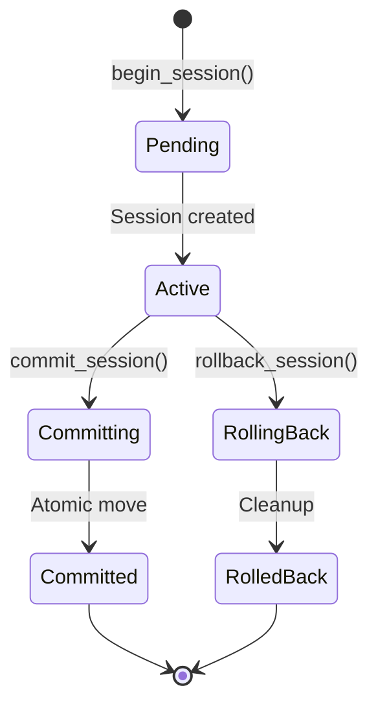
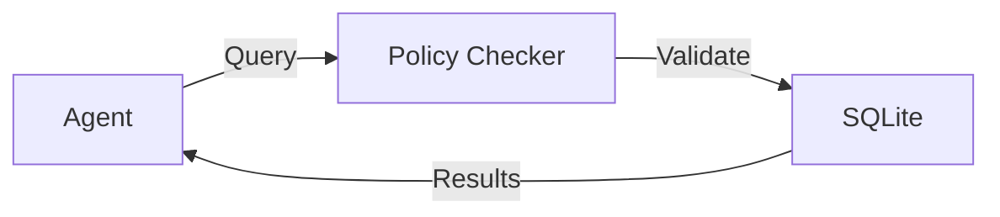
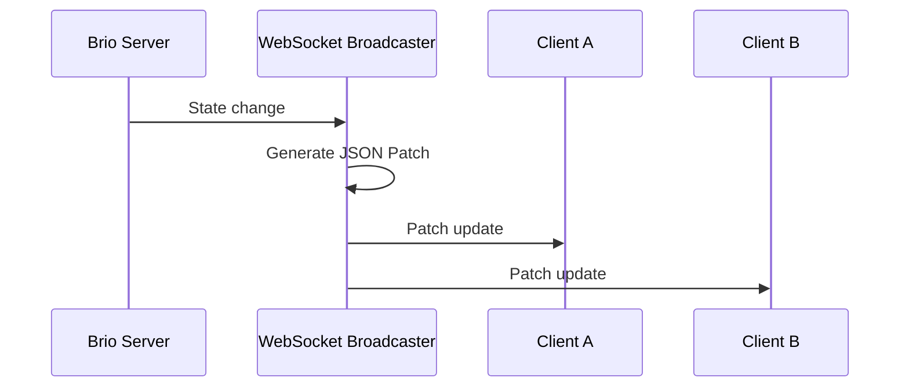
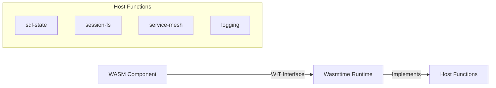
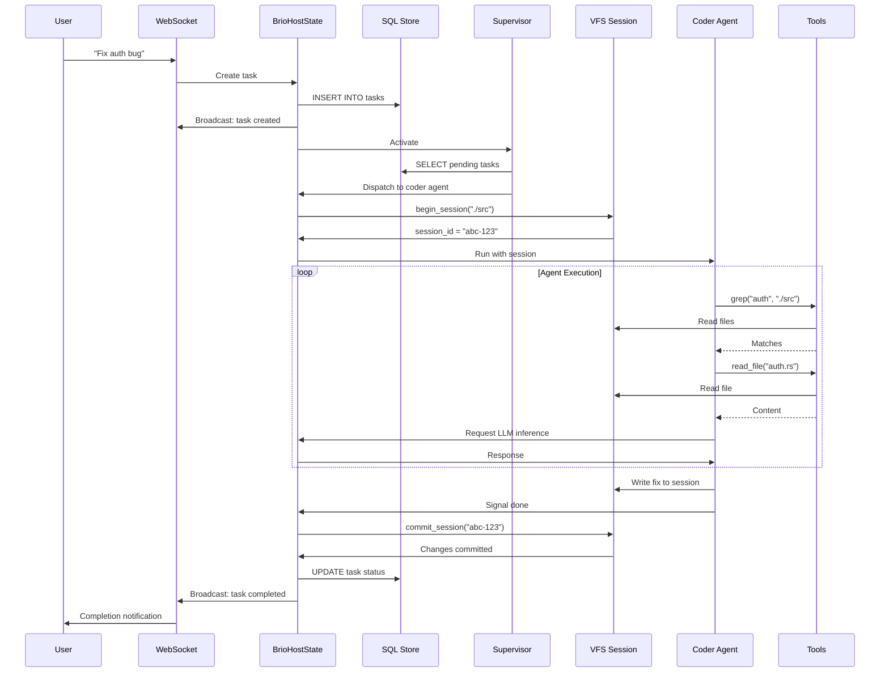
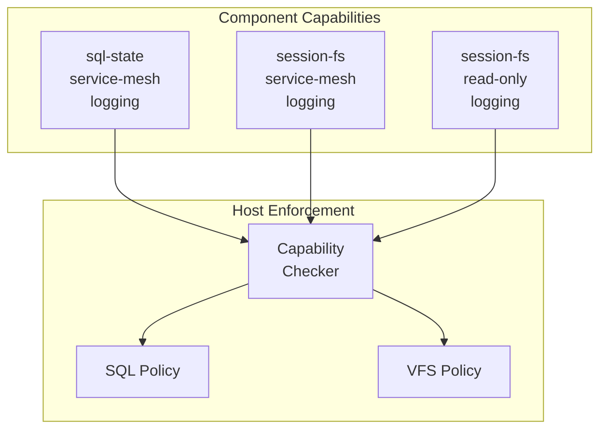
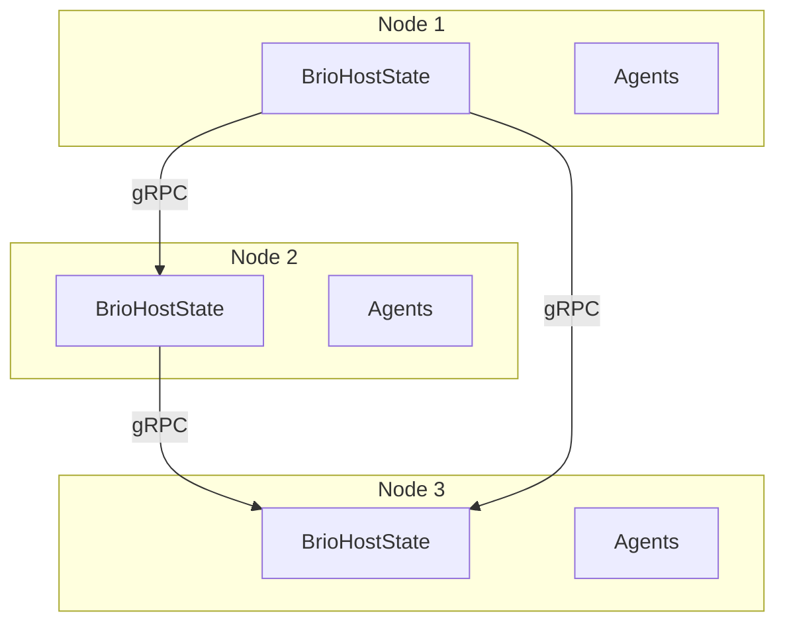

# Architecture

Brio-Kernel is designed as a strictly headless micro-kernel that orchestrates AI agents using the WebAssembly Component Model. This document explains the architecture, design principles, and system components.

## Design Principles

### 1. Security-First

All components run in sandboxed WebAssembly with capability-based access control:

- **WASM Sandbox**: Components cannot access host resources directly
- **Capability Model**: Each component declares required capabilities
- **Policy Enforcement**: SQL and VFS access is controlled at runtime
- **Input Validation**: All inputs are validated before processing

### 2. Zero-Copy Performance

Internal communication uses direct memory channels instead of serialization:

- **No HTTP Between Components**: Uses tokio mpsc channels
- **Shared Memory**: Large data transfers use zero-copy techniques
- **Minimal Serialization**: Protocol Buffers only at network boundaries

### 3. Atomic Operations

File changes are atomic with rollback capability:

- **Session-Based VFS**: Changes isolated in temp directories
- **Atomic Commit**: Move operations ensure consistency
- **Automatic Rollback**: Failed operations clean up automatically

## System Architecture



## Core Subsystems

### 1. BrioHostState

The central orchestrator managing all system state:



**Responsibilities:**
- Component lifecycle management
- Task routing and dispatch
- State synchronization
- Resource allocation

### 2. Service Mesh (IPC)

Zero-copy inter-component communication:



**Features:**
- Local routing via tokio mpsc
- Remote routing via gRPC (distributed mode)
- Automatic service discovery
- Load balancing
- Circuit breakers

### 3. VFS Session Manager

Copy-on-write workspace isolation:



**Workflow:**
1. `begin_session(base_path)` - Creates sandbox copy
2. Agent writes to `/tmp/brio/sess-{id}/`
3. `commit_session(id)` - Atomic move to original
4. `rollback_session(id)` - Discard changes

**Features:**
- Directory hashing for conflict detection
- Reflink support (copy-on-write) when available
- Automatic cleanup on failure

### 4. SQL Store

Policy-enforced SQLite access:



**Policy System:**
- Prefix-based table scoping
- Query validation with sqlparser
- Agent "coder" can only access `coder_*` tables
- Row-level security support

### 5. WebSocket Broadcaster

Real-time state distribution:



**Format:** JSON Patch (RFC 6902)
```json
{
  "op": "replace",
  "path": "/tasks/0/status",
  "value": "completed"
}
```

### 6. Inference Provider System

Multi-model LLM abstraction:

```mermaid
graph TB
    Agent[Agent] -->|chat()| Registry[Provider Registry]
    Registry -->|Select| OpenAI[OpenAI Provider]
    Registry -->|Select| Anthropic[Anthropic Provider]
    Registry -->|Select| Local[Local Provider]
    
    OpenAI -->|HTTP| OpenAI_API[OpenAI API]
    Anthropic -->|HTTP| Anthropic_API[Anthropic API]
    Local -->|HTTP| Ollama[Ollama/etc.]
```

**Features:**
- Retry logic with exponential backoff
- Rate limiting
- Circuit breaker pattern
- Provider fallback

### 7. WASM Component Runtime

Powered by Wasmtime:



## Data Flow Example

### Scenario: User Requests Bug Fix



## Directory Structure

```
brio-core/
├── Cargo.toml              # Workspace manifest
├── Cargo.lock
├── deny.toml               # Dependency policy
├── wit/                    # WIT interface definitions
│   ├── host.wit           # Core host interfaces
│   ├── mesh.wit           # Service mesh interfaces
│   ├── tools.wit          # Tool interfaces
│   └── brio.wit           # Main world definitions
├── kernel/                 # Rust host implementation
│   └── src/
│       ├── host/          # Host state and orchestration
│       ├── engine/        # Wasmtime runtime setup
│       ├── mesh/          # Service mesh implementation
│       ├── store/         # SQL store
│       ├── vfs/           # VFS session manager
│       ├── ws/            # WebSocket broadcaster
│       ├── inference/     # LLM provider abstraction
│       └── infrastructure/# Config, telemetry, server
├── components/             # WASM components
│   ├── supervisor/        # Policy engine
│   ├── agents/            # Agent implementations
│   │   ├── coder/
│   │   ├── reviewer/
│   │   ├── council/
│   │   ├── foreman/
│   │   └── smart-agent/
│   ├── agent-sdk/         # Shared SDK library
│   └── tools/             # Tool implementations
│       ├── shell-tool/
│       ├── tool_grep/
│       └── tool_read_file/
├── integration-tests/      # Integration tests
└── benches/               # Performance benchmarks
```

## Security Model

### Capability-Based Access Control



### Isolation Layers

1. **WASM Sandbox**: Memory isolation, no direct host access
2. **VFS Sessions**: File write isolation
3. **SQL Policy**: Table-level access control
4. **Permission Checker**: Runtime validation

## Performance Characteristics

| Metric | Target | Notes |
|--------|--------|-------|
| Task Dispatch Latency | <10ms | Local mesh routing |
| VFS Session Creation | <100ms | With reflink support |
| File Commit | <50ms | Atomic move |
| WebSocket Broadcast | <5ms | JSON patch diff |
| Agent Startup | <500ms | WASM instantiation |
| LLM Response | Varies | Depends on provider |

## Scalability Considerations

### Current Limits

- **Concurrent Agents**: Limited by system resources (default: 10)
- **File Size**: 10MB per file (configurable)
- **Session Count**: Limited by disk space
- **WebSocket Connections**: 1000+ (configurable)

### Distributed Mode

For horizontal scaling:



## Future Enhancements

### Implemented ✅

- ~~Distributed Mesh~~ - Multi-node service mesh
- ~~Multi-Model Support~~ - Concurrent LLM providers

### Planned 🚧

- **Component Hot-Reload** - Update agents without restart
- **Persistent Sessions** - Resume across restarts
- **Plugin System** - Third-party tool installation
- **Advanced Scheduling** - Priority queues, resource limits

## Additional Resources

- **[Security Model](../concepts/security-model.md)** - Detailed security documentation
- **[WIT Interfaces](../concepts/wit-interfaces.md)** - Interface definitions
- **[Distributed Mesh](../guides/distributed-mesh.md)** - Multi-node deployment
- **[Creating Agents](../guides/creating-agents.md)** - Build custom agents

---

This architecture enables Brio to provide a secure, high-performance platform for AI agent orchestration with strong isolation guarantees and flexible extensibility.
