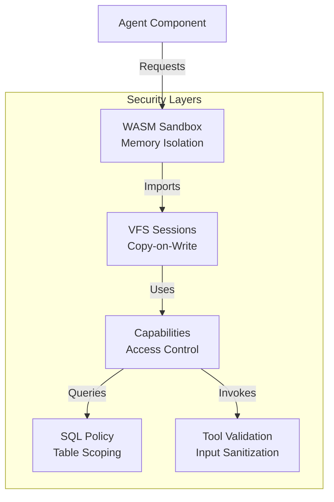
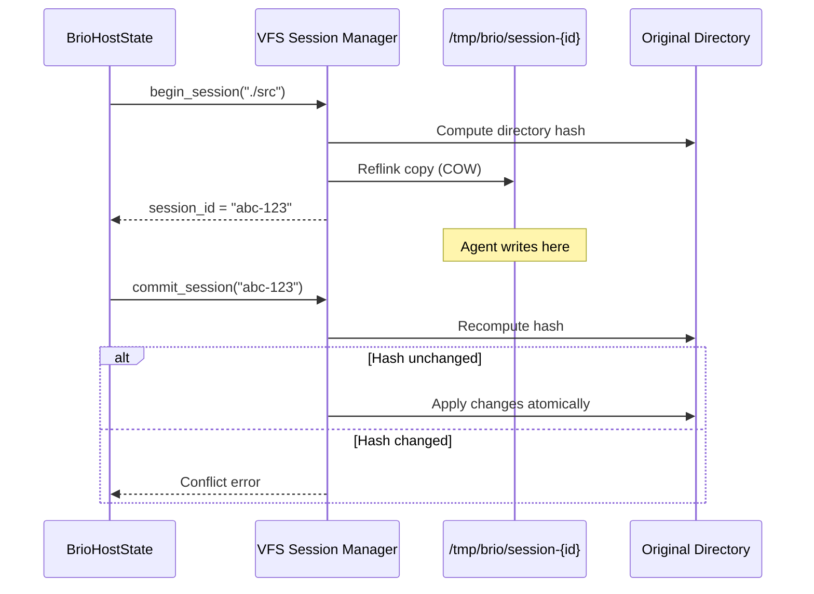
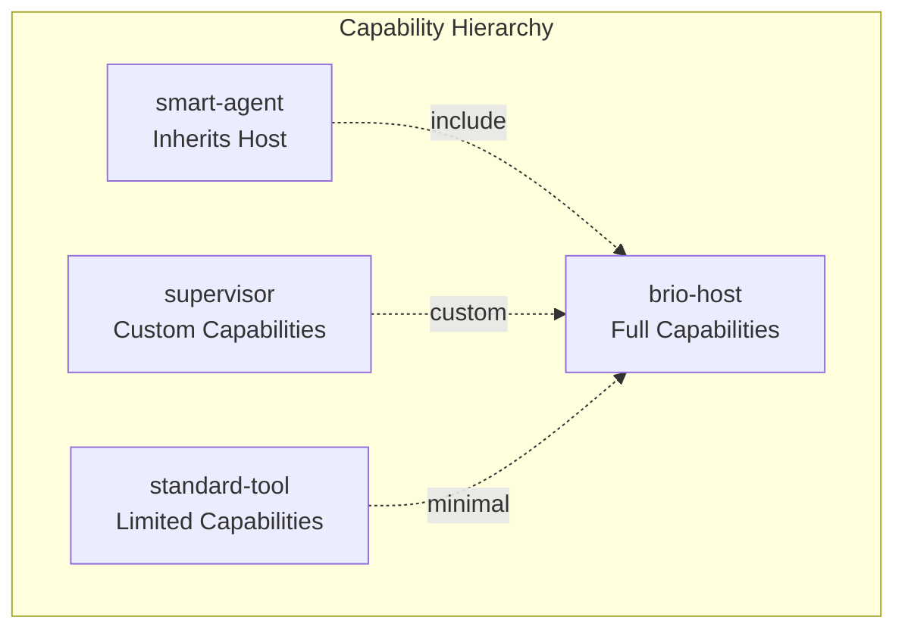

# Security Model

Brio-Kernel implements a defense-in-depth security architecture with multiple isolation layers. Security is not an afterthought—it is fundamental to the system design.

## Security Philosophy

Brio follows the **principle of least privilege** combined with **defense in depth**. Every component operates with only the permissions it needs, and multiple security layers ensure that a failure at one layer does not compromise the entire system.

### Threat Model

Brio-Kernel operates within the following threat model:

| Threat Category | Description | Risk Level |
|-----------------|-------------|------------|
| Malicious Agents | Agents may attempt to access unauthorized resources | High |
| Tool Exploitation | Tools may be manipulated to perform unintended actions | Medium |
| Data Exfiltration | Agents may try to access sensitive files outside their scope | High |
| Prompt Injection | LLM inputs may contain malicious instructions | Medium |
| Supply Chain | Compromised WASM components | Low (trusted source) |



## WASM Sandbox Isolation

All Brio components run as WebAssembly (WASM) components within the Wasmtime runtime. This provides the foundation of the security model.

### Memory Isolation

WASM provides complete memory isolation through its linear memory model:

- Each component has its own isolated memory space
- No direct access to host memory or other components' memory
- Memory bounds are enforced at runtime by the WASM VM
- Buffer overflows within a component cannot escape the sandbox

### No Direct Host Access

WASM components cannot directly access host resources:

```rust
// This would NOT work in a WASM component - no direct filesystem access
use std::fs::File;  // Not available in WASM

// Instead, components must use WIT interfaces
let content = brio::core::session_fs_ops::read_file(session_id, path)?;
```

### Capability-Based Interface Imports

Components explicitly declare their required capabilities through WIT imports:

```wit
// Example: An agent's required capabilities
world smart-agent {
    import service-mesh;     // Can call other services
    import session-fs;       // Can create sessions
    import session-fs-ops;   // Can read/write files
    import sql-state;        // Can query database
    import logging;          // Can log events
    import brio:ai/inference; // Can call LLMs
}
```

### Compile-Time Capability Verification

The WASM Component Model verifies capabilities at compile time:

- A component cannot import interfaces not declared in its world
- Missing imports result in compilation errors
- The host runtime only provides implementations for declared imports

## VFS Session Isolation

The Virtual File System (VFS) provides session-based workspace isolation for file operations.

### Copy-on-Write Workspace Sessions

Each agent operates within an isolated session:



### Session Isolation Benefits

1. **Prevents Cross-Contamination**: Changes in one session do not affect others
2. **Atomic Operations**: All changes are applied atomically on commit
3. **Conflict Detection**: Directory hashing detects concurrent modifications
4. **Automatic Cleanup**: Failed sessions are automatically rolled back

### Atomic Commit/Rollback

Sessions provide ACID-like properties:

- **Atomic**: Changes are applied as a single operation
- **Consistent**: Conflict detection ensures consistency
- **Isolated**: Sessions do not interfere with each other
- **Durable**: Committed changes are persisted

```rust
// Example: Session lifecycle
let session_id = vfs.begin_session("./src")?;

// Agent makes changes in the session
tool.write_file(&session_id, "file.rs", content)?;

// Commit or rollback
try {
    vfs.commit_session(&session_id)?;  // Atomic apply
} catch {
    vfs.rollback_session(&session_id)?; // Discard changes
}
```

### Session Lifecycle Security

Sessions have strict lifecycle management:

| State | Description | Security Property |
|-------|-------------|-------------------|
| Pending | Session being created | No access yet |
| Active | Session ready for use | Validated base path |
| Committing | Changes being applied | Hash verification |
| Committed | Changes persisted | Atomic move |
| RollingBack | Changes discarded | Complete cleanup |

## Capability-Based Access Control

Brio uses WIT interface imports as capabilities. This is a form of capability-based security where possessing an import grants the right to use that functionality.

### What Are Capabilities

In Brio, capabilities are WIT interface imports:

```wit
// Capability: Database access
import sql-state;

// Capability: Session filesystem
import session-fs;

// Capability: Service mesh communication
import service-mesh;
```

### How Capabilities Are Granted

Capabilities are granted at compile time through world composition:

```wit
// brio-host world has all capabilities
world brio-host {
    import service-mesh;
    import sql-state;
    import session-fs;
    import brio:ai/inference;
    import logging;
    import planner;
    import pub-sub;
}

// smart-agent includes brio-host and adds agent-runner
world smart-agent {
    include brio-host;
    export agent-runner;
    export event-handler;
}
```

### World Composition and Capability Inheritance

Components inherit capabilities through world inclusion:



### Runtime Capability Enforcement

The host runtime enforces capabilities at the interface level:

```rust
// Host checks SQL access at runtime
if !policy.authorize(scope, sql) {
    return Err("Access denied: table outside scope");
}

// Host validates session ownership
if session.owner != caller_id {
    return Err("Session not owned by caller");
}
```

### Agent Capability Matrix

Different agents have different capabilities:

| Agent | File Read | File Write | SQL Access | Shell | LLM |
|-------|-----------|------------|------------|-------|-----|
| Supervisor | No | No | Yes (all tables) | No | Yes |
| Coder | Yes | Yes | Yes (scoped) | Limited | Yes |
| Reviewer | Yes | **No** | Yes (scoped) | No | Yes |
| Foreman | Yes | No | Yes (scoped) | Limited | Yes |
| Tool | Yes | Limited | No | Limited | No |

## SQL Policy Enforcement

Database access is controlled through policy enforcement that validates queries before execution.

### Table Scoping (Prefix-Based)

Agents can only access tables matching their scope prefix:

```rust
// Policy: agent "coder" can only access tables starting with "coder_"
let sql = "SELECT * FROM coder_tasks WHERE status = 'pending'";
assert!(policy.authorize("coder", sql).is_ok());

// This would be rejected
let sql = "SELECT * FROM system_config";
assert!(policy.authorize("coder", sql).is_err());
```

### Query Validation

SQL queries are parsed and validated using `sqlparser`:

```rust
impl QueryPolicy for PrefixPolicy {
    fn authorize(&self, scope: &str, sql: &str) -> Result<(), PolicyError> {
        let ast = Parser::parse_sql(&dialect, sql)?;
        
        for statement in ast {
            // Visitor traverses AST to find all table references
            let mut visitor = TableVisitor { scope };
            statement.visit(&mut visitor)?;
        }
        Ok(())
    }
}
```

### Agent-Specific Table Access

Each agent type has its own table prefix:

| Agent | Table Prefix | Example Tables |
|-------|--------------|----------------|
| Supervisor | `supervisor_` | supervisor_tasks, supervisor_agents |
| Coder | `coder_` | coder_changes, coder_sessions |
| Reviewer | `reviewer_` | reviewer_findings, reviewer_checks |

### Preventing SQL Injection

The policy system provides defense against SQL injection:

1. **Parsed Queries**: All queries are parsed into AST before validation
2. **Parameterized Queries**: Use placeholders for values
3. **Table Name Validation**: Only validated table names are allowed
4. **Statement Type Restrictions**: DDL statements may be restricted

```rust
// Safe: Uses parameters
let sql = "SELECT * FROM coder_tasks WHERE id = ?";
store.query(scope, sql, &[&task_id])?;

// Policy validates even with injection attempt
let sql = "SELECT * FROM coder_tasks WHERE id = 1; DROP TABLE supervisor_config;";
// Rejected: Cannot access supervisor_config
```

## Tool Security Validation

Tools implement security validation to prevent common attack vectors.

### Path Traversal Protection

All file operations block path traversal attempts:

```rust
pub fn validate_path(path: &str, base_dir: &Path) -> Result<PathBuf, FileSystemError> {
    // Check for parent directory references
    for component in path.components() {
        if let Component::ParentDir = component {
            return Err(FileSystemError::PathTraversal { path });
        }
    }
    
    // Ensure resolved path is within base directory
    let resolved = base_dir.join(path);
    let canonical = resolved.canonicalize()?;
    if !canonical.starts_with(base_dir) {
        return Err(FileSystemError::PathTraversal { path });
    }
    
    Ok(resolved)
}
```

Blocked patterns:
- `../etc/passwd` → Blocked
- `safe/../../../etc/passwd` → Blocked
- `/etc/passwd` → Blocked (absolute paths)

### File Size Limits

Large files are rejected to prevent DoS attacks:

```rust
const MAX_FILE_SIZE: u64 = 10 * 1024 * 1024; // 10MB

pub fn validate_file_size(path: &Path, max_size: u64) -> Result<(), FileSystemError> {
    let metadata = std::fs::metadata(path)?;
    if metadata.len() > max_size {
        return Err(FileSystemError::FileTooLarge { 
            path, 
            size, 
            max_size 
        });
    }
    Ok(())
}
```

### Shell Command Allowlists

Shell commands are validated against allowlists:

```rust
pub fn validate_shell_command(
    command: &str,
    allowlist: &[impl AsRef<str>],
) -> Result<(), ToolError> {
    let first_word = command.split_whitespace().next().unwrap_or(command);
    
    if !allowlist.iter().any(|prefix| first_word == prefix.as_ref()) {
        return Err(ToolError::Blocked {
            tool: "shell",
            reason: format!("Command '{first_word}' not allowed"),
        });
    }
    Ok(())
}
```

### Dangerous Command Blocking

Dangerous commands are blocked at multiple layers:

```rust
// Shell tool blocks dangerous commands
const DANGEROUS_COMMANDS: &[&str] = &["rm", "mkfs", "dd", "format", "fdisk"];

fn validate_command(command: &str) -> Result<(), ShellError> {
    let cmd_lower = command.to_lowercase();
    if DANGEROUS_COMMANDS.iter().any(|&d| cmd_lower.starts_with(d)) {
        return Err(ShellError::DangerousCommand(command.to_string()));
    }
    Ok(())
}
```

### Shell Metacharacter Blocking

Command injection is prevented by blocking metacharacters:

```rust
const DANGEROUS_CHARS: &[char] = &['|', ';', '&', '$', '`', '>', '<', '(', ')'];

if command.chars().any(|c| DANGEROUS_CHARS.contains(&c)) {
    return Err(ShellError::DangerousCommand(
        "Command contains shell metacharacters".to_string()
    ));
}
```

Blocked patterns:
- `ls|cat /etc/passwd` → Blocked
- `echo; rm -rf /` → Blocked
- `cmd && rm -rf /` → Blocked

### Pattern Length Limits

To prevent ReDoS attacks, pattern lengths are limited:

```rust
const MAX_PATTERN_LENGTH: usize = 1000;

if pattern.len() > MAX_PATTERN_LENGTH {
    return Err(ToolError::InvalidInput("Pattern too long".to_string()));
}
```

## Read-Only Agent Pattern

The Reviewer Agent demonstrates the read-only security pattern.

### Reviewer Agent Implementation

```rust
impl StandardAgent for ReviewerAgent {
    fn create_tool_registry(&self, config: &AgentConfig) -> ToolRegistry {
        let mut registry = ToolRegistry::new();
        
        // Read tools only - NO write tool
        registry.register("read_file", Box::new(ReadFileTool::new(max_size)), parser);
        registry.register("ls", Box::new(ListDirectoryTool::new(max_depth)), parser);
        registry.register("done", Box::new(DoneTool), parser);
        
        // INTENTIONALLY OMITTED: write_file
        // This prevents accidental modifications during review
        
        registry
    }
}
```

### Why Read-Only Is Valuable

1. **Prevents Accidental Changes**: Reviewers cannot accidentally modify code
2. **Reduces Attack Surface**: Less functionality means fewer vulnerabilities
3. **Clear Intent**: The agent's purpose is clear from its capabilities
4. **Easier Auditing**: Read-only operations are simpler to audit

### When to Use Read-Only Agents

Use read-only agents for:

- **Code Review**: Analyzing code without modifying it
- **Audit**: Reviewing security or compliance
- **Analysis**: Static analysis and reporting
- **Monitoring**: Observing system state
- **Reporting**: Generating reports without side effects

## Audit and Logging

Brio provides comprehensive logging for security monitoring.

### Structured Logging Interface

```witnterface logging {
    enum level {
        trace, debug, info, warn, error
    }
    
    log: func(level: level, context: string, message: string);
}
```

### What Gets Logged

| Event | Level | Context | Details |
|-------|-------|---------|---------|
| Session Created | Info | vfs-session | Session ID, base path |
| Session Committed | Info | vfs-session | Session ID, changes count |
| Session Rolled Back | Info | vfs-session | Session ID, reason |
| SQL Query | Debug | sql-state | Scope, query (sanitized) |
| SQL Violation | Warn | sql-policy | Scope, attempted table |
| Tool Execution | Info | tool-{name} | Tool, params (sanitized) |
| Tool Blocked | Warn | tool-validation | Tool, reason |
| Agent Started | Info | agent-{name} | Agent, task ID |
| Agent Completed | Info | agent-{name} | Agent, result |

### Security Event Monitoring

Monitor for these security events:

```bash
# Watch for policy violations
journalctl -u brio -f | grep "Access Denied"

# Monitor for blocked tools
tail -f /var/log/brio.log | grep "ToolError::Blocked"

# Track session anomalies
grep "Conflict detected" /var/log/brio.log
```

## Security Best Practices

### Agent Configuration Guidelines

```rust
// security_config.rs
pub struct AgentSecurityConfig {
    /// Maximum file size an agent can read
    pub max_file_size: u64,
    
    /// Maximum directory depth for listing
    pub max_depth: u32,
    
    /// Allowed shell commands (empty = no shell)
    pub shell_allowlist: Vec<String>,
    
    /// SQL table prefix for this agent
    pub sql_scope: String,
    
    /// Whether agent can write files
    pub allow_write: bool,
}

impl AgentSecurityConfig {
    /// Read-only reviewer configuration
    pub fn reviewer() -> Self {
        Self {
            max_file_size: 10 * 1024 * 1024,
            max_depth: 10,
            shell_allowlist: vec![],  // No shell
            sql_scope: "reviewer".to_string(),
            allow_write: false,  // Read-only
        }
    }
    
    /// Full-capability coder configuration
    pub fn coder() -> Self {
        Self {
            max_file_size: 10 * 1024 * 1024,
            max_depth: 20,
            shell_allowlist: vec!["ls", "cat", "grep", "find"],
            sql_scope: "coder".to_string(),
            allow_write: true,
        }
    }
}
```

### Shell Access Management

1. **Principle of Least Privilege**: Only grant shell access when necessary
2. **Allowlist Over Denylist**: Explicitly allow commands rather than blocking dangerous ones
3. **Regular Audits**: Review shell command logs
4. **Minimal Arguments**: Limit argument complexity

```rust
// Good: Restrictive allowlist
pub const SAFE_COMMANDS: &[&str] = &["ls", "cat", "echo", "grep", "find"];

// Bad: Trying to block all dangerous commands
pub const DANGEROUS_COMMANDS: &[&str] = &["rm", "mkfs", "dd", "format", "fdisk"];
// Problem: What about "sudo rm", "shred", "wipe", etc.?
```

### File Size Limits

Configure appropriate limits for your use case:

| Use Case | Max File Size | Max Lines | Reason |
|----------|---------------|-----------|--------|
| Code Review | 10MB | 10,000 | Prevent DoS |
| Log Analysis | 100MB | 100,000 | Logs can be large |
| Binary Processing | 50MB | N/A | Binary files |
| Documentation | 5MB | 5,000 | Text only |

### Network Security

When Brio communicates with external LLM providers:

1. **Use TLS**: Always use HTTPS for API calls
2. **API Key Management**: Store keys in environment variables, not code
3. **Rate Limiting**: Implement request rate limits
4. **Request Validation**: Validate LLM responses before processing

```rust
// Good: API key from environment
let api_key = std::env::var("OPENAI_API_KEY")
    .expect("OPENAI_API_KEY not set");

// Bad: Hardcoded API key
let api_key = "sk-1234567890abcdef";  // Never do this!
```

## Threat Mitigation Matrix

| Threat | Mitigation Layer | How It Works |
|--------|------------------|--------------|
| **Path Traversal** | Tool validation | Path canonicalization and `../` blocking |
| **Directory Escape** | VFS sessions | Isolated temp directories with base path validation |
| **SQL Injection** | SQL policy | Query parsing and table prefix validation |
| **Unauthorized Table Access** | SQL policy | Prefix-based scoping (`agent_*`) |
| **Memory Corruption** | WASM sandbox | Linear memory with bounds checking |
| **Host Resource Access** | WASM sandbox | No direct system calls |
| **Command Injection** | Tool validation | Shell metacharacter blocking |
| **Destructive Commands** | Tool validation | Dangerous command denylist |
| **File Size DoS** | Tool validation | Size limits before reading |
| **ReDoS (Regex DoS)** | Tool validation | Pattern length limits |
| **Cross-Session Contamination** | VFS sessions | Copy-on-write isolation |
| **Concurrent Modification** | VFS sessions | Directory hash conflict detection |
| **Privilege Escalation** | Capabilities | Compile-time import restrictions |
| **Unauthorized Agent Actions** | Capabilities | World composition enforcement |

## Security Checklist

When deploying Brio-Kernel:

- [ ] Review agent capability configurations
- [ ] Set appropriate file size limits
- [ ] Configure shell command allowlists
- [ ] Enable comprehensive logging
- [ ] Set up security event monitoring
- [ ] Regularly audit SQL access patterns
- [ ] Review session lifecycle logs
- [ ] Validate VFS cleanup is working
- [ ] Test conflict detection
- [ ] Verify WASM sandbox is active

## Reporting Security Issues

If you discover a security vulnerability:

1. Do not open a public issue
2. Email security@brio.dev with details
3. Include reproduction steps if possible
4. Allow time for remediation before disclosure

---

**Remember**: Security is a process, not a product. Regular reviews and updates are essential to maintaining a secure system.
