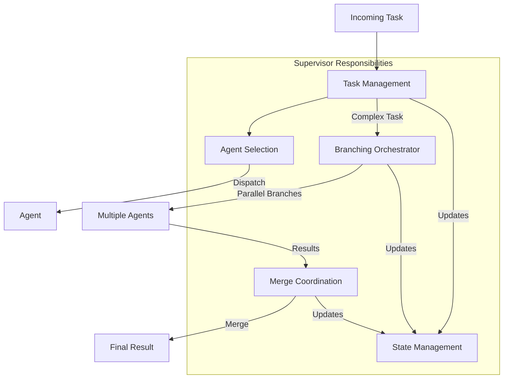
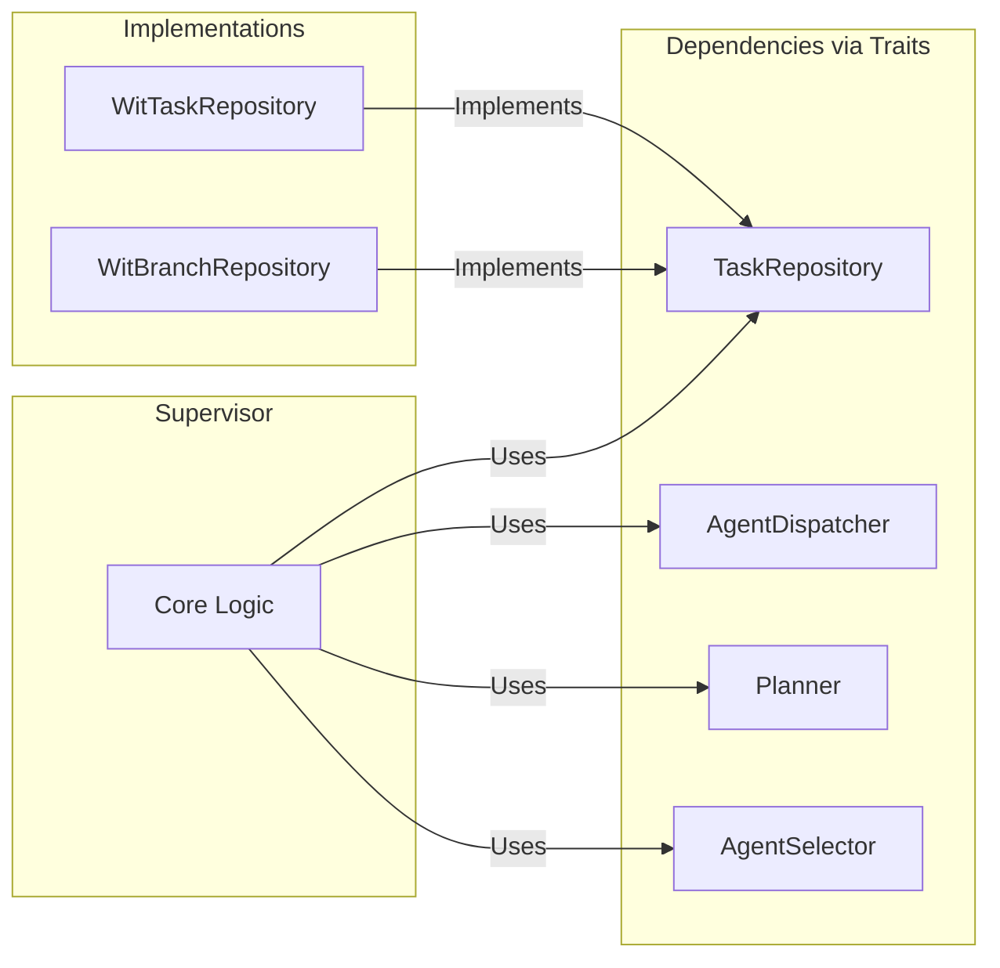
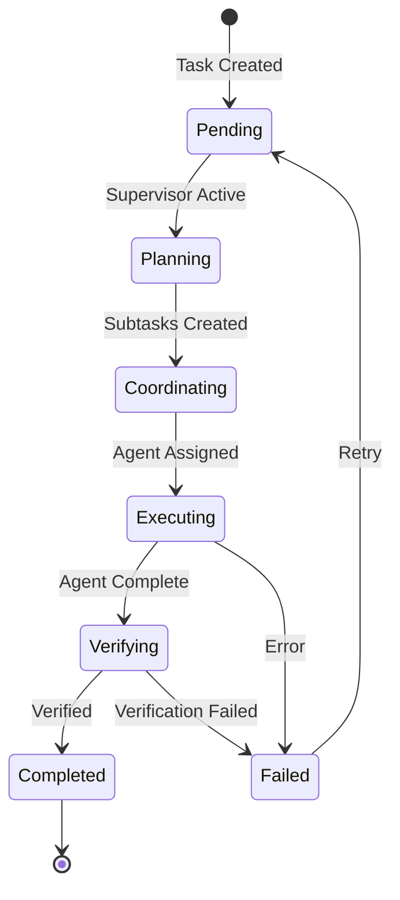
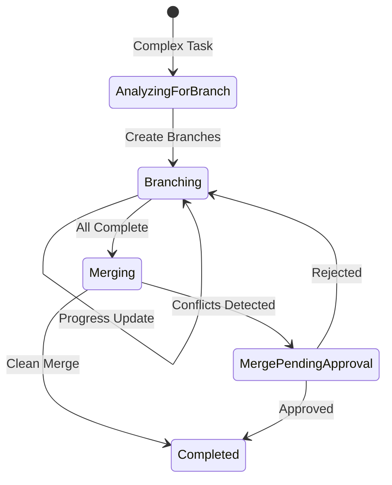
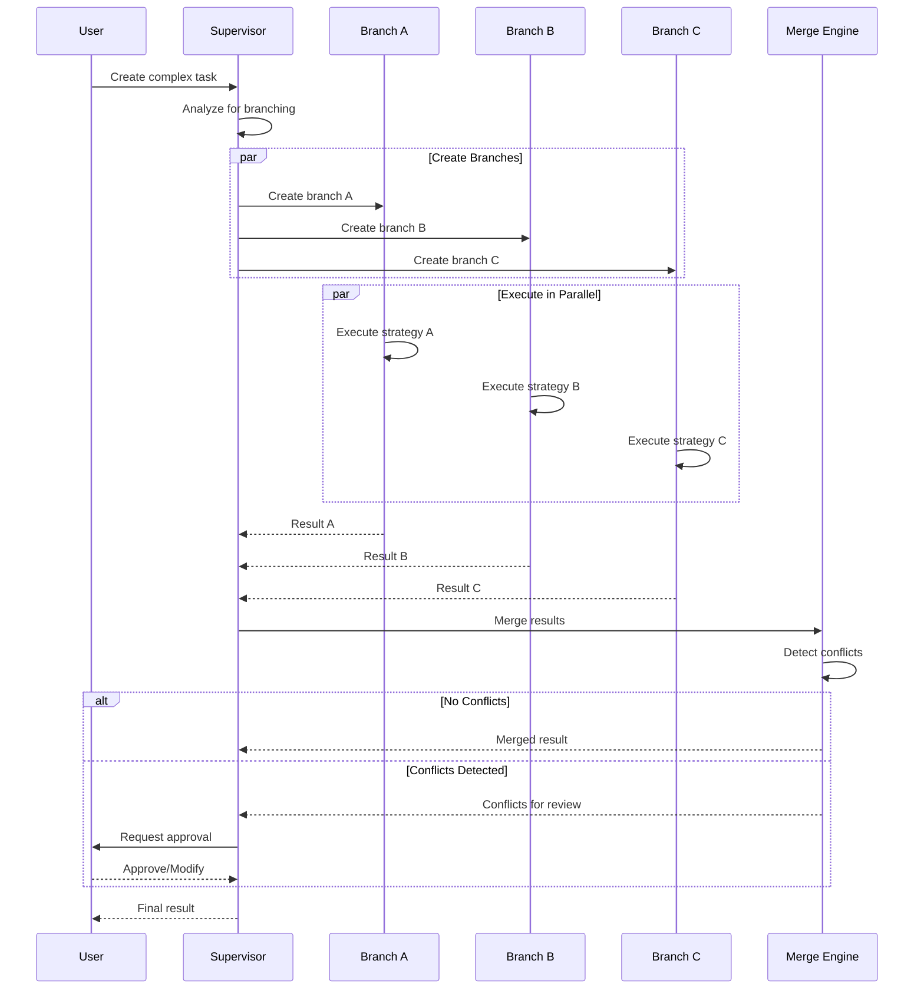
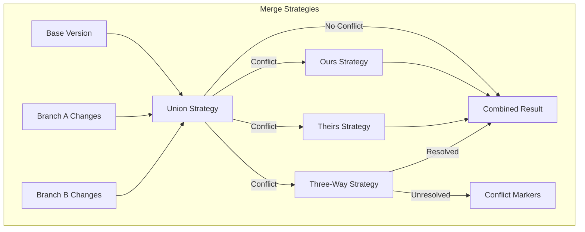
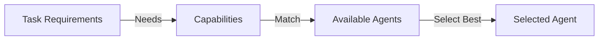
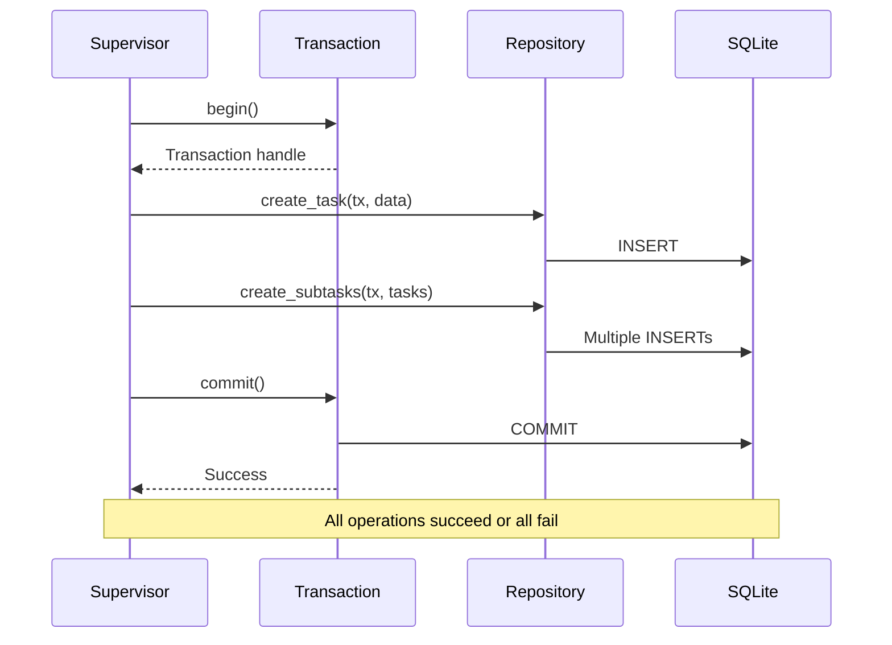
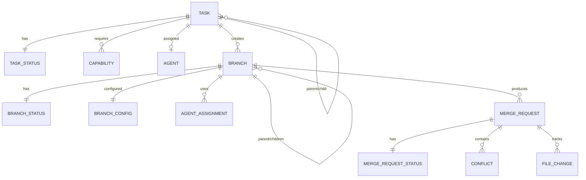

# Supervisor

The Supervisor is the orchestration brain of Brio-Kernel. It manages task lifecycle, coordinates agents, and implements sophisticated branching and merging workflows.

## What is the Supervisor?

The Supervisor is a **WebAssembly component** that serves as the central coordination layer for:

- **Task Management** - Fetching, dispatching, and tracking tasks
- **Agent Selection** - Intelligently matching tasks to appropriate agents
- **Branching Orchestration** - Enabling parallel task execution
- **Merge Coordination** - Handling conflict detection and resolution
- **State Management** - Maintaining task and branch state machines



## Architecture

The Supervisor uses **dependency injection** for all dependencies:



This design allows for:
- **Testing** - Mock implementations for unit tests
- **Flexibility** - Swappable implementations
- **WIT Integration** - Clean separation from host concerns

## Task Lifecycle

Tasks move through a well-defined state machine:



### Task States

| State | Description | Transition To |
|-------|-------------|---------------|
| **Pending** | Waiting to be processed | Planning |
| **Planning** | Decomposing into subtasks | Coordinating |
| **Coordinating** | Assigning to agents | Executing |
| **Executing** | Agent is working | Verifying, Failed |
| **Verifying** | Validating results | Completed, Failed |
| **Completed** | Successfully finished | - |
| **Failed** | Error occurred | Pending (retry) |

### Branching Task States

For complex tasks requiring parallel execution:



## Branching Orchestrator

The branching orchestrator enables **parallel execution** of tasks:



### Branch Configuration

```rust
pub struct BranchConfig {
    /// Human-readable branch name
    pub name: String,
    /// Assigned agents for this branch
    pub agents: Vec<AgentAssignment>,
    /// Execution strategy
    pub execution_strategy: ExecutionStrategy,
    /// Auto-merge without approval
    pub auto_merge: bool,
    /// Merge strategy to use
    pub merge_strategy: String,
}

pub enum ExecutionStrategy {
    /// Execute agents sequentially
    Sequential,
    /// Execute agents in parallel
    Parallel { max_concurrent: u32 },
}
```

### Example: Implementing a Feature

```toml
# Branch configuration for feature implementation
[[branches]]
name = "approach-a"
agents = ["coder", "reviewer"]
execution_strategy = { type = "Sequential" }
merge_strategy = "union"

[[branches]]
name = "approach-b"
agents = ["smart-agent"]
execution_strategy = { type = "Parallel", max_concurrent = 2 }
merge_strategy = "union"
auto_merge = false
```

## Merge Strategies

The Supervisor supports 4 merge strategies for combining branch results:

| Strategy | Description | Use Case |
|----------|-------------|----------|
| **Union** | Combines non-conflicting changes | Default, general purpose |
| **Ours** | Prefers base version on conflict | Conservative updates |
| **Theirs** | Prefers branch version on conflict | Accept branch changes |
| **Three-Way** | Line-level conflict detection | Precise control |



See [Merge Strategies](../guides/merge-strategies.md) for detailed documentation.

## Agent Selection

The Supervisor intelligently matches tasks to agents based on:

### Capability-Based Selection



**Example:**
```rust
// Task requires file writing
if task.requires_write_access() {
    candidates.retain(|a| a.has_capability("write_file"));
}

// Task involves shell commands
if task.requires_shell() {
    candidates.retain(|a| a.has_capability("shell"));
}
```

### Selection Methods

1. **Capability-Based** (default) - Match task requirements to agent capabilities
2. **Round-Robin** - Distribute evenly across agents
3. **Random** - Random selection (for testing)

## Transaction System

The Supervisor implements database transactions for atomic operations:



### Transaction Safety

- **Auto-Rollback**: Transactions automatically rollback if not committed
- **Error Handling**: Proper error conversion and propagation
- **WIT Compatibility**: Works with WIT sql-state interface

```rust
// Manual control
let mut tx = Transaction::begin()?;
tx.execute("INSERT INTO tasks ...", &params)?;
tx.commit()?;

// Closure API (auto commit/rollback)
repo.with_transaction(|tx| {
    tx.execute("INSERT ...", &params)?;
    tx.execute("UPDATE ...", &params)?;
    Ok(())
})?;
```

## Domain Model

### Core Entities



### Key Types

**Task:**
```rust
pub struct Task {
    pub id: TaskId,
    pub content: String,
    pub priority: Priority,
    pub status: TaskStatus,
    pub parent_id: Option<TaskId>,
    pub assigned_agent: Option<AgentId>,
    pub required_capabilities: HashSet<Capability>,
}
```

**Branch:**
```rust
pub struct Branch {
    pub id: BranchId,
    pub parent_id: Option<BranchId>,
    pub session_id: String,
    pub name: String,
    pub status: BranchStatus,
    pub children: Vec<BranchId>,
    pub config: BranchConfig,
    pub created_at: DateTime<Utc>,
    pub completed_at: Option<DateTime<Utc>>,
    pub execution_result: Option<BranchResult>,
    pub merge_result: Option<MergeResult>,
}
```

## Configuration

### TOML Configuration

```toml
[supervisor]
enabled = true
poll_interval = 5  # seconds

# Branching
max_concurrent_branches = 5
auto_merge = false

# Merge strategy
merge_strategy = "union"

# Agent selection
[supervisor.agent_selection]
method = "capability"
```

### Environment Variables

```bash
export BRIO_SUPERVISOR_ENABLED=true
export BRIO_SUPERVISOR_POLL_INTERVAL=5
export BRIO_SUPERVISOR_MAX_CONCURRENT_BRANCHES=5
export BRIO_SUPERVISOR_AUTO_MERGE=false
export BRIO_SUPERVISOR_MERGE_STRATEGY="union"
```

## WIT Interfaces

The Supervisor implements these WIT interfaces:

### Required Imports

- `sql-state` - Database operations
- `service-mesh` - Inter-component communication
- `logging` - Structured logging

### Implementation

```wit
world supervisor {
  import sql-state;
  import service-mesh;
  import logging;
  
  // Supervisor logic implemented in Rust
  // Compiled to WASM component
}
```

## Best Practices

### Task Design

1. **Clear Descriptions** - Tasks should be specific and actionable
2. **Appropriate Scope** - Break large tasks into smaller ones
3. **Capability Requirements** - Specify required capabilities
4. **Priority Levels** - Use priority for task ordering

### Branching

1. **Start Simple** - Use branching for complex tasks only
2. **Limit Concurrent Branches** - Prevent resource exhaustion
3. **Auto-merge Cautiously** - Review before enabling
4. **Choose Strategy Wisely** - Match strategy to use case

### Error Handling

1. **Retry Failed Tasks** - Implement retry logic
2. **Monitor Timeouts** - Set appropriate limits
3. **Log Everything** - Use structured logging
4. **Alert on Failures** - Integrate with monitoring

## Monitoring

### Metrics

- Tasks created/completed/failed per minute
- Average task execution time
- Branch creation and merge rates
- Conflict detection rates
- Agent utilization

### Health Checks

```bash
# Check supervisor health
curl http://localhost:8080/health/supervisor

# Get task statistics
curl http://localhost:8080/api/supervisor/stats
```

## Troubleshooting

### Common Issues

**Tasks Not Being Processed**
- Check supervisor is enabled: `BRIO_SUPERVISOR_ENABLED=true`
- Verify database connectivity
- Check agent availability

**Branches Stuck in Merging**
- Check for unresolved conflicts
- Verify merge strategy configuration
- Review branch logs for errors

**Agent Selection Failing**
- Verify agents are registered
- Check capability requirements
- Review agent health status

## Additional Resources

- **[Branching Workflows](../guides/branching-workflows.md)** - Detailed branching guide
- **[Merge Strategies](../guides/merge-strategies.md)** - Complete merge strategy documentation
- **[Creating Agents](../guides/creating-agents.md)** - Build agents that work with Supervisor
- **[Agent SDK](../api-reference/agent-sdk.md)** - SDK for agent development

---

The Supervisor is the orchestration layer that makes Brio's multi-agent system possible. Its combination of task management, branching, and merge capabilities enables complex workflows that would be difficult to coordinate manually.
