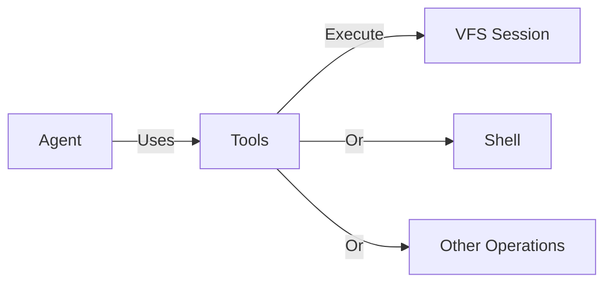
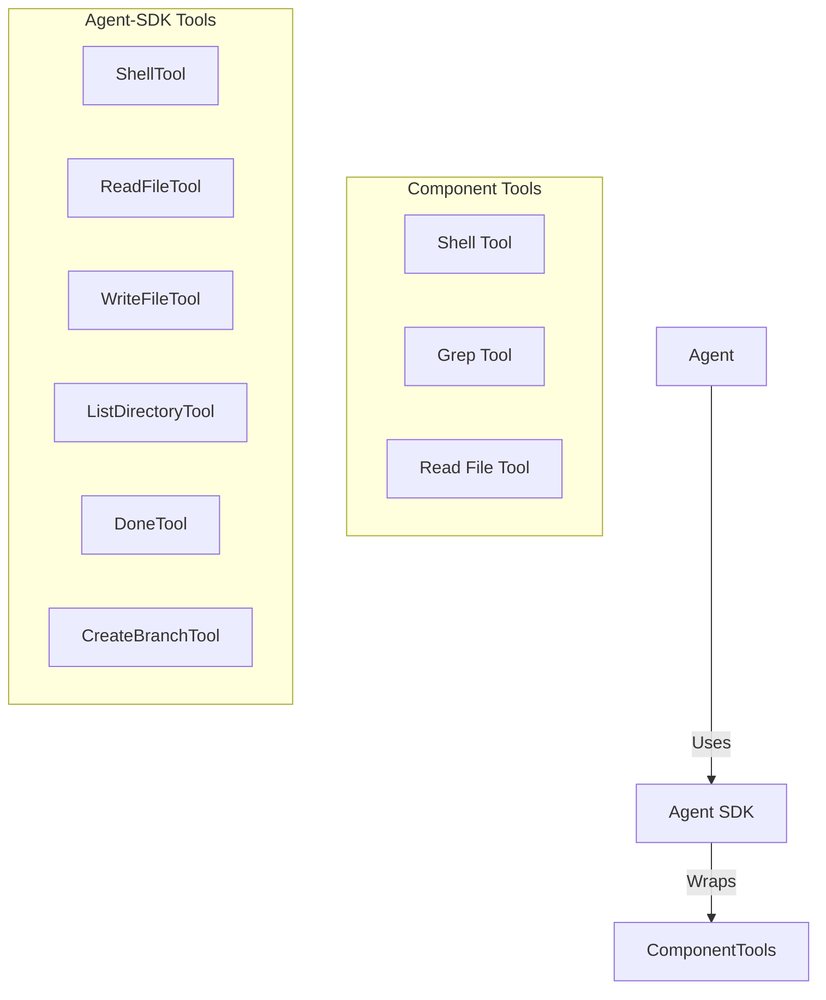
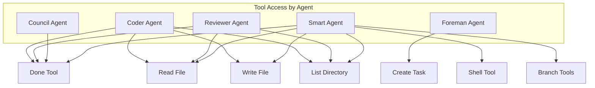
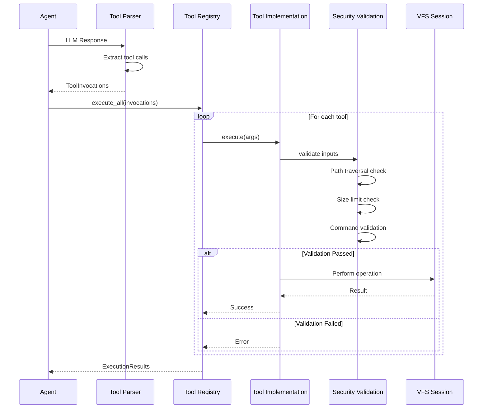

# Tools

Tools are the building blocks that enable agents to interact with the system. They provide type-safe, secure interfaces for filesystem operations, shell execution, and more.

## What is a Tool?

A tool in Brio is a **WebAssembly component** that provides a specific capability:

- **Stateless** - No persistent state between invocations
- **Pure Functions** - Same input produces same output
- **Type-Safe** - WIT interface definitions
- **Secure** - Input validation and sandboxing
- **Composable** - Agents can combine multiple tools



## Tool Architecture

### Two-Layer Architecture

Brio has two layers of tools:



**Component Tools**: Low-level WASM components
**Agent-SDK Tools**: Higher-level Rust wrappers in the SDK

### Tool Trait

All tools implement the `Tool` trait:

```rust
pub trait Tool: Send + Sync {
    /// Tool name (unique identifier)
    fn name(&self) -> Cow<'static, str>;
    
    /// Human-readable description
    fn description(&self) -> Cow<'static, str>;
    
    /// Execute the tool with given arguments
    fn execute(
        &self, 
        args: &HashMap<String, String>
    ) -> Result<String, ToolError>;
}
```

## Available Tools

### Component Tools

These are standalone WASM components:

| Tool | Purpose | Security Features |
|------|---------|-------------------|
| **Shell Tool** | Execute shell commands | Blocked characters, dangerous command blocklist |
| **Grep Tool** | Pattern matching in files | Path validation, pattern length limits |
| **Read File Tool** | Read file contents | Path traversal protection, size limits |

### Agent-SDK Tools

These are Rust implementations in the `agent-sdk` crate:

| Tool | Purpose | Available To |
|------|---------|--------------|
| **DoneTool** | Mark task completion | All agents |
| **ReadFileTool** | Read files with size limits | Coder, Reviewer, Smart |
| **WriteFileTool** | Write file contents | Coder, Smart |
| **ListDirectoryTool** | List directory contents | Coder, Reviewer, Smart |
| **ShellTool** | Execute shell commands | Smart (configurable) |
| **CreateBranchTool** | Create VFS branches | Smart (via callback) |
| **ListBranchesTool** | List available branches | Smart (via callback) |



## Tool Execution Flow



## Security Model

### Input Validation

All tools validate inputs before execution:

```mermaid
graph TB
    Input[User Input] --> Path[Path Validation]
    Input --> Size[Size Validation]
    Input --> Command[Command Validation]
    
    Path -->|Block| Traversal[../ blocked]
    Path -->|Block| Absolute[/abs blocked]
    
    Size -->|Block| TooLarge[File too large]
    
    Command -->|Block| Danger[rm/mkfs blocked]
    Command -->|Block| Meta[|;$& blocked]
    
    Path -->|Pass| Execute[Execute Tool]
    Size -->|Pass| Execute
    Command -->|Pass| Execute
```

### Security Features by Tool

**Shell Tool:**
- Blocks dangerous characters: `|`, `;`, `&`, `$`, `` ` ``, `>`, `<`, `(`, `)`, `{`, `}`
- Blocks dangerous commands: `rm`, `mkfs`, `dd`, `format`, `fdisk`, `del`
- Blocks path traversal: `../`, `..\`
- Uses `sh -c` with direct execution (no shell interpolation)

**File Tools:**
- Path traversal protection
- File size limits (10MB default)
- Null byte detection
- Symlink validation (optional)

**Grep Tool:**
- Pattern length limits (1000 chars)
- Path validation
- No regex (substring only for safety)

## Tool Invocation Format

Agents use XML-style tags to invoke tools:

```xml
<!-- Mark task completion -->
<done>
Successfully implemented the feature. The code includes:
- Input validation
- Error handling
- Unit tests
</done>

<!-- Read a file -->
<read_file path="src/main.rs" />

<!-- List directory -->
<ls path="src/components" />

<!-- Write to file -->
<write_file path="src/lib.rs">
pub fn hello() {
    println!("Hello, World!");
}
</write_file>

<!-- Execute shell command -->
<shell>cargo build --release</shell>
```

### Tool Parser

The `ToolParser` extracts tool invocations from agent responses:

```rust
pub struct ToolParser {
    done_regex: Regex,
    read_regex: Regex,
    write_regex: Regex,
    list_regex: Regex,
    shell_regex: Regex,
}

impl ToolParser {
    pub fn parse(&self, 
        response: &str
    ) -> Result<Vec<ToolInvocation>, ToolError> {
        // Extracts all tool calls from response
    }
}
```

## Tool Registry

The `ToolRegistry` manages tool execution:

```rust
pub struct ToolRegistry {
    tools: HashMap<String, Box<dyn Tool>>,
}

impl ToolRegistry {
    /// Register a tool
    pub fn register(&mut self, 
        tool: Box<dyn Tool>
    ) -> Result<(), ToolError>;
    
    /// Execute a single tool
    pub fn execute(&self, 
        name: &str, 
        args: &HashMap<String, String>
    ) -> Result<String, ToolError>;
    
    /// Execute multiple tools
    pub fn execute_all(
        &self, 
        invocations: &[ToolInvocation]
    ) -> Result<ExecutionResult, ToolError>;
    
    /// Get help text for all tools
    pub fn help_text(&self
    ) -> String;
}
```

### Registry Builder

```rust
use agent_sdk::agent::registry::ToolRegistryBuilder;

let registry = ToolRegistryBuilder::new()
    .with_done_tool()
    .with_read_tool(max_file_size)
    .with_list_tool(max_depth)
    .with_write_tool()
    .with_shell_tool(allowlist)
    .build();
```

## Creating Custom Tools

To create a custom tool:

1. **Define WIT Interface** (for component tools)
2. **Implement Tool Trait** (for SDK tools)
3. **Add Security Validation**
4. **Register with Registry**

See [Creating Tools](../guides/creating-tools.md) for a complete tutorial.

## Tool Configuration

### Global Tool Settings

```toml
[agents.tools]
enable_write = true
enable_shell = false

[agents.tools.shell]
allowlist = ["ls", "cat", "grep", "cargo", "rustc"]
blocklist = ["rm", "sudo", "mkfs"]
```

### Per-Agent Tool Configuration

```toml
[agents.smart]
enable_write = true
enable_shell = true
shell_allowlist = ["cargo", "python", "node"]

[agents.reviewer]
enable_write = false  # Read-only for safety
```

## Best Practices

### Tool Design

1. **Single Responsibility** - Each tool does one thing well
2. **Idempotent** - Same input produces same output
3. **Pure Functions** - No side effects beyond declared behavior
4. **Fail Fast** - Validate inputs before execution
5. **Clear Errors** - Provide actionable error messages

### Security

1. **Validate Everything** - Never trust input
2. **Defense in Depth** - Multiple validation layers
3. **Fail Closed** - Deny access by default
4. **Log Security Events** - Audit security decisions
5. **Regular Audits** - Review tool security

### Performance

1. **Limit File Sizes** - Prevent memory exhaustion
2. **Timeout Operations** - Prevent hanging
3. **Resource Quotas** - Limit concurrent operations
4. **Caching** - Cache expensive operations
5. **Lazy Loading** - Load tools on demand

## Tool Comparison

| Feature | Component Tool | SDK Tool |
|---------|---------------|----------|
| **Implementation** | WASM Component | Rust Library |
| **Language** | Any (via WASM) | Rust |
| **Distribution** | Separate WASM file | Compiled into agent |
| **Updates** | Hot-swappable | Requires recompilation |
| **Security** | Host-enforced | Library-enforced |
| **Use Case** | Shared, system-level | Agent-specific |

## Monitoring Tools

### Usage Statistics

Track tool usage:

```rust
// Tool execution metrics
tool_executions_total{tool="read_file"} 1234
tool_executions_total{tool="write_file"} 567
tool_errors_total{tool="shell", error="validation_failed"} 12

// Execution duration
tool_execution_duration_seconds{tool="grep"} 0.045
```

### Debugging

Enable debug logging for tools:

```bash
RUST_LOG=agent_sdk::tools=debug cargo run --bin brio-kernel
```

## Additional Resources

- **[Shell Tool](../api-reference/tools/shell-tool.md)** - Detailed shell tool documentation
- **[Grep Tool](../api-reference/tools/tool-grep.md)** - Pattern matching tool
- **[Read File Tool](../api-reference/tools/tool-read-file.md)** - File reading tool
- **[Creating Tools](../guides/creating-tools.md)** - Build custom tools
- **[Agent SDK](../api-reference/agent-sdk.md)** - SDK documentation

---

Tools are the bridge between AI agents and the real world. They provide safe, controlled access to system resources while maintaining the security and isolation guarantees of the Brio architecture.
