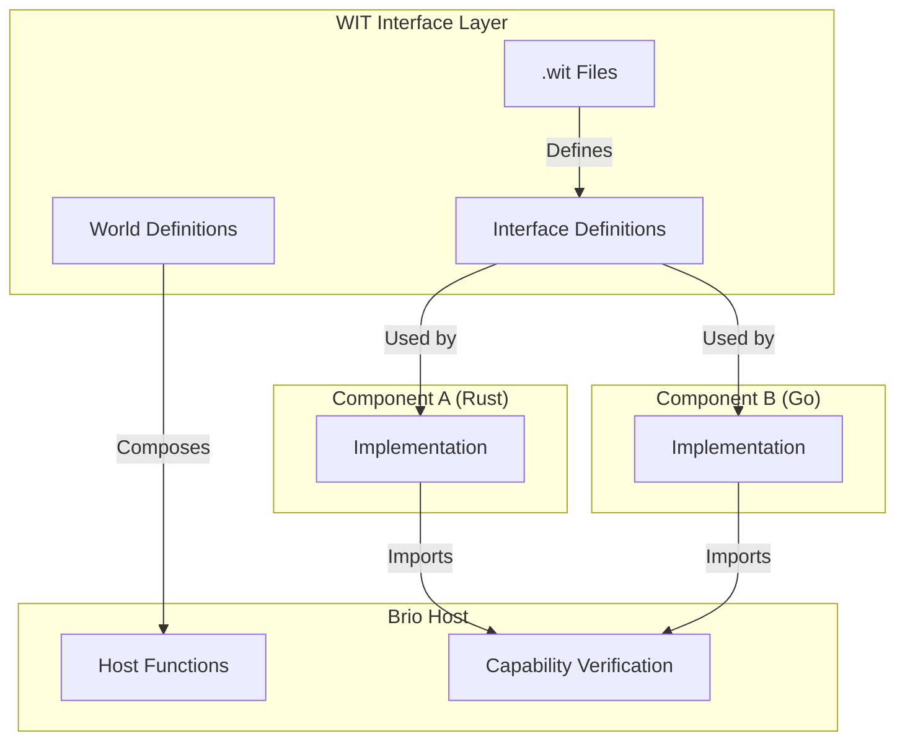
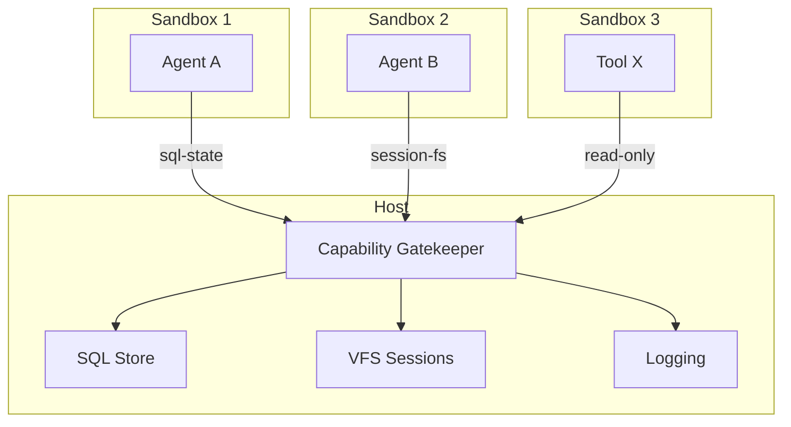
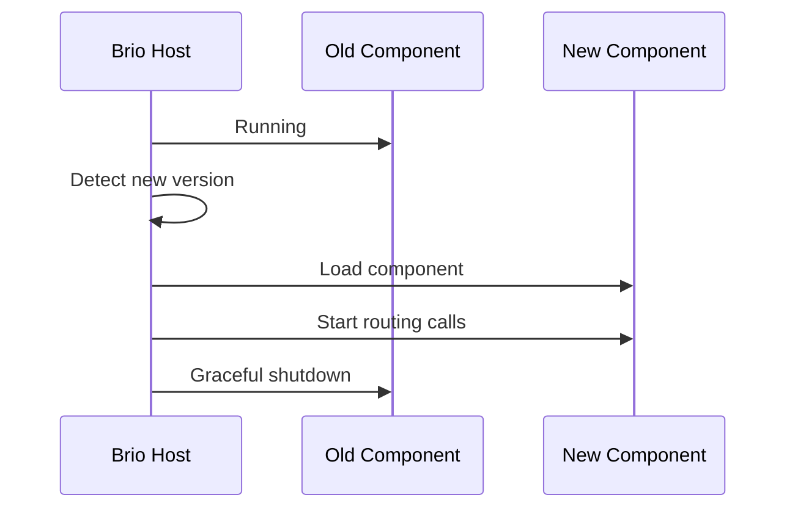
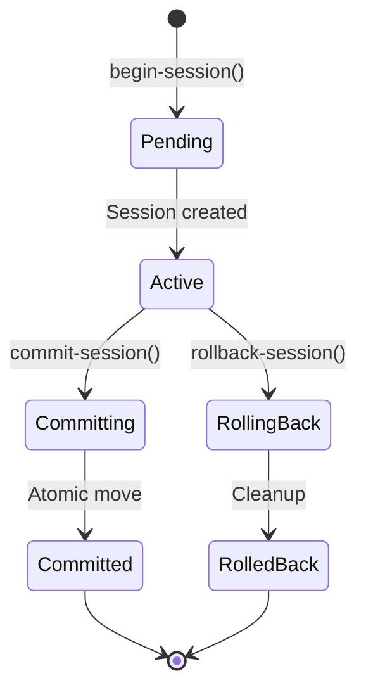
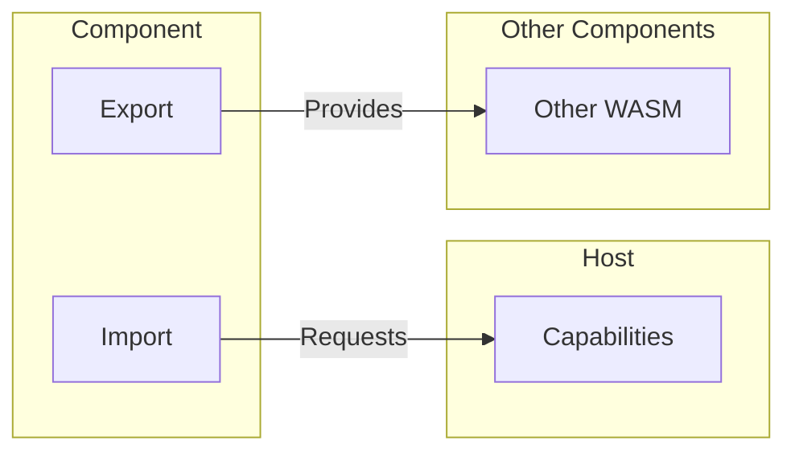
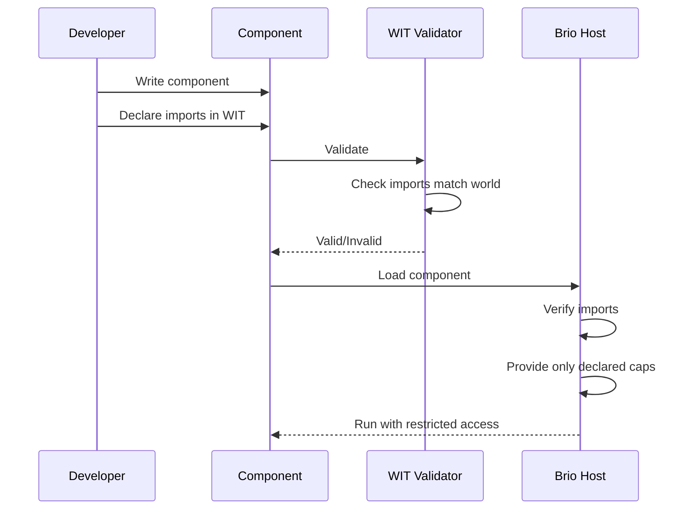

# WIT Interfaces

Brio-Kernel uses WIT (Wasm Interface Types) files to define the contract between WebAssembly components and the host system. WIT provides a language-agnostic way to specify interfaces, enabling components written in different languages to interoperate securely.

## What Are WIT Interfaces?

WIT is the Interface Definition Language (IDL) for the WebAssembly Component Model. In Brio-Kernel:

- **WIT files** define what capabilities components can import from or export to the host
- **Compile-time verification** ensures components only access declared capabilities
- **Language independence** allows components in Rust, Go, Python, etc. to interoperate
- **Capability-based security** enforces the principle of least privilege



## Why Component-Based Architecture?

WebAssembly components provide several advantages for AI agent systems:

### 1. Security Isolation

Each agent runs in its own sandbox with no direct access to host resources:



### 2. Language Flexibility

Teams can use the best language for each component:

| Component | Language | Reason |
|-----------|----------|--------|
| Core agents | Rust | Performance, safety |
| Legacy tools | Go | Existing codebase |
| Prototype agents | Python | Rapid iteration |
| Performance-critical | C++ | Maximum speed |

### 3. Hot Reloading

Components can be updated independently without restarting the kernel:



### 4. Deterministic Execution

WASM provides reproducible behavior across platforms:

- Same binary runs identically on macOS, Linux, Windows
- No "works on my machine" issues
- Easier debugging and testing

## Core Host Interfaces (`host.wit`)

The `host.wit` file defines fundamental interfaces that agents use to interact with the Brio kernel.

### `sql-state` - Database Access

The `sql-state` interface provides SQLite database access with policy enforcement. Each agent can only access tables with specific prefixes matching their role.

```wit
interface sql-state {
    record row {
        columns: list<string>,
        values: list<string>
    }

    // Agents/Supervisor can execute queries restricted to their scope
    query: func(sql: string, params: list<string>) -> result<list<row>, string>;
    execute: func(sql: string, params: list<string>) -> result<u32, string>;
}
```

**Key Concepts:**

- **Query vs Execute**: Use `query` for SELECT statements, `execute` for INSERT/UPDATE/DELETE
- **Policy Enforcement**: Agents can only access tables prefixed with their role (e.g., `coder_*` tables for Coder Agent)
- **Parameterized Queries**: Always use parameterized queries to prevent SQL injection

**Example Usage:**

```rust
use brio::core::sql_state::{query, execute, Row};

// Query tasks
let rows = query(
    "SELECT id, status FROM coder_tasks WHERE priority = ?",
    &["high"]
)?;

for row in rows {
    println!("Task: {:?}", row.values);
}

// Insert a new record
let affected = execute(
    "INSERT INTO coder_tasks (description, status) VALUES (?, ?)",
    &["Fix bug", "pending"]
)?;
```

### `session-fs` - Virtual Filesystem Sessions

The `session-fs` interface provides isolated workspace sessions using copy-on-write semantics. Changes are sandboxed until explicitly committed.

```wit
interface session-fs {
    /// Creates a sandboxed copy of the target directory.
    begin-session: func(base-path: string) -> result<string, string>;

    /// Applies changes from the session back to the original directory.
    commit-session: func(session-id: string) -> result<tuple<>, string>;

    /// Returns the filesystem path for a given session.
    get-session-path: func(session-id: string) -> result<string, string>;

    /// Discards all changes made in the session.
    rollback-session: func(session-id: string) -> result<tuple<>, string>;
}
```

**Session Lifecycle:**



**Example Usage:**

```rust
use brio::core::session_fs::{begin_session, commit_session, rollback_session, get_session_path};

// Create a sandboxed session
let session_id = begin_session("./src")?;

// Get the session path for file operations
let session_path = get_session_path(&session_id)?;
println!("Working in: {}", session_path);

// ... agent makes changes to files in session ...

// Commit changes back to original directory
match commit_session(&session_id) {
    Ok(()) => println!("Changes committed successfully"),
    Err(e) => {
        eprintln!("Commit failed: {}", e);
        rollback_session(&session_id)?;
    }
}
```

**Benefits:**

- **Atomic Changes**: All-or-nothing commits prevent partial updates
- **Rollback Support**: Failed operations can be discarded cleanly
- **Conflict Detection**: Session hashes detect concurrent modifications
- **Copy-on-Write**: Reflink support minimizes disk usage

## Service Mesh Interfaces (`mesh.wit`)

The `mesh.wit` file defines interfaces for inter-component communication.

### `service-mesh` - Remote Procedure Calls

Components can call methods on other components through the service mesh.

```wit
interface service-mesh {
    variant payload {
        json(string),
        binary(list<u8>)
    }

    call: func(target: string, method: string, args: payload) -> result<payload, string>;
}
```

**Payload Types:**

- **JSON**: For structured data with schema validation
- **Binary**: For raw bytes, images, protobuf, etc.

**Example Usage:**

```rust
use brio::core::service_mesh::{call, Payload};
use serde_json::json;

// Call a tool via the mesh
let args = Payload::Json(json!({
    "pattern": "TODO",
    "path": "./src"
}).to_string());

let result = call("grep-tool", "grep", args)?;

match result {
    Payload::Json(json_str) => {
        let matches: Vec<GrepMatch> = serde_json::from_str(&json_str)?;
        // Process matches
    }
    Payload::Binary(data) => {
        // Handle binary response
    }
}
```

### `pub-sub` - Event Publishing/Subscribing

Components can publish and subscribe to topics for event-driven communication.

```wit
interface pub-sub {
    use service-mesh.{payload};

    subscribe: func(topic: string) -> result<tuple<>, string>;
    publish: func(topic: string, data: payload) -> result<tuple<>, string>;
}
```

**Example Usage:**

```rust
use brio::core::pub_sub::{subscribe, publish};
use brio::core::service_mesh::Payload;

// Subscribe to task completion events
subscribe("tasks.completed")?;

// Publish an event
let event_data = Payload::Json(r#"{"task_id": "123", "status": "done"}"#.to_string());
publish("tasks.completed", event_data)?;
```

### `event-handler` - Event Processing

Components that handle events implement this interface to receive callbacks.

```wit
interface event-handler {
    use service-mesh.{payload};

    handle-event: func(topic: string, data: payload);
}
```

**Example Implementation:**

```rust
// In your component
impl brio::core::event_handler::EventHandler for MyComponent {
    fn handle_event(topic: String, data: Payload) {
        match topic.as_str() {
            "tasks.completed" => handle_task_completed(data),
            "milestones.reached" => handle_milestone(data),
            _ => log_warn("Unknown topic: {}", topic),
        }
    }
}
```

## Tool Interfaces (`tools.wit`, `tool.wit`)

Tools are specialized components that perform specific operations like file reading or pattern matching.

### Standard `tool` Interface (`tool.wit`)

All tools must implement this interface:

```wit
interface tool {
    record tool-info {
        name: string,
        description: string,
        version: string,
        requires-session: bool,
    }

    info: func() -> tool-info;
    execute: func(params: string, session-id: option<string>) -> result<string, string>;
}
```

**Key Fields:**

- **name**: Unique identifier for the tool
- **description**: Human-readable description for agent prompts
- **version**: Semantic version string
- **requires-session**: Whether the tool needs filesystem access

**Example Implementation:**

```rust
struct MyTool;

impl Tool for MyTool {
    fn info() -> ToolInfo {
        ToolInfo {
            name: "my-tool".to_string(),
            description: "Performs custom operations".to_string(),
            version: "1.0.0".to_string(),
            requires_session: false,
        }
    }

    fn execute(params: String, session_id: Option<String>) -> Result<String, String> {
        let args: MyArgs = serde_json::from_str(&params)
            .map_err(|e| format!("Invalid params: {}", e))?;
        
        // Perform operation
        let result = do_work(args)?;
        
        Ok(serde_json::to_string(&result).unwrap())
    }
}
```

### `tool-grep` - Pattern Matching (`tools.wit`)

```wit
interface tool-grep {
    record grep-match {
        line-number: u32,
        content: string,
    }

    record grep-result {
        file-path: string,
        matches: list<grep-match>,
    }

    grep: func(pattern: string, path: string) -> result<list<grep-result>, string>;
}
```

**Usage:**

```rust
use brio::core::tool_grep::{grep, GrepResult};

let results: Vec<GrepResult> = grep("TODO", "./src")?;
for result in results {
    println!("Found in: {}", result.file_path);
    for m in result.matches {
        println!("  Line {}: {}", m.line_number, m.content);
    }
}
```

### `tool-read-file` - File Reading (`tools.wit`)

```wit
interface tool-read-file {
    read-file: func(path: string) -> result<string, string>;
    read-file-range: func(path: string, start-line: u32, end-line: u32) -> result<string, string>;
}
```

**Usage:**

```rust
use brio::core::tool_read_file::{read_file, read_file_range};

// Read entire file
let content = read_file("./src/main.rs")?;

// Read specific lines (1-indexed, inclusive)
let lines = read_file_range("./src/main.rs", 1, 50)?;
```

### `session-fs-ops` - Filesystem Operations (`tools.wit`)

For session-aware tools that need to read/write files within a session:

```wit
interface session-fs-ops {
    record directory-entry {
        name: string,
        is-directory: bool,
        size: u64,
    }

    read-file: func(session-id: string, path: string) -> result<string, string>;
    read-file-range: func(session-id: string, path: string, start-line: u32, end-line: u32) -> result<string, string>;
    write-file: func(session-id: string, path: string, content: string) -> result<tuple<>, string>;
    list-directory: func(session-id: string, path: string) -> result<list<directory-entry>, string>;
}
```

## Agent Interfaces (`brio.wit`)

The `brio.wit` file defines interfaces for AI agent components.

### `agent-runner` - Task Execution

Agents implement this interface to receive and execute tasks:

```wit
interface agent-runner {
    record task-context {
        task-id: string,
        description: string,
        input-files: list<string>,
    }

    run: func(context: task-context) -> result<string, string>;
}
```

**Task Context Fields:**

- **task-id**: Unique identifier for this task
- **description**: Natural language description of what to do
- **input-files**: List of relevant file paths for context

**Example Agent Implementation:**

```rust
struct CoderAgent;

impl AgentRunner for CoderAgent {
    fn run(context: TaskContext) -> Result<String, String> {
        // 1. Read input files
        for file in &context.input_files {
            let content = read_file(file)?;
            // Process...
        }
        
        // 2. Build prompt with context
        let prompt = build_prompt(&context);
        
        // 3. Run ReAct loop
        let result = react_loop(prompt)?;
        
        // 4. Return summary
        Ok(result)
    }
}
```

### `smart-agent` World

The `smart-agent` world combines all capabilities for a full-featured agent:

```wit
world smart-agent {
    include brio-host;
    export agent-runner;
    export event-handler;
}
```

This world:
- Imports all host capabilities (SQL, VFS, mesh, logging, etc.)
- Exports the agent-runner interface for task execution
- Exports event-handler for pub-sub participation

## Other Important Interfaces

### `logging` - Structured Logging (`logging.wit`)

```wit
interface logging {
    enum level {
        trace,
        debug,
        info,
        warn,
        error,
    }

    log: func(level: level, context: string, message: string);
}
```

**Usage:**

```rust
use brio::core::logging::{log, Level};

log(Level::Info, "coder-agent", "Starting task execution");
log(Level::Debug, "coder-agent", "Processing 5 files");
log(Level::Error, "coder-agent", "Failed to read file");
```

### `planner` - Task Decomposition (`planner.wit`)

```wit
interface planner {
    record subtask {
        id: string,
        description: string,
    }

    record plan {
        steps: list<subtask>,
    }

    decompose: func(objective: string) -> result<plan, string>;
}
```

**Usage:**

```rust
use brio::core::planner::{decompose, Plan};

let plan: Plan = decompose("Implement user authentication")?;
for step in plan.steps {
    println!("{}: {}", step.id, step.description);
}
```

### `inference` - LLM Access (`deps/inference/inference.wit`)

```wit
package brio:ai;

interface inference {
    variant role {
        system,
        user,
        assistant
    }

    record message {
        role: role,
        content: string
    }

    record usage {
        prompt-tokens: u32,
        completion-tokens: u32,
        total-tokens: u32
    }

    record completion-response {
        content: string,
        usage: option<usage>
    }

    variant inference-error {
        provider-error(string),
        rate-limit,
        context-length-exceeded
    }

    chat: func(model: string, messages: list<message>) -> result<completion-response, inference-error>;
}
```

**Usage:**

```rust
use brio::ai::inference::{chat, Role, Message, CompletionResponse};

let messages = vec![
    Message {
        role: Role::System,
        content: "You are a helpful coding assistant.".to_string(),
    },
    Message {
        role: Role::User,
        content: "Explain Rust lifetimes.".to_string(),
    },
];

let response: CompletionResponse = chat("gpt-4", &messages)?;
println!("Response: {}", response.content);
```

## Worlds

Worlds in WIT define the complete set of imports and exports for a component type. Brio-Kernel defines several worlds for different component types.

### `brio-host` - Core Host World

The base world that provides all host capabilities:

```wit
world brio-host {
    import service-mesh;
    import sql-state;
    import session-fs;
    import brio:ai/inference;
    import logging;
    import planner;
    import pub-sub;
}
```

Components in this world can:
- Call other components via service-mesh
- Query and update the database via sql-state
- Manage filesystem sessions via session-fs
- Use AI models via inference
- Log structured messages
- Decompose tasks via planner
- Subscribe to and publish events

### `smart-agent` - Agent World

Extends `brio-host` for full-featured agents:

```wit
world smart-agent {
    include brio-host;
    export agent-runner;
    export event-handler;
}
```

This world is for agents that:
- Execute tasks (export agent-runner)
- Handle events (export event-handler)
- Have full access to host capabilities

### `standard-tool` - Stateless Tools

For simple tools without filesystem access:

```wit
world standard-tool {
    export tool;
}
```

These tools:
- Only export the tool interface
- Cannot access session-fs or session-fs-ops
- Are stateless and pure
- Examples: Calculator, text transformers

### `session-aware-tool` - Tools with Session Access

For tools that need to read/write files:

```wit
world session-aware-tool {
    import session-fs;
    import session-fs-ops;
    export tool;
}
```

These tools:
- Import session management capabilities
- Can read and write files within sessions
- Receive session-id in execute() calls
- Examples: File editors, code formatters

## Security Model

WIT enables capability-based security through explicit imports and exports.

### Import vs Export



- **Imports**: What the component needs from the host (capabilities)
- **Exports**: What the component provides to others (services)

### World Composition

Worlds compose capabilities to create security boundaries:

```mermaid
graph TB
    subgraph "brio-host"
        SQL[sql-state]
        FS[session-fs]
        MESH[service-mesh]
        LOG[logging]
    end
    
    subgraph "smart-agent"
        SA_HOST[include brio-host]
        SA_RUN[export agent-runner]
    end
    
    subgraph "standard-tool"
        ST_TOOL[export tool]
    end
    
    subgraph "session-aware-tool"
        SAT_FS[import session-fs]
        SAT_TOOL[export tool]
    end
    
    SQL --> SA_HOST
    FS --> SA_HOST
    SA_HOST --> SA_RUN
    ST_TOOL -->|No FS access| 
    SAT_FS --> SAT_TOOL
```

### Capability Verification at Compile Time

The WebAssembly Component Model verifies capabilities at compile time:

1. **WIT Validation**: The component's WASM binary is checked against its WIT interface
2. **Import Checking**: All imported functions must be declared in the world
3. **Export Validation**: All exported functions must match the interface signature
4. **Host Enforcement**: The host only provides declared capabilities



**Example Security Scenario:**

```wit
// reviewer-agent.wit - Read-only agent
world reviewer-agent {
    import service-mesh;
    import session-fs;  // Can read files
    import logging;
    // NO sql-state import - cannot access database
    // NO session-fs-ops import - cannot write files
    export agent-runner;
}
```

This agent can:
- Read files via session-fs
- Call tools via service-mesh
- Log messages

Cannot:
- Write files (no session-fs-ops)
- Access database (no sql-state)
- Modify system state

## Usage Examples

### Agent Importing sql-state

```rust
// In a smart-agent component
wit_bindgen::generate!({
    world: "smart-agent",
    path: "../../brio-core/wit",
});

use crate::brio::core::sql_state::{query, execute};

fn track_task_completion(task_id: &str) -> Result<(), String> {
    // Query current status
    let rows = query(
        "SELECT status FROM tasks WHERE id = ?",
        &[task_id]
    )?;
    
    // Update to completed
    execute(
        "UPDATE tasks SET status = 'completed' WHERE id = ?",
        &[task_id]
    )?;
    
    Ok(())
}
```

### Tool Using session-fs

```rust
// In a session-aware-tool component
wit_bindgen::generate!({
    world: "session-aware-tool",
    path: "../../brio-core/wit",
});

use crate::brio::core::{
    session_fs::{begin_session, commit_session},
    session_fs_ops::{write_file, read_file},
};

struct CodeFormatter;

impl Tool for CodeFormatter {
    fn info() -> ToolInfo {
        ToolInfo {
            name: "code-formatter".to_string(),
            description: "Formats code files".to_string(),
            version: "1.0.0".to_string(),
            requires_session: true,
        }
    }

    fn execute(params: String, session_id: Option<String>) -> Result<String, String> {
        let session_id = session_id.ok_or("Session required")?;
        let args: FormatArgs = serde_json::from_str(&params)
            .map_err(|e| e.to_string())?;
        
        // Read file from session
        let content = read_file(&session_id, &args.path)?;
        
        // Format the code
        let formatted = format_code(&content)?;
        
        // Write back to session
        write_file(&session_id, &args.path, &formatted)?;
        
        Ok(r#"{"status": "formatted"}"#.to_string())
    }
}
```

### Calling Between Components via service-mesh

```rust
// Agent calling a tool through the mesh
use crate::brio::core::service_mesh::{call, Payload};
use serde_json::json;

fn analyze_code(path: &str) -> Result<AnalysisResult, String> {
    // Call grep tool to find patterns
    let grep_result = call(
        "grep-tool",
        "grep",
        Payload::Json(json!({
            "pattern": "unsafe",
            "path": path
        }).to_string())
    )?;
    
    // Parse the JSON response
    let matches: Vec<GrepResult> = match grep_result {
        Payload::Json(json_str) => {
            serde_json::from_str(&json_str)
                .map_err(|e| format!("Parse error: {}", e))?
        }
        _ => return Err("Expected JSON response".to_string()),
    };
    
    // Process results
    let analysis = analyze_matches(matches)?;
    
    Ok(analysis)
}
```

## Summary

WIT interfaces provide the foundation for Brio-Kernel's secure, modular architecture:

- **Explicit capabilities** through import/export declarations
- **Compile-time verification** prevents capability violations
- **World composition** creates secure boundaries for different component types
- **Language agnostic** enabling polyglot development
- **Sandboxed execution** ensures isolation between components

Understanding these interfaces is essential for developing custom agents and tools that integrate seamlessly with the Brio-Kernel ecosystem.

## Related Documentation

- **[Architecture](./architecture.md)** - System architecture overview
- **[Agents](./agents.md)** - Agent concepts and types
- **[Tools](./tools.md)** - Tool development guide
- **[Supervisor](./supervisor.md)** - Policy and task distribution
- **[Creating Agents](../guides/creating-agents.md)** - Build custom agents
