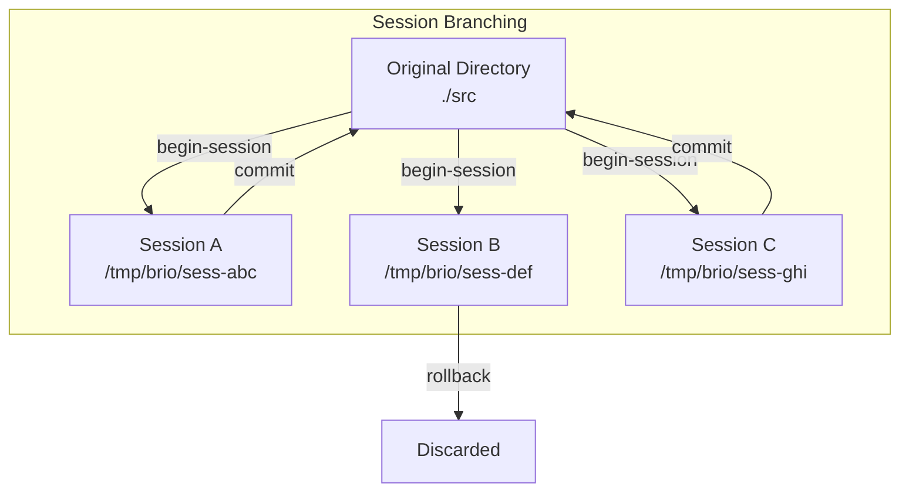
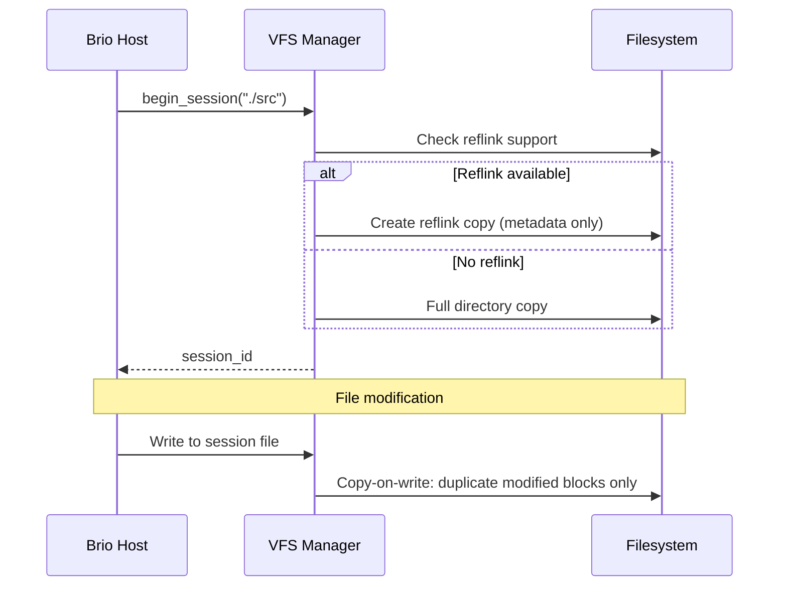
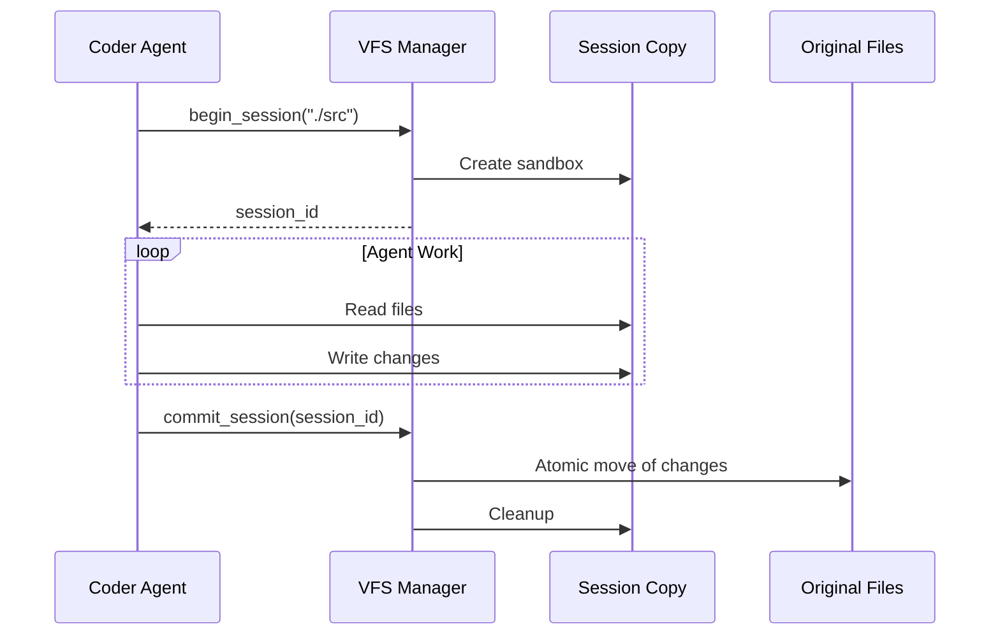
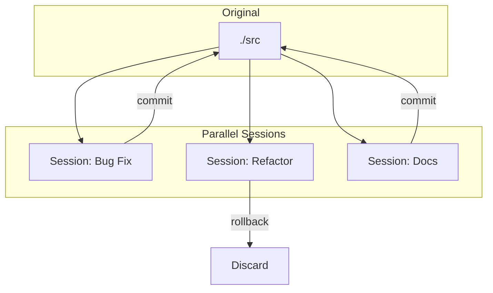
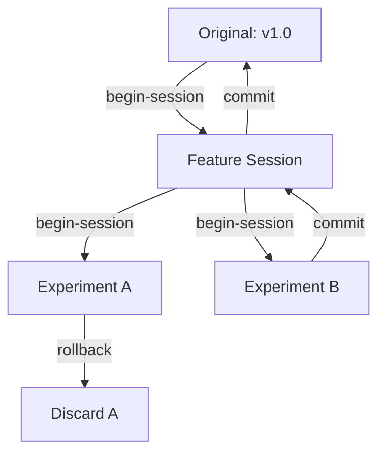
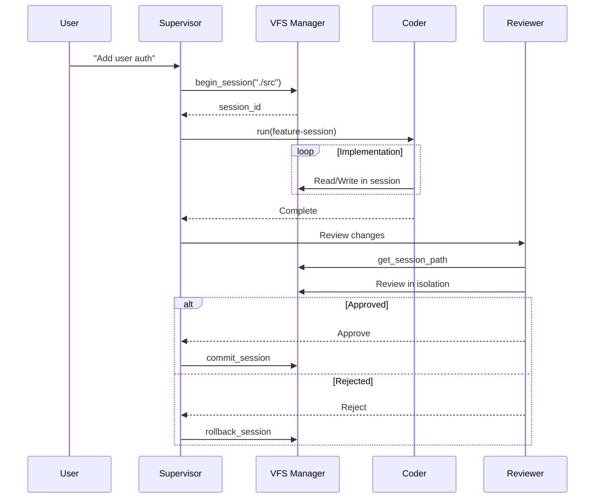
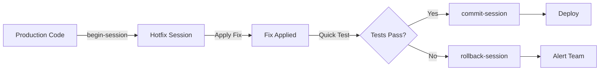
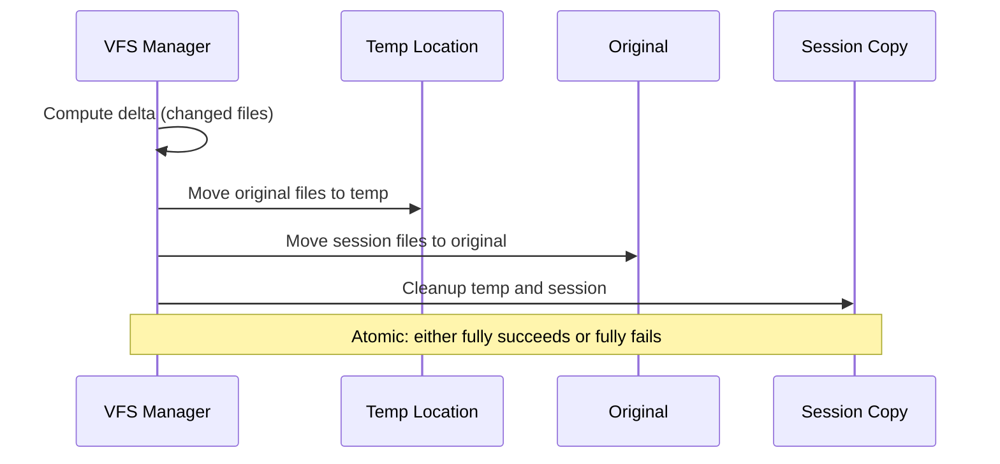
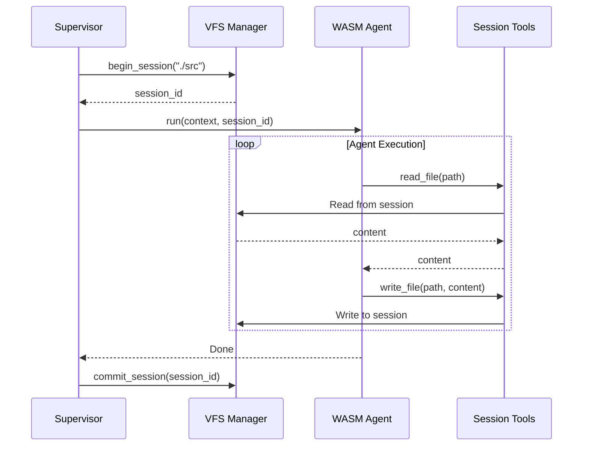

# VFS Session Branching Workflows

This guide covers patterns and best practices for using Brio-Kernel's Virtual File System (VFS) sessions. Sessions provide isolated workspace environments that enable safe experimentation, parallel development, and atomic changes.

## Table of Contents

1. [Introduction](#introduction)
2. [Session Lifecycle](#session-lifecycle)
3. [Basic Workflow Patterns](#basic-workflow-patterns)
4. [Common Branching Strategies](#common-branching-strategies)
5. [Commit and Rollback](#commit-and-rollback)
6. [Integration with Agents](#integration-with-agents)
7. [Best Practices](#best-practices)
8. [Troubleshooting](#troubleshooting)
9. [Example Workflows](#example-workflows)

---

## Introduction

### What is VFS Session Branching?

VFS sessions provide copy-on-write workspace isolation for file operations. Think of them as lightweight, temporary branches for your filesystem:



### Comparison to Git Branches

| Aspect | Git Branches | VFS Sessions |
|--------|--------------|--------------|
| **Scope** | Repository-level | Directory-level |
| **Creation Time** | ~100ms | <100ms |
| **Storage** | Full copy (or pointers) | Copy-on-write |
| **Persistence** | Permanent until deleted | Temporary, explicit commit |
| **Conflicts** | Merge required | Last-write-wins (with detection) |
| **Use Case** | Long-lived features | Short-lived experiments |

### Benefits

- **Isolation**: Changes in one session don't affect others
- **Atomicity**: All-or-nothing commits prevent partial updates
- **Rollback**: Discard changes without trace
- **Parallelism**: Multiple agents work independently
- **Safety**: Failed operations don't corrupt original files

---

## Session Lifecycle

### begin-session: Creating Isolated Workspaces

The `begin-session` function creates a sandboxed copy of a target directory:

```rust
use brio::core::session_fs::begin_session;

// Create a new session from the current working directory
let session_id = begin_session("./src")?;
println!("Session created: {}", session_id);
// Output: Session created: sess-a1b2c3d4-...
```

**What happens:**

1. Directory hash is computed for conflict detection
2. Copy-on-write snapshot is created (uses reflink if available)
3. Session ID is returned for subsequent operations
4. Session path is accessible via `get-session-path`

### Session Directory Structure

```
/tmp/brio/
├── sess-abc123/
│   ├── src/           # Copy of original directory
│   ├── .brio/
│   │   ├── manifest   # File list with hashes
│   │   └── parent     # Reference to original path
│   └── ...
├── sess-def456/
│   └── ...
└── metadata.db        # Session registry
```

### Copy-on-Write Semantics

Sessions use copy-on-write to minimize disk usage:



**Copy-on-Write Behavior:**

| Operation | Original | Session Copy |
|-----------|----------|--------------|
| **Read** | Shared blocks | Shared blocks |
| **Write** | Unchanged | New blocks allocated |
| **Delete** | Unchanged | Reference removed |

### Reflink Support

Refclone (copy-on-write at filesystem level) is available on:

- **Linux**: Btrfs, XFS, OCFS2
- **macOS**: APFS
- **Windows**: ReFS

When reflink is unavailable, VFS falls back to full copy:

```rust
// Check if reflink is available for a path
fn check_reflink_support(path: &str) -> bool {
    // Platform-specific check
    #[cfg(target_os = "linux")]
    {
        // Check filesystem type
        // Btrfs, XFS support reflink
    }
    // ...
}
```

---

## Basic Workflow Patterns

### Single-Session Workflow

The simplest pattern: one agent, one session, atomic commit.



**Example:**

```rust
use brio::core::session_fs::{begin_session, commit_session, rollback_session};

fn implement_feature(base_path: &str) -> Result<(), String> {
    // 1. Create session
    let session_id = begin_session(base_path)?;
    
    // 2. Get session path for file operations
    let session_path = get_session_path(&session_id)?;
    
    // 3. Agent performs work in session
    // (Read files, apply AI-generated changes, etc.)
    
    // 4. Validate changes
    if validate_changes(&session_path)? {
        // 5a. Commit if valid
        commit_session(&session_id)?;
        println!("Feature implemented successfully");
    } else {
        // 5b. Rollback if invalid
        rollback_session(&session_id)?;
        println!("Changes discarded");
    }
    
    Ok(())
}
```

### Multi-Session Parallel Work

Multiple agents work independently on different sessions:



**Example:**

```rust
use std::thread;

fn parallel_tasks(base_path: &str) -> Result<(), String> {
    // Create three independent sessions
    let sessions = vec![
        ("bugfix", begin_session(base_path)?),
        ("refactor", begin_session(base_path)?),
        ("docs", begin_session(base_path)?),
    ];
    
    // Spawn agents in parallel
    let handles: Vec<_> = sessions
        .into_iter()
        .map(|(name, session_id)| {
            thread::spawn(move || {
                // Each agent works in its own session
                run_agent_task(name, &session_id)
            })
        })
        .collect();
    
    // Collect results
    for handle in handles {
        let result = handle.join().unwrap()?;
        println!("Task completed: {}", result);
    }
    
    // Commit successful sessions
    for (name, session_id) in &completed_sessions {
        if results[name].success {
            commit_session(session_id)?;
        } else {
            rollback_session(session_id)?;
        }
    }
    
    Ok(())
}
```

### Session Hierarchies (Parent/Child)

Sessions can be nested for incremental work:



**Use case**: Build a feature incrementally, experiment with approaches:

```rust
fn hierarchical_workflow(base_path: &str) -> Result<(), String> {
    // 1. Create feature branch session
    let feature_session = begin_session(base_path)?;
    
    // 2. Work on feature
    implement_core_feature(&feature_session)?;
    
    // 3. Experiment with two UI approaches
    let ui_a = begin_session(&get_session_path(&feature_session)?)?;
    let ui_b = begin_session(&get_session_path(&feature_session)?)?;
    
    // 4. Test both approaches
    let result_a = test_ui_approach(&ui_a)?;
    let result_b = test_ui_approach(&ui_b)?;
    
    // 5. Choose best approach
    if result_a.score > result_b.score {
        commit_session(&ui_a)?;
        rollback_session(&ui_b)?;
    } else {
        commit_session(&ui_b)?;
        rollback_session(&ui_a)?;
    }
    
    // 6. Commit feature to main
    commit_session(&feature_session)?;
    
    Ok(())
}
```

---

## Common Branching Strategies

### Feature Branch Pattern

Isolated development of new features:



**Characteristics:**
- One session per feature
- Explicit review before commit
- Rollback on rejection
- Clean history

### Experimental Branch Pattern

Try ideas without risk:

```rust
fn experiment_with_approach(base_path: &str, approach: &str) -> Result<ExperimentResult, String> {
    let session_id = begin_session(base_path)?;
    let session_path = get_session_path(&session_id)?;
    
    println!("Trying approach: {}", approach);
    
    // Apply experimental changes
    match apply_approach(&session_path, approach) {
        Ok(_) => {
            // Run tests to validate
            if run_tests(&session_path)? {
                // Success! Keep it
                commit_session(&session_id)?;
                Ok(ExperimentResult::Success)
            } else {
                // Tests failed, discard
                rollback_session(&session_id)?;
                Ok(ExperimentResult::FailedTests)
            }
        }
        Err(e) => {
            // Implementation failed, discard
            rollback_session(&session_id)?;
            Ok(ExperimentResult::ImplementationError(e))
        }
    }
}
```

### Review Branch Pattern

Multiple reviewers on same changes:

```rust
fn parallel_review(base_path: &str, changes_session: &str) -> Result<ReviewDecision, String> {
    // Create review sessions for each reviewer
    let reviewers = vec!["security", "performance", "style"];
    
    let review_sessions: Vec<_> = reviewers
        .iter()
        .map(|_| begin_session(base_path))
        .collect::<Result<_, _>>()?;
    
    // Apply changes to each review session
    for session in &review_sessions {
        apply_changes_to_session(changes_session, session)?;
    }
    
    // Run parallel reviews
    let results = parallel_review_checks(&review_sessions, &reviewers)?;
    
    // Decision logic
    let all_passed = results.values().all(|r| r.passed);
    
    if all_passed {
        // Apply original changes
        commit_session(changes_session)?;
        Ok(ReviewDecision::Approve)
    } else {
        rollback_session(changes_session)?;
        Ok(ReviewDecision::Reject(results))
    }
}
```

### Hotfix Pattern

Emergency fix with minimal disruption:



```rust
fn hotfix_workflow(base_path: &str, issue: &Issue) -> Result<FixResult, String> {
    // Create session immediately
    let session_id = begin_session(base_path)?;
    let session_path = get_session_path(&session_id)?;
    
    // Apply minimal fix
    apply_minimal_fix(&session_path, issue)?;
    
    // Run critical tests only (fast path)
    if run_critical_tests(&session_path)? {
        // Commit and deploy
        commit_session(&session_id)?;
        deploy_fix()?;
        Ok(FixResult::Deployed)
    } else {
        // Rollback and escalate
        rollback_session(&session_id)?;
        escalate_issue(issue)?;
        Ok(FixResult::Escalated)
    }
}
```

---

## Commit and Rollback

### Atomic Commits (Move Semantics)

Commits use atomic move operations for consistency:



**The commit process:**

1. Calculate directory hashes for conflict detection
2. Create backup of original files (temporary)
3. Move session files to original location
4. Verify integrity
5. Clean up session directory

```rust
use brio::core::session_fs::commit_session;

fn safe_commit(session_id: &str) -> Result<(), String> {
    match commit_session(session_id) {
        Ok(()) => {
            println!("Changes committed atomically");
            Ok(())
        }
        Err(e) => {
            eprintln!("Commit failed: {}", e);
            // Original files remain unchanged
            Err(e)
        }
    }
}
```

### Rollback for Cleanup

Discard changes cleanly:

```rust
use brio::core::session_fs::rollback_session;

fn cleanup_on_error(session_id: &str) -> Result<(), String> {
    // Rollback removes the session directory
    // Original files are untouched
    rollback_session(session_id)?;
    
    println!("Session {} rolled back, no changes persisted", session_id);
    Ok(())
}
```

**What rollback does:**

- Removes session directory tree
- Releases all references
- Frees disk space (copy-on-write blocks)
- Logs cleanup for audit trail

### Conflict Detection

VFS detects concurrent modifications:

```rust
fn commit_with_conflict_check(session_id: &str) -> Result<(), String> {
    match commit_session(session_id) {
        Ok(()) => Ok(()),
        Err(e) if e.contains("CONFLICT") => {
            // Original directory was modified after session creation
            eprintln!("Conflict detected!");
            eprintln!("Options:");
            eprintln!("  1. Rollback and recreate session");
            eprintln!("  2. Manual merge");
            
            // Default: rollback
            rollback_session(session_id)?;
            Err("Concurrent modification detected".to_string())
        }
        Err(e) => Err(e),
    }
}
```

**Conflict scenarios:**

| Scenario | Detection | Resolution |
|----------|-----------|------------|
| Concurrent sessions | Hash mismatch | Last-write-wins |
| External modification | Hash mismatch | Rollback recommended |
| Same file modified | Content diff | Manual intervention |

### Error Recovery

Handle failures gracefully:

```rust
fn robust_workflow(base_path: &str) -> Result<(), String> {
    let session_id = begin_session(base_path)?;
    
    // Wrap work in catch_unwind for panic safety
    let result = std::panic::catch_unwind(|| {
        perform_work(&session_id)
    });
    
    match result {
        Ok(Ok(())) => {
            // Success path
            if let Err(e) = commit_session(&session_id) {
                // Commit failed, try rollback
                let _ = rollback_session(&session_id);
                return Err(format!("Commit failed: {}", e));
            }
            Ok(())
        }
        Ok(Err(e)) => {
            // Work failed, rollback
            rollback_session(&session_id)?;
            Err(e)
        }
        Err(_) => {
            // Panic occurred, cleanup
            let _ = rollback_session(&session_id);
            Err("Agent panicked".to_string())
        }
    }
}
```

---

## Integration with Agents

### How Agents Use Sessions

Agents receive session context through the task system:



### Session Per Task Pattern

Each task gets its own isolated session:

```rust
fn dispatch_task(task: &Task) -> Result<TaskResult, String> {
    // Create session for this task
    let session_id = begin_session(&task.working_directory)?;
    
    // Build agent context with session
    let context = TaskContext {
        task_id: task.id.clone(),
        description: task.description.clone(),
        input_files: task.files.clone(),
        session_id: Some(session_id.clone()),
    };
    
    // Run agent
    let result = run_agent(&task.agent_type, &context);
    
    // Commit or rollback based on result
    match result {
        Ok(output) => {
            commit_session(&session_id)?;
            Ok(TaskResult::Success(output))
        }
        Err(e) => {
            rollback_session(&session_id)?;
            Ok(TaskResult::Failure(e))
        }
    }
}
```

### Multiple Agents on Same Session

Agents can share a session for collaborative work:

```rust
fn collaborative_workflow(base_path: &str) -> Result<(), String> {
    // Create shared session
    let shared_session = begin_session(base_path)?;
    
    // Phase 1: Coder agent
    let coder_result = run_agent("coder", AgentContext {
        session_id: shared_session.clone(),
        task: "Implement API endpoint",
        ..Default::default()
    })?;
    
    // Phase 2: Reviewer agent (sees coder's changes)
    let review_result = run_agent("reviewer", AgentContext {
        session_id: shared_session.clone(),
        task: "Review API implementation",
        ..Default::default()
    })?;
    
    // Phase 3: Test agent (sees all changes)
    let test_result = run_agent("tester", AgentContext {
        session_id: shared_session.clone(),
        task: "Write tests for API",
        ..Default::default()
    })?;
    
    // Commit all collaborative work
    if coder_result.success && review_result.passed && test_result.success {
        commit_session(&shared_session)?;
    } else {
        rollback_session(&shared_session)?;
    }
    
    Ok(())
}
```

### Session Passing Between Agents

Sessions can be transferred:

```rust
fn multi_stage_pipeline(base_path: &str) -> Result<(), String> {
    // Stage 1: Planner creates session
    let session_id = begin_session(base_path)?;
    let plan = run_agent("planner", AgentContext {
        session_id: session_id.clone(),
        task: "Design feature",
    })?;
    
    // Stage 2: Coder works in same session
    run_agent("coder", AgentContext {
        session_id: session_id.clone(),
        task: &format!("Implement: {}", plan.summary),
    })?;
    
    // Stage 3: Reviewer validates
    let review = run_agent("reviewer", AgentContext {
        session_id: session_id.clone(),
        task: "Review implementation",
    })?;
    
    // Final commit
    if review.approved {
        commit_session(&session_id)?;
    }
    
    Ok(())
}
```

---

## Best Practices

### Session Naming Conventions

While session IDs are auto-generated, track them with descriptive metadata:

```rust
struct SessionMetadata {
    session_id: String,
    purpose: String,
    agent: String,
    task_id: String,
    created_at: DateTime<Utc>,
}

// Log session creation with context
fn create_tracked_session(base_path: &str, purpose: &str, agent: &str) -> Result<String, String> {
    let session_id = begin_session(base_path)?;
    
    let metadata = SessionMetadata {
        session_id: session_id.clone(),
        purpose: purpose.to_string(),
        agent: agent.to_string(),
        task_id: generate_task_id(),
        created_at: Utc::now(),
    };
    
    log_session_created(metadata)?;
    Ok(session_id)
}
```

### Cleanup Strategies

Prevent session accumulation:

```rust
struct SessionGuard {
    session_id: String,
    committed: bool,
}

impl SessionGuard {
    fn new(base_path: &str) -> Result<Self, String> {
        let session_id = begin_session(base_path)?;
        Ok(SessionGuard {
            session_id,
            committed: false,
        })
    }
    
    fn commit(mut self) -> Result<(), String> {
        commit_session(&self.session_id)?;
        self.committed = true;
        Ok(())
    }
}

impl Drop for SessionGuard {
    fn drop(&mut self) {
        if !self.committed {
            // Auto-rollback on scope exit if not committed
            let _ = rollback_session(&self.session_id);
        }
    }
}

// Usage
fn safe_workflow(base_path: &str) -> Result<(), String> {
    let guard = SessionGuard::new(base_path)?;
    
    // Do work...
    perform_work(guard.session_id())?;
    
    // Explicitly commit on success
    guard.commit()?;
    Ok(())
    // Auto-rollback if commit() wasn't called
}
```

### Large File Handling

Optimize for large files:

```rust
fn handle_large_files(base_path: &str) -> Result<(), String> {
    // Check available space before creating session
    let required_space = estimate_session_size(base_path)?;
    let available_space = check_disk_space()?;
    
    if required_space > available_space * 0.8 {
        return Err("Insufficient disk space for session".to_string());
    }
    
    // Create session
    let session_id = begin_session(base_path)?;
    
    // For very large files, consider:
    // 1. Excluding them from session (if not needed)
    // 2. Using symlinks instead of copies
    // 3. Streaming modifications instead of full copy
    
    Ok(())
}
```

### Concurrent Access Patterns

Handle concurrent sessions safely:

```rust
use std::sync::Arc;
use tokio::sync::RwLock;

struct SessionManager {
    active_sessions: Arc<RwLock<HashMap<String, SessionInfo>>>,
}

impl SessionManager {
    async fn acquire_session(&self, base_path: &str) -> Result<SessionHandle, String> {
        // Check for existing sessions on same path
        let sessions = self.active_sessions.read().await;
        let existing: Vec<_> = sessions
            .values()
            .filter(|s| s.base_path == base_path)
            .collect();
        
        if !existing.is_empty() {
            println!("Warning: {} existing sessions on {}", existing.len(), base_path);
        }
        drop(sessions);
        
        // Create new session
        let session_id = begin_session(base_path)?;
        
        let mut sessions = self.active_sessions.write().await;
        sessions.insert(session_id.clone(), SessionInfo {
            session_id: session_id.clone(),
            base_path: base_path.to_string(),
            created_at: Instant::now(),
        });
        
        Ok(SessionHandle {
            session_id,
            manager: self.active_sessions.clone(),
        })
    }
}
```

---

## Troubleshooting

### Session Conflicts

**Symptom:** `commit_session` fails with conflict error

**Resolution:**

```rust
fn handle_conflict(session_id: &str, base_path: &str) -> Result<(), String> {
    eprintln!("Session conflict detected!");
    
    // Option 1: Rollback and recreate
    rollback_session(session_id)?;
    let new_session = begin_session(base_path)?;
    println!("Recreated session: {}", new_session);
    
    // Option 2: Manual inspection (if safe)
    // let session_path = get_session_path(session_id)?;
    // inspect_differences(&session_path, base_path)?;
    
    Ok(())
}
```

### Disk Space Management

**Symptom:** Session creation fails with "No space left on device"

**Prevention:**

```rust
fn check_space_before_session(base_path: &str) -> Result<(), String> {
    let source_size = calculate_dir_size(base_path)?;
    let available = get_available_space("/tmp")?;
    
    // Need at least 2x for worst case (full copy + working space)
    if available < source_size * 2 {
        return Err(format!(
            "Insufficient space: need {}MB, have {}MB",
            source_size * 2 / 1024 / 1024,
            available / 1024 / 1024
        ));
    }
    
    Ok(())
}
```

### Permission Issues

**Symptom:** "Permission denied" during commit

**Common causes:**

1. Original directory is read-only
2. Session created with different user
3. File ownership mismatch

```rust
fn diagnose_permission_issue(session_id: &str, base_path: &str) -> Result<(), String> {
    // Check original directory permissions
    let orig_perms = std::fs::metadata(base_path)?.permissions();
    println!("Original permissions: {:?}", orig_perms);
    
    // Check session path
    let session_path = get_session_path(session_id)?;
    let session_perms = std::fs::metadata(&session_path)?.permissions();
    println!("Session permissions: {:?}", session_perms);
    
    // Ensure session files have correct ownership
    #[cfg(unix)]
    {
        use std::os::unix::fs::MetadataExt;
        let orig_uid = std::fs::metadata(base_path)?.uid();
        let session_uid = std::fs::metadata(&session_path)?.uid();
        
        if orig_uid != session_uid {
            println!("Warning: UID mismatch (orig: {}, session: {})", orig_uid, session_uid);
        }
    }
    
    Ok(())
}
```

### Debugging Sessions

Enable detailed logging:

```rust
fn debug_session(session_id: &str) -> Result<(), String> {
    println!("=== Session Debug Info ===");
    println!("Session ID: {}", session_id);
    
    let session_path = get_session_path(session_id)?;
    println!("Session Path: {}", session_path);
    
    // List session contents
    println!("\nSession Contents:");
    for entry in walkdir::WalkDir::new(&session_path) {
        let entry = entry?;
        let metadata = entry.metadata()?;
        println!("  {} ({} bytes)", 
            entry.path().display(),
            metadata.len()
        );
    }
    
    // Check manifest
    let manifest_path = format!("{}/.brio/manifest", session_path);
    if std::path::Path::new(&manifest_path).exists() {
        let manifest = std::fs::read_to_string(&manifest_path)?;
        println!("\nManifest:\n{}", manifest);
    }
    
    Ok(())
}
```

---

## Example Workflows

### Complete Example: Feature Implementation with Rollback

```rust
use brio::core::session_fs::*;

fn implement_feature_with_rollback(base_path: &str, feature: &FeatureRequest) -> Result<FeatureResult, String> {
    println!("🚀 Starting feature: {}", feature.name);
    
    // 1. Create isolated session
    let session_id = begin_session(base_path)?;
    println!("📁 Session created: {}", session_id);
    
    let session_path = get_session_path(&session_id)?;
    
    // 2. Run implementation agent
    println!("🤖 Running implementation agent...");
    let impl_result = run_coder_agent(&session_path, &feature.description);
    
    if let Err(e) = impl_result {
        println!("❌ Implementation failed: {}", e);
        rollback_session(&session_id)?;
        return Ok(FeatureResult::Failed(e));
    }
    
    // 3. Run tests in session
    println!("🧪 Running tests...");
    let test_result = run_tests(&session_path);
    
    if !test_result.passed {
        println!("❌ Tests failed");
        rollback_session(&session_id)?;
        return Ok(FeatureResult::TestsFailed(test_result.output));
    }
    
    // 4. Run linter
    println!("🔍 Running linter...");
    let lint_result = run_linter(&session_path);
    
    if !lint_result.clean {
        println!("⚠️  Lint issues found");
        // Auto-fix lint issues
        if !auto_fix_lint(&session_path)? {
            rollback_session(&session_id)?;
            return Ok(FeatureResult::LintFailed);
        }
    }
    
    // 5. Review (optional)
    if feature.requires_review {
        println!("👀 Awaiting review...");
        let review_result = request_review(&session_id)?;
        
        if !review_result.approved {
            println!("❌ Changes rejected");
            rollback_session(&session_id)?;
            return Ok(FeatureResult::Rejected(review_result.comments));
        }
    }
    
    // 6. Commit changes
    println!("💾 Committing changes...");
    match commit_session(&session_id) {
        Ok(()) => {
            println!("✅ Feature '{}' implemented successfully!", feature.name);
            Ok(FeatureResult::Success)
        }
        Err(e) => {
            println!("❌ Commit failed: {}", e);
            rollback_session(&session_id)?;
            Ok(FeatureResult::CommitFailed(e))
        }
    }
}
```

### Parallel Review Workflow

```rust
fn parallel_review_workflow(base_path: &str, changes: &ChangeSet) -> Result<ReviewOutcome, String> {
    println!("Starting parallel review...");
    
    // Create session with changes
    let main_session = begin_session(base_path)?;
    apply_changes(&main_session, changes)?;
    
    // Spawn review sessions for each reviewer type
    let reviewers = vec![
        ("security", security_review),
        ("performance", performance_review),
        ("style", style_review),
        ("logic", logic_review),
    ];
    
    let mut review_sessions = Vec::new();
    
    for (name, _) in &reviewers {
        let session = begin_session(base_path)?;
        apply_changes(&session, changes)?;
        review_sessions.push((name, session));
    }
    
    // Run reviews in parallel
    let results: Vec<_> = review_sessions
        .iter()
        .map(|(name, session)| {
            let reviewer_fn = reviewers.iter().find(|(n, _)| n == name).unwrap().1;
            (*name, reviewer_fn(session))
        })
        .collect();
    
    // Aggregate results
    let mut all_passed = true;
    let mut feedback = Vec::new();
    
    for (name, result) in results {
        match result {
            Ok(review) if review.passed => {
                println!("✅ {} review passed", name);
            }
            Ok(review) => {
                println!("❌ {} review failed", name);
                all_passed = false;
                feedback.push((name, review.comments));
            }
            Err(e) => {
                println!("⚠️  {} review error: {}", name, e);
                all_passed = false;
            }
        }
    }
    
    // Decision
    if all_passed {
        commit_session(&main_session)?;
        Ok(ReviewOutcome::Approved)
    } else {
        rollback_session(&main_session)?;
        Ok(ReviewOutcome::Rejected(feedback))
    }
}
```

### Experiment and Discard Pattern

```rust
fn experiment_pattern(base_path: &str, experiment: &Experiment) -> Result<ExperimentOutcome, String> {
    println!("🔬 Running experiment: {}", experiment.name);
    
    let session_id = begin_session(base_path)?;
    let session_path = get_session_path(&session_id)?;
    
    // Try the experimental approach
    match try_approach(&session_path, experiment) {
        Ok(metrics) => {
            println!("📊 Experiment metrics: {:?}", metrics);
            
            // Evaluate success criteria
            if metrics.improvement > experiment.threshold {
                println!("✅ Experiment successful! Keeping changes.");
                commit_session(&session_id)?;
                Ok(ExperimentOutcome::Kept(metrics))
            } else {
                println!("🗑️  Experiment didn't meet threshold. Discarding.");
                rollback_session(&session_id)?;
                Ok(ExperimentOutcome::Discarded(metrics))
            }
        }
        Err(e) => {
            println!("💥 Experiment failed: {}", e);
            rollback_session(&session_id)?;
            Ok(ExperimentOutcome::Failed(e))
        }
    }
}
```

---

## Summary

VFS sessions provide a powerful mechanism for safe, isolated file operations:

- **Atomic operations** ensure all-or-nothing changes
- **Copy-on-write** minimizes disk overhead
- **Parallel execution** enables concurrent agent workflows
- **Automatic rollback** provides safety on failure

Key takeaways:

1. Always use sessions for file modifications
2. Commit only after validation
3. Clean up sessions (explicit or RAII patterns)
4. Handle conflicts gracefully
5. Monitor disk space for large projects

For more information:

- [Architecture Overview](../concepts/architecture.md)
- [WIT Interfaces](../concepts/wit-interfaces.md)
- [Creating Agents](../guides/creating-agents.md)
