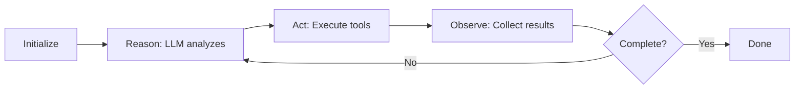

# Creating Custom Agents

This guide walks you through building custom agents for Brio-Kernel. Agents are WebAssembly components that use AI models to perform autonomous tasks.

## Prerequisites

Before creating a custom agent, ensure you have:

- **Rust** (1.70+) installed
- **wasm32-wasi** target: `rustup target add wasm32-wasi`
- **wasm-tools** for component generation
- Familiarity with Rust and the Brio architecture

## What is a Custom Agent?

A custom agent is a WebAssembly component that:

- Implements the `StandardAgent` trait (or custom event-driven logic)
- Registers specific tools for its domain
- Uses AI models for reasoning and decision-making
- Follows the ReAct loop pattern

**When to create a custom agent:**

- You need domain-specific capabilities (e.g., testing, deployment)
- Existing agents don't fit your workflow
- You want to experiment with different AI prompting strategies
- You need specialized tool combinations

## Agent Architecture Overview

### StandardAgent Trait

The `StandardAgent` trait is the foundation for most agents:

```rust
pub trait StandardAgent: Clone + Send + Sync {
    /// Unique agent name
    const NAME: &'static str;
    
    /// Build the system prompt
    fn build_prompt(
        &self,
        context: &TaskContext,
        tools: &ToolRegistry,
        config: &StandardAgentConfig,
    ) -> String;
    
    /// Create tool registry
    fn create_tool_registry(&self, config: &AgentConfig) -> ToolRegistry;
    
    /// Perform AI inference
    fn perform_inference(
        &self,
        model: &str,
        history: &[Message],
    ) -> Result<InferenceResponse, AgentError>;
}
```

### ReAct Loop Pattern

The Reasoning + Acting (ReAct) loop is the core execution pattern:



**Flow:**
1. Build prompt with context and available tools
2. Send to AI model for reasoning
3. Parse tool invocations from response
4. Execute tools and collect results
5. Feed results back to AI
6. Repeat until `done` tool called

### Tool Registry

Each agent configures its own `ToolRegistry` with domain-specific tools:

| Tool | Description | Access Level |
|------|-------------|--------------|
| `read_file` | Read file contents | Read-only |
| `write_file` | Write/modify files | Write |
| `ls` | List directory contents | Read-only |
| `shell` | Execute shell commands | Shell |
| `done` | Mark task complete | Control |

### Task Context Flow

```
User Request
    ↓
TaskContext { task_id, description, input_files }
    ↓
Agent::run(context)
    ↓
ReAct Loop → Tool Execution → Completion
    ↓
Result String
```

## Project Setup

### 1. Create Agent Component

Create a new Rust crate in the agents directory:

```bash
cd brio-core/components/agents
mkdir my-agent
cd my-agent
cargo init --lib
```

### 2. Configure Cargo.toml

```toml
[package]
name = "my-agent"
version = "0.1.0"
edition = "2021"

[dependencies]
agent-sdk = { path = "../../agent-sdk" }
wit-bindgen = "0.24"
tracing = "0.1"

[lib]
crate-type = ["cdylib"]
```

### 3. Component Bindings Setup

Generate WIT bindings in `src/lib.rs`:

```rust
#![allow(missing_docs)]

use wit_bindgen::generate;

generate!({
    world: "smart-agent",
    path: "../../../wit",
    skip: ["tool"],
    generate_all,
});
```

## Implementing StandardAgent

### Step 1: Define Agent Struct

```rust
use agent_sdk::agent::{StandardAgent, StandardAgentConfig};
use agent_sdk::types::{InferenceResponse, Message, TaskContext};
use agent_sdk::{AgentConfig, AgentError, ToolRegistry};

#[derive(Clone)]
pub struct MyAgent;
```

### Step 2: Implement StandardAgent Trait

```rust
impl StandardAgent for MyAgent {
    const NAME: &'static str = "my-agent";

    fn build_prompt(
        &self,
        context: &TaskContext,
        tools: &ToolRegistry,
        _config: &StandardAgentConfig,
    ) -> String {
        format!(
            r"""You are {name}, a specialized agent.

## Task
{description}

## Available Tools
{tool_help}

Think step by step and use tools to complete the task.
When finished, use <done>summary</done>.
""",
            name = Self::NAME,
            description = context.description,
            tool_help = tools.help_text()
        )
    }

    fn create_tool_registry(&self, config: &AgentConfig) -> ToolRegistry {
        let mut registry = ToolRegistry::new();
        
        // Register tools (see Tool Configuration section)
        registry.register("done", Box::new(DoneTool), create_done_parser());
        registry.register("read_file", 
            Box::new(ReadFileTool::new(config.max_file_size)), 
            create_read_parser()
        );
        
        registry
    }

    fn perform_inference(
        &self,
        model: &str,
        history: &[Message],
    ) -> Result<InferenceResponse, AgentError> {
        // Convert to WIT types
        let wit_messages: Vec<brio::ai::inference::Message> = history
            .iter()
            .map(|msg| brio::ai::inference::Message {
                role: convert_role(msg.role),
                content: msg.content.clone(),
            })
            .collect();

        // Call AI interface
        let response = brio::ai::inference::chat(model, &wit_messages)
            .map_err(|e| AgentError::Inference(InferenceError::ApiError(format!("{e:?}"))))?;

        Ok(InferenceResponse {
            content: response.content,
            model: model.to_string(),
            tokens_used: response.usage.map(|u| u.total_tokens),
            finish_reason: None,
        })
    }
}
```

### Step 3: Implement Guest Interfaces

```rust
use agent_sdk::agent::{handle_standard_event, run_standard_agent};

impl exports::brio::core::agent_runner::Guest for MyAgent {
    fn run(context: exports::brio::core::agent_runner::TaskContext) -> Result<String, String> {
        let task_context = TaskContext::new(&context.task_id, &context.description)
            .with_files(context.input_files);

        let config = StandardAgentConfig::default();

        run_standard_agent(&MyAgent, &task_context, &config)
            .map_err(|e| format!("Agent execution failed: {e}"))
    }
}

impl exports::brio::core::event_handler::Guest for MyAgent {
    fn handle_event(topic: String, data: exports::brio::core::event_handler::Payload) {
        let data_str = match &data {
            exports::brio::core::event_handler::Payload::Json(s) => s.clone(),
            exports::brio::core::event_handler::Payload::Binary(_) => "[Binary]".to_string(),
        };
        handle_standard_event(Self::NAME, &topic, &data_str);
    }
}

export!(MyAgent);
```

### Step 4: Role Conversion Helper

```rust
fn convert_role(role: Role) -> brio::ai::inference::Role {
    match role {
        Role::System => brio::ai::inference::Role::System,
        Role::User => brio::ai::inference::Role::User,
        Role::Assistant | Role::Tool => brio::ai::inference::Role::Assistant,
    }
}
```

## Tool Configuration

### Adding Tools to Registry

```rust
use agent_sdk::agent::parsers::{
    create_done_parser, create_read_parser, 
    create_write_parser, create_list_parser
};
use agent_sdk::agent::tools::{DoneTool, ListDirectoryTool, ReadFileTool};

fn create_tool_registry(&self, config: &AgentConfig) -> ToolRegistry {
    let mut registry = ToolRegistry::new();
    
    // Required: done tool for task completion
    registry.register("done", Box::new(DoneTool), create_done_parser());
    
    // Read-only tools
    registry.register(
        "read_file",
        Box::new(ReadFileTool::new(config.max_file_size)),
        create_read_parser()
    );
    
    registry.register(
        "ls",
        Box::new(ListDirectoryTool::new(config.max_depth)),
        create_list_parser()
    );
    
    // Write tool (only for agents that modify files)
    if config.tool_config.enable_write {
        registry.register("write_file", Box::new(WriteFileTool), create_write_parser());
    }
    
    registry
}
```

### Tool Access Patterns

| Pattern | Tools | Use Case |
|---------|-------|----------|
| **Read-Only** | read_file, ls, done | Analysis, review, safety-critical |
| **Write** | + write_file | Code generation, modifications |
| **Shell** | + shell | Build, test, deployment tasks |

### Custom Tool Implementation

```rust
use agent_sdk::{Tool, ToolError};
use std::borrow::Cow;
use std::collections::HashMap;

struct MyCustomTool;

impl Tool for MyCustomTool {
    fn name(&self) -> Cow<'static, str> {
        Cow::Borrowed("my_tool")
    }
    
    fn description(&self) -> Cow<'static, str> {
        Cow::Borrowed(r#"<my_tool arg="value">content</my_tool>"#)
    }
    
    fn execute(&self, args: &HashMap<String, String>) -> Result<String, ToolError> {
        let arg = args.get("arg")
            .ok_or_else(|| ToolError::InvalidArguments {
                tool: "my_tool".to_string(),
                reason: "Missing 'arg'".to_string(),
            })?;
        
        // Tool logic here
        Ok(format!("Processed: {}", arg))
    }
}
```

## Prompt Engineering

### Building Effective Prompts

```rust
fn build_prompt(&self, context: &TaskContext, tools: &ToolRegistry, _config: &StandardAgentConfig) -> String {
    format!(
        r"""You are {name}, an expert in [domain].

## Your Role
[Describe what the agent does and its expertise]

## Capabilities
- Capability 1
- Capability 2
- Capability 3

## Available Tools
{tool_descriptions}

## Tool Usage Rules
1. Use strict XML syntax: <tool>content</tool>
2. Multiple tools per response allowed
3. Always check paths with `ls` before reading
4. Read files before modifying them

## Task
{description}

## Process
1. <thinking>Analyze the task and plan</thinking>
2. Use tools to gather information
3. Execute the task step by step
4. Verify results
5. Mark complete with <done>summary</done>
""",
        name = Self::NAME,
        tool_descriptions = tools.help_text(),
        description = context.description
    )
}
```

### Context Window Management

- **Be concise**: Include only necessary file content
- **Use summaries**: For large files, show structure not full content
- **Chunk large tasks**: Break into subtasks if context grows
- **Prioritize**: Include most relevant files first

### System vs User Prompts

| Type | Purpose | Content |
|------|---------|---------|
| **System** | Define behavior, capabilities, constraints | Agent role, rules, tool descriptions |
| **User** | Task-specific context | Description, input files, current state |

## Configuration and Environment Variables

### Using AgentConfig

```rust
// Load from environment
let config = AgentConfig::from_env()?;

// Or use defaults
let config = AgentConfig::default();

// Or build manually
let config = AgentConfig::builder()
    .max_iterations(30)
    .model("gpt-4")
    .verbose(true)
    .build()?;
```

### Environment Variables

| Variable | Description | Default |
|----------|-------------|---------|
| `BRIO_AGENT_MAX_ITERATIONS` | Max ReAct iterations | 20 |
| `BRIO_AGENT_MODEL` | AI model to use | best-available |
| `BRIO_AGENT_TIMEOUT_SECONDS` | Execution timeout | 300 |
| `BRIO_AGENT_VERBOSE` | Enable verbose logging | false |
| `BRIO_AGENT_MAX_FILE_SIZE` | Max file read size (bytes) | 10MB |
| `BRIO_AGENT_MAX_DEPTH` | Max directory depth | 10 |

### Runtime Configuration

```rust
fn create_tool_registry(&self, config: &AgentConfig) -> ToolRegistry {
    let mut registry = ToolRegistry::new();
    
    // Conditionally enable tools based on config
    if config.tool_config.enable_write {
        registry.register("write_file", ...);
    }
    
    if config.tool_config.enable_shell {
        registry.register("shell", ...);
    }
    
    registry
}
```

## Testing Your Agent

### Unit Testing

```rust
#[cfg(test)]
mod tests {
    use super::*;

    #[test]
    fn test_agent_prompt_building() {
        let agent = MyAgent;
        let context = TaskContext::new("test", "Test task");
        let config = StandardAgentConfig::default();
        let tools = agent.create_tool_registry(&AgentConfig::default());
        
        let prompt = agent.build_prompt(&context, &tools, &config);
        
        assert!(prompt.contains("my-agent"));
        assert!(prompt.contains("Test task"));
        assert!(prompt.contains("read_file"));
    }

    #[test]
    fn test_tool_registry() {
        let agent = MyAgent;
        let config = AgentConfig::default();
        let registry = agent.create_tool_registry(&config);
        
        assert!(registry.available_tools().contains(&"done"));
        assert!(registry.available_tools().contains(&"read_file"));
    }
}
```

### Integration Testing

Create a test that runs the full agent with mock inference:

```rust
#[test]
fn test_agent_execution() {
    // Mock inference responses
    let responses = vec![
        InferenceResponse {
            content: "<thinking>I'll read the file</thinking>\n<read_file>src/main.rs</read_file>".to_string(),
            model: "test".to_string(),
            tokens_used: Some(50),
            finish_reason: None,
        },
        InferenceResponse {
            content: "<done>Task completed</done>".to_string(),
            model: "test".to_string(),
            tokens_used: Some(20),
            finish_reason: Some("stop"),
        },
    ];
    
    // Test execution...
}
```

### Debugging Tips

1. **Enable verbose mode**: Set `BRIO_AGENT_VERBOSE=true`
2. **Check logs**: Use `tracing` macros for debugging
3. **Inspect prompts**: Print the generated system prompt
4. **Test tools individually**: Verify each tool works standalone
5. **Use small test cases**: Start with simple tasks

## Deployment

### Building the WASM Component

```bash
# Build the agent
cargo build --target wasm32-wasi --release

# Convert to component
wasm-tools component new \
    target/wasm32-wasi/release/my_agent.wasm \
    -o my-agent.wasm

# Validate component
wasm-tools validate my-agent.wasm
```

### Registering with Supervisor

Add to supervisor configuration (e.g., `config.toml`):

```toml
[[agents]]
name = "my-agent"
component_path = "./agents/my-agent.wasm"
model = "gpt-4"
max_iterations = 25

[agents.tools]
enable_write = true
enable_shell = false
```

### Configuration File Updates

Update your Brio configuration to include the new agent:

```toml
[supervisor]
agents_dir = "./agents"
default_agent = "coder"

[[agents]]
name = "my-agent"
component_path = "./agents/my-agent.wasm"
description = "My custom agent for specific tasks"
```

## Example: Minimal Agent

Complete minimal example showing all key components:

```rust
//! Minimal Agent Example

#![allow(missing_docs)]

use agent_sdk::agent::parsers::{create_done_parser, create_read_parser};
use agent_sdk::agent::tools::{DoneTool, ReadFileTool};
use agent_sdk::agent::{
    StandardAgent, StandardAgentConfig, handle_standard_event, run_standard_agent
};
use agent_sdk::types::{InferenceResponse, Message, Role, TaskContext};
use agent_sdk::{AgentConfig, AgentError, InferenceError, PromptBuilder, ToolRegistry};
use wit_bindgen::generate;

generate!({
    world: "smart-agent",
    path: "../../../wit",
    skip: ["tool"],
    generate_all,
});

#[derive(Clone)]
pub struct MinimalAgent;

impl StandardAgent for MinimalAgent {
    const NAME: &'static str = "minimal-agent";

    fn build_prompt(
        &self,
        context: &TaskContext,
        tools: &ToolRegistry,
        _config: &StandardAgentConfig,
    ) -> String {
        let config = AgentConfig::from_env().unwrap_or_default();
        PromptBuilder::build_smart_agent(context, tools, &config)
    }

    fn create_tool_registry(&self, config: &AgentConfig) -> ToolRegistry {
        let mut registry = ToolRegistry::new();
        
        registry.register("done", Box::new(DoneTool), create_done_parser());
        registry.register(
            "read_file",
            Box::new(ReadFileTool::new(config.max_file_size)),
            create_read_parser()
        );
        
        registry
    }

    fn perform_inference(
        &self,
        model: &str,
        history: &[Message],
    ) -> Result<InferenceResponse, AgentError> {
        let wit_messages: Vec<brio::ai::inference::Message> = history
            .iter()
            .map(|msg| brio::ai::inference::Message {
                role: convert_role(msg.role),
                content: msg.content.clone(),
            })
            .collect();

        let response = brio::ai::inference::chat(model, &wit_messages)
            .map_err(|e| AgentError::Inference(InferenceError::ApiError(format!("{e:?}"))))?;

        Ok(InferenceResponse {
            content: response.content,
            model: model.to_string(),
            tokens_used: response.usage.map(|u| u.total_tokens),
            finish_reason: None,
        })
    }
}

impl exports::brio::core::agent_runner::Guest for MinimalAgent {
    fn run(context: exports::brio::core::agent_runner::TaskContext) -> Result<String, String> {
        let task_context = TaskContext::new(&context.task_id, &context.description)
            .with_files(context.input_files);

        run_standard_agent(&MinimalAgent, &task_context, &StandardAgentConfig::default())
            .map_err(|e| format!("Agent execution failed: {e}"))
    }
}

impl exports::brio::core::event_handler::Guest for MinimalAgent {
    fn handle_event(topic: String, data: exports::brio::core::event_handler::Payload) {
        let data_str = match &data {
            exports::brio::core::event_handler::Payload::Json(s) => s.clone(),
            exports::brio::core::event_handler::Payload::Binary(_) => "[Binary]".to_string(),
        };
        handle_standard_event(Self::NAME, &topic, &data_str);
    }
}

fn convert_role(role: Role) -> brio::ai::inference::Role {
    match role {
        Role::System => brio::ai::inference::Role::System,
        Role::User => brio::ai::inference::Role::User,
        Role::Assistant | Role::Tool => brio::ai::inference::Role::Assistant,
    }
}

export!(MinimalAgent);
```

## Advanced Topics

### Custom Tool Parsers

For tools with complex XML formats:

```rust
use agent_sdk::ToolParser;
use regex::Captures;
use std::collections::HashMap;
use std::sync::Arc;

fn create_custom_parser() -> Arc<ToolParser> {
    Arc::new(
        ToolParser::new(
            r#"<custom_tool\s+name="([^"]+)"\s+value="([^"]+)">([^<]*)</custom_tool>"#,
            |caps: &Captures| {
                let mut args = HashMap::new();
                if let Some(m) = caps.get(1) {
                    args.insert("name".to_string(), m.as_str().to_string());
                }
                if let Some(m) = caps.get(2) {
                    args.insert("value".to_string(), m.as_str().to_string());
                }
                if let Some(m) = caps.get(3) {
                    args.insert("content".to_string(), m.as_str().to_string());
                }
                args
            }
        ).unwrap()
    )
}
```

### Event-Driven Agents

For agents that react to events (like Foreman):

```rust
impl exports::brio::core::event_handler::Guest for EventDrivenAgent {
    fn handle_event(topic: String, data: Payload) {
        match topic.as_str() {
            "task.completed" => handle_task_completed(data),
            "milestone.created" => handle_milestone_created(data),
            _ => tracing::info!("Unknown event: {}", topic),
        }
    }
}
```

### Multi-Step Planning

For agents that need to break down complex tasks:

```rust
fn build_prompt(&self, context: &TaskContext, tools: &ToolRegistry, _config: &StandardAgentConfig) -> String {
    format!(
        r"""You are a planning agent.

## Task
{description}

## Planning Process
1. Analyze requirements and constraints
2. Break into subtasks (max 5)
3. Define dependencies
4. Estimate complexity

## Output Format
Use <plan> with <step> elements:
<plan>
  <step id="1" depends_on="">First subtask</step>
  <step id="2" depends_on="1">Second subtask</step>
</plan>
<done>Planning complete</done>

## Tools
{tool_help}
""",
        description = context.description,
        tool_help = tools.help_text()
    )
}
```

## Best Practices

1. **Start Simple**: Begin with read-only tools, add write later
2. **Clear Prompts**: Be explicit about agent role and capabilities
3. **Tool Safety**: Validate all arguments before execution
4. **Test Thoroughly**: Mock inference for reproducible tests
5. **Document**: Add doc comments to all public items
6. **Handle Errors**: Use `?` operator and proper error types
7. **Limit Scope**: Agents should do one thing well
8. **Monitor**: Add tracing for observability

## Resources

- [Agent SDK Reference](../api-reference/agent-sdk.md)
- [Standard Agents](../concepts/agents.md)
- [Tools Guide](../concepts/tools.md)
- [Example: Coder Agent](../../brio-core/components/agents/coder/src/lib.rs)

---

Creating custom agents extends Brio-Kernel's capabilities for your specific needs. Start with the minimal example and incrementally add features.
